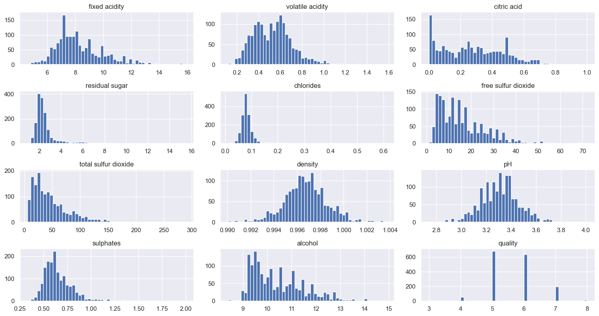
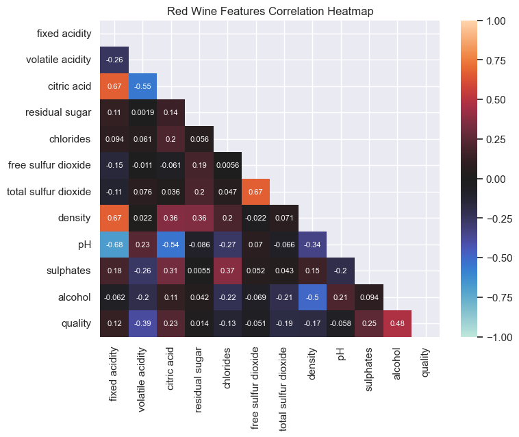
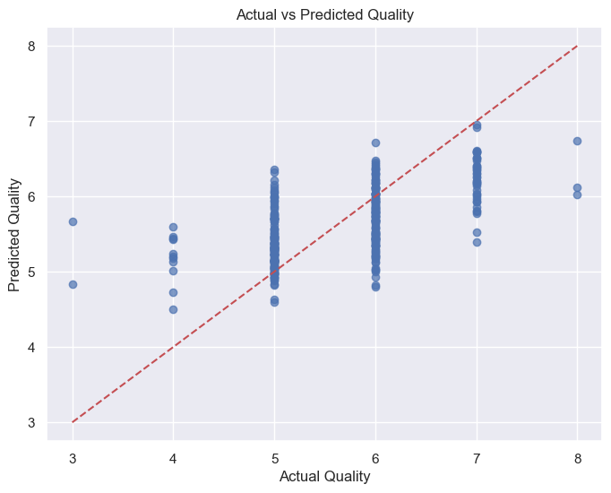
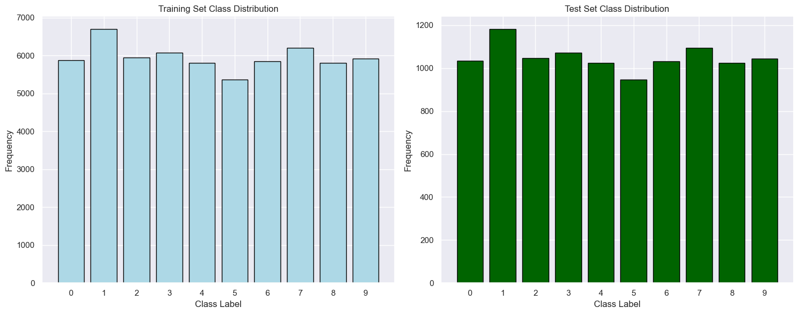
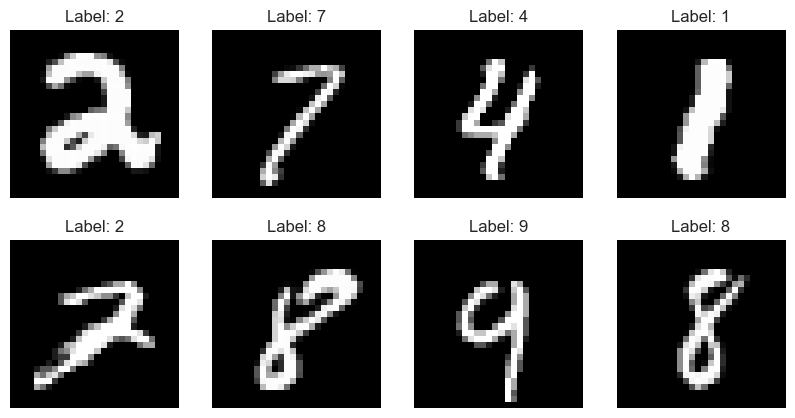
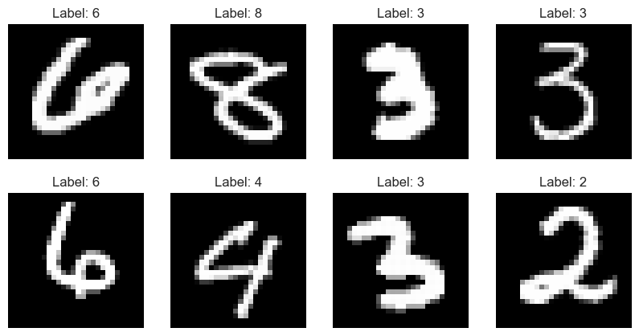
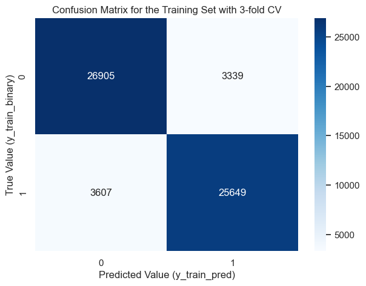
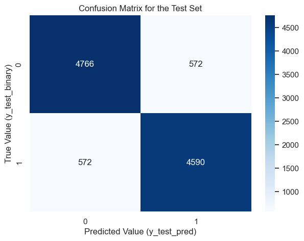
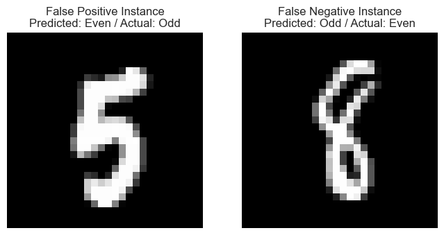

# HW1: Wine Quality Analysis with Linear Regression

**Project:** Machine Learning Assignment 1  
**Course:** DAMA61 - Data Science & Machine Learning  
**Date:** 2024  
**Technologies:** Python, Pandas, NumPy, Scikit-learn, Matplotlib, Seaborn  
**Dataset:** Wine Quality Dataset (UCI Machine Learning Repository)

## Project Description

This project focuses on analyzing wine quality data using linear regression techniques. The assignment involves:

- Loading and exploring the red wine quality dataset
- Performing exploratory data analysis (EDA) including descriptive statistics, histograms, and feature analysis
- Building and evaluating linear regression models to predict wine quality
- Using metrics such as R² score, MAE, MAPE, MSE, and accuracy to assess model performance
- Visualizing predictions through Actual vs Predicted plots

The dataset contains various chemical properties of red wines (fixed acidity, volatile acidity, citric acid, residual sugar, chlorides, free sulfur dioxide, total sulfur dioxide, density, pH, sulphates, alcohol) and a quality rating.

## Key Results

- **Model Type:** Linear Regression with StandardScaler
- **Evaluation Metrics:** R² Score, MAE, MAPE, MSE, Accuracy
- **Dataset:** Wine Quality Dataset (red wines)
- **Focus:** Regression analysis and model evaluation

---

# Problem 1


```python
import pandas as pd
import numpy as np
import matplotlib.pyplot as plt
import seaborn as sns
sns.set()
from sklearn.linear_model import LinearRegression
from pathlib import Path
import zipfile
import urllib.request
from sklearn.preprocessing import StandardScaler
from sklearn.model_selection import train_test_split
from sklearn.metrics import r2_score, mean_absolute_error, mean_absolute_percentage_error, mean_squared_error, accuracy_score
from sklearn.model_selection import cross_val_score
from sklearn.model_selection import train_test_split, cross_val_score, KFold


```

## <b>1.1</b>
### <u>Open a Jupyter-notebook. Download the wines dataset and load the data of the “red” wines.</u>

## 📕 Fetch & Load Wine_Quality_Data


```python
from pathlib import Path
import pandas as pd

def load_wine_quality_data():
    '''This function downloads and unzips the wine_quality.zip file, 
    containing the winequality-white.csv and winequality-red.csv. After the extraction, 
    the function returns the winequality-red.csv as a Pandas dataframe'''
    
    zip_path = Path('datasets/wine_quality.zip')  # Path to the ZIP file
    dataset_folder = Path('datasets/wine_quality_dataset')  # Path to the extracted dataset folder
    
    if not dataset_folder.exists():  # Check if dataset is already downloaded
        Path('datasets').mkdir(parents=True, exist_ok=True)  # In case it doesn't exist, create the datasets folder
        
        url = 'https://archive.ics.uci.edu/static/public/186/wine+quality.zip'  # URL of the dataset
        urllib.request.urlretrieve(url, zip_path)  # Download the ZIP file to the path given earlier
        
        with zipfile.ZipFile(zip_path) as zip_ref:  # Open the ZIP file
            zip_ref.extractall(dataset_folder)  # Extract all files to the dataset folder
        print('Dataset downloaded and extracted successfully.')
    
    return pd.read_csv(dataset_folder / 'winequality-red.csv')  # Return the DataFramea
wine_quality_data = load_wine_quality_data()

red_wine_df = pd.read_csv('datasets/wine_quality_dataset/winequality-red.csv', sep=';')
```

Print the dataset's first rows


```python
red_wine_df.head()
```


<div>
<style scoped>
    .dataframe tbody tr th:only-of-type {
        vertical-align: middle;
    }

    .dataframe tbody tr th {
        vertical-align: top;
    }

    .dataframe thead th {
        text-align: right;
    }
</style>
<table border="1" class="dataframe">
  <thead>
    <tr style="text-align: right;">
      <th></th>
      <th>fixed acidity</th>
      <th>volatile acidity</th>
      <th>citric acid</th>
      <th>residual sugar</th>
      <th>chlorides</th>
      <th>free sulfur dioxide</th>
      <th>total sulfur dioxide</th>
      <th>density</th>
      <th>pH</th>
      <th>sulphates</th>
      <th>alcohol</th>
      <th>quality</th>
    </tr>
  </thead>
  <tbody>
    <tr>
      <th>0</th>
      <td>7.4</td>
      <td>0.70</td>
      <td>0.00</td>
      <td>1.9</td>
      <td>0.076</td>
      <td>11.0</td>
      <td>34.0</td>
      <td>0.9978</td>
      <td>3.51</td>
      <td>0.56</td>
      <td>9.4</td>
      <td>5</td>
    </tr>
    <tr>
      <th>1</th>
      <td>7.8</td>
      <td>0.88</td>
      <td>0.00</td>
      <td>2.6</td>
      <td>0.098</td>
      <td>25.0</td>
      <td>67.0</td>
      <td>0.9968</td>
      <td>3.20</td>
      <td>0.68</td>
      <td>9.8</td>
      <td>5</td>
    </tr>
    <tr>
      <th>2</th>
      <td>7.8</td>
      <td>0.76</td>
      <td>0.04</td>
      <td>2.3</td>
      <td>0.092</td>
      <td>15.0</td>
      <td>54.0</td>
      <td>0.9970</td>
      <td>3.26</td>
      <td>0.65</td>
      <td>9.8</td>
      <td>5</td>
    </tr>
    <tr>
      <th>3</th>
      <td>11.2</td>
      <td>0.28</td>
      <td>0.56</td>
      <td>1.9</td>
      <td>0.075</td>
      <td>17.0</td>
      <td>60.0</td>
      <td>0.9980</td>
      <td>3.16</td>
      <td>0.58</td>
      <td>9.8</td>
      <td>6</td>
    </tr>
    <tr>
      <th>4</th>
      <td>7.4</td>
      <td>0.70</td>
      <td>0.00</td>
      <td>1.9</td>
      <td>0.076</td>
      <td>11.0</td>
      <td>34.0</td>
      <td>0.9978</td>
      <td>3.51</td>
      <td>0.56</td>
      <td>9.4</td>
      <td>5</td>
    </tr>
  </tbody>
</table>
</div>


## <b>1.2</b>
### <u>What are the features describing the quality of the wines?</u>


Overview of the red wine dataframe


```python
red_wine_df.info()
```

    <class 'pandas.core.frame.DataFrame'>
    RangeIndex: 1599 entries, 0 to 1598
    Data columns (total 12 columns):
     #   Column                Non-Null Count  Dtype  
    ---  ------                --------------  -----  
     0   fixed acidity         1599 non-null   float64
     1   volatile acidity      1599 non-null   float64
     2   citric acid           1599 non-null   float64
     3   residual sugar        1599 non-null   float64
     4   chlorides             1599 non-null   float64
     5   free sulfur dioxide   1599 non-null   float64
     6   total sulfur dioxide  1599 non-null   float64
     7   density               1599 non-null   float64
     8   pH                    1599 non-null   float64
     9   sulphates             1599 non-null   float64
     10  alcohol               1599 non-null   float64
     11  quality               1599 non-null   int64  
    dtypes: float64(11), int64(1)
    memory usage: 150.0 KB
    

We notice there are 12 different features, 1599 non-null values out of 1599 entries, which means there are no missing values. 11 columns are of type float64 and describe continuous numerical features, while 1 column is of type int64, and describes a discrete numerical feature. \
Let's store the feature names in a list and print them out.


```python
red_wine_df_col = list(red_wine_df.columns) # Get the columns
print(f'The features of the dataset are: {", ".join(red_wine_df_col)}.') # Join them
```

    The features of the dataset are: fixed acidity, volatile acidity, citric acid, residual sugar, chlorides, free sulfur dioxide, total sulfur dioxide, density, pH, sulphates, alcohol, quality.
    

## <b>1.3</b>
### <u>Compute the descriptive statistics of the dataset features and discuss about their types, ranges and completeness.</u>


Check the dataset features' descriptive statistics


```python
red_wine_df.describe()
```


<div>
<style scoped>
    .dataframe tbody tr th:only-of-type {
        vertical-align: middle;
    }

    .dataframe tbody tr th {
        vertical-align: top;
    }

    .dataframe thead th {
        text-align: right;
    }
</style>
<table border="1" class="dataframe">
  <thead>
    <tr style="text-align: right;">
      <th></th>
      <th>fixed acidity</th>
      <th>volatile acidity</th>
      <th>citric acid</th>
      <th>residual sugar</th>
      <th>chlorides</th>
      <th>free sulfur dioxide</th>
      <th>total sulfur dioxide</th>
      <th>density</th>
      <th>pH</th>
      <th>sulphates</th>
      <th>alcohol</th>
      <th>quality</th>
    </tr>
  </thead>
  <tbody>
    <tr>
      <th>count</th>
      <td>1599.000000</td>
      <td>1599.000000</td>
      <td>1599.000000</td>
      <td>1599.000000</td>
      <td>1599.000000</td>
      <td>1599.000000</td>
      <td>1599.000000</td>
      <td>1599.000000</td>
      <td>1599.000000</td>
      <td>1599.000000</td>
      <td>1599.000000</td>
      <td>1599.000000</td>
    </tr>
    <tr>
      <th>mean</th>
      <td>8.319637</td>
      <td>0.527821</td>
      <td>0.270976</td>
      <td>2.538806</td>
      <td>0.087467</td>
      <td>15.874922</td>
      <td>46.467792</td>
      <td>0.996747</td>
      <td>3.311113</td>
      <td>0.658149</td>
      <td>10.422983</td>
      <td>5.636023</td>
    </tr>
    <tr>
      <th>std</th>
      <td>1.741096</td>
      <td>0.179060</td>
      <td>0.194801</td>
      <td>1.409928</td>
      <td>0.047065</td>
      <td>10.460157</td>
      <td>32.895324</td>
      <td>0.001887</td>
      <td>0.154386</td>
      <td>0.169507</td>
      <td>1.065668</td>
      <td>0.807569</td>
    </tr>
    <tr>
      <th>min</th>
      <td>4.600000</td>
      <td>0.120000</td>
      <td>0.000000</td>
      <td>0.900000</td>
      <td>0.012000</td>
      <td>1.000000</td>
      <td>6.000000</td>
      <td>0.990070</td>
      <td>2.740000</td>
      <td>0.330000</td>
      <td>8.400000</td>
      <td>3.000000</td>
    </tr>
    <tr>
      <th>25%</th>
      <td>7.100000</td>
      <td>0.390000</td>
      <td>0.090000</td>
      <td>1.900000</td>
      <td>0.070000</td>
      <td>7.000000</td>
      <td>22.000000</td>
      <td>0.995600</td>
      <td>3.210000</td>
      <td>0.550000</td>
      <td>9.500000</td>
      <td>5.000000</td>
    </tr>
    <tr>
      <th>50%</th>
      <td>7.900000</td>
      <td>0.520000</td>
      <td>0.260000</td>
      <td>2.200000</td>
      <td>0.079000</td>
      <td>14.000000</td>
      <td>38.000000</td>
      <td>0.996750</td>
      <td>3.310000</td>
      <td>0.620000</td>
      <td>10.200000</td>
      <td>6.000000</td>
    </tr>
    <tr>
      <th>75%</th>
      <td>9.200000</td>
      <td>0.640000</td>
      <td>0.420000</td>
      <td>2.600000</td>
      <td>0.090000</td>
      <td>21.000000</td>
      <td>62.000000</td>
      <td>0.997835</td>
      <td>3.400000</td>
      <td>0.730000</td>
      <td>11.100000</td>
      <td>6.000000</td>
    </tr>
    <tr>
      <th>max</th>
      <td>15.900000</td>
      <td>1.580000</td>
      <td>1.000000</td>
      <td>15.500000</td>
      <td>0.611000</td>
      <td>72.000000</td>
      <td>289.000000</td>
      <td>1.003690</td>
      <td>4.010000</td>
      <td>2.000000</td>
      <td>14.900000</td>
      <td>8.000000</td>
    </tr>
  </tbody>
</table>
</div>


Inspect the features data types and completness


```python
red_wine_df.info()
```

    <class 'pandas.core.frame.DataFrame'>
    RangeIndex: 1599 entries, 0 to 1598
    Data columns (total 12 columns):
     #   Column                Non-Null Count  Dtype  
    ---  ------                --------------  -----  
     0   fixed acidity         1599 non-null   float64
     1   volatile acidity      1599 non-null   float64
     2   citric acid           1599 non-null   float64
     3   residual sugar        1599 non-null   float64
     4   chlorides             1599 non-null   float64
     5   free sulfur dioxide   1599 non-null   float64
     6   total sulfur dioxide  1599 non-null   float64
     7   density               1599 non-null   float64
     8   pH                    1599 non-null   float64
     9   sulphates             1599 non-null   float64
     10  alcohol               1599 non-null   float64
     11  quality               1599 non-null   int64  
    dtypes: float64(11), int64(1)
    memory usage: 150.0 KB
    


```python
red_wine_df.isnull().sum()
```


    fixed acidity           0
    volatile acidity        0
    citric acid             0
    residual sugar          0
    chlorides               0
    free sulfur dioxide     0
    total sulfur dioxide    0
    density                 0
    pH                      0
    sulphates               0
    alcohol                 0
    quality                 0
    dtype: int64


```python
def feature_type(column_name):
    '''
    Determines the type of a given feature.
    '''
    if column_name == 'quality':
        return 'Ordinal Categorical' # Checks if the column name is 'qualtiy', which is of ordinal categorical type. 
    else:
        return 'Continuous Numerical' # Every other column is of continuous numerical type.
```

Present the type, range and completeness of the dataset features


```python
descriptive_stats = red_wine_df.describe() 

for column in descriptive_stats.columns: # Loop through the columns to retrieve its descriptive statistics and store their type, min and max values, and count.
    f_type = feature_type(column)
    min_val = descriptive_stats.loc['min', column]
    max_val = descriptive_stats.loc['max', column]
    count_val = descriptive_stats.loc['count', column]
    
    # Print the features' details
    print(f'Feature: {column}')
    print(f' - Type: {f_type}')
    print(f' - Range: [{min_val}, {max_val}]')
    print(f' - Completeness: {int(count_val)} / {len(red_wine_df)} values present')
    print('-' * 40) # Separator

```

    Feature: fixed acidity
     - Type: Continuous Numerical
     - Range: [4.6, 15.9]
     - Completeness: 1599 / 1599 values present
    ----------------------------------------
    Feature: volatile acidity
     - Type: Continuous Numerical
     - Range: [0.12, 1.58]
     - Completeness: 1599 / 1599 values present
    ----------------------------------------
    Feature: citric acid
     - Type: Continuous Numerical
     - Range: [0.0, 1.0]
     - Completeness: 1599 / 1599 values present
    ----------------------------------------
    Feature: residual sugar
     - Type: Continuous Numerical
     - Range: [0.9, 15.5]
     - Completeness: 1599 / 1599 values present
    ----------------------------------------
    Feature: chlorides
     - Type: Continuous Numerical
     - Range: [0.012, 0.611]
     - Completeness: 1599 / 1599 values present
    ----------------------------------------
    Feature: free sulfur dioxide
     - Type: Continuous Numerical
     - Range: [1.0, 72.0]
     - Completeness: 1599 / 1599 values present
    ----------------------------------------
    Feature: total sulfur dioxide
     - Type: Continuous Numerical
     - Range: [6.0, 289.0]
     - Completeness: 1599 / 1599 values present
    ----------------------------------------
    Feature: density
     - Type: Continuous Numerical
     - Range: [0.99007, 1.00369]
     - Completeness: 1599 / 1599 values present
    ----------------------------------------
    Feature: pH
     - Type: Continuous Numerical
     - Range: [2.74, 4.01]
     - Completeness: 1599 / 1599 values present
    ----------------------------------------
    Feature: sulphates
     - Type: Continuous Numerical
     - Range: [0.33, 2.0]
     - Completeness: 1599 / 1599 values present
    ----------------------------------------
    Feature: alcohol
     - Type: Continuous Numerical
     - Range: [8.4, 14.9]
     - Completeness: 1599 / 1599 values present
    ----------------------------------------
    Feature: quality
     - Type: Ordinal Categorical
     - Range: [3.0, 8.0]
     - Completeness: 1599 / 1599 values present
    ----------------------------------------
    

Domain knowledge observations: The wines in this dataset represent a diverse range. Most of the wines fall within expected ranges for acidity, alcohol content, and pH. A wide range of values for Residual Sugar, shows that the wines include both dry and sweet wines. The quality ratings indicate that most wines are average, with no wines rated extremely poorly (min rating is 3) or excellently (max rating is 8).

## <b>1.4</b>
### <u>Form the histograms of the features and discuss their distribution. Can the distribution of some features be improved (tending more towards the Gaussian) and how?</u>


```python
red_wine_df.hist(bins=50, figsize=(15,8)) # Create the histograms, with 50 bins
plt.tight_layout() # Use tight_layout so that the histogram title does not collide with the x-axis ticks/values.
plt.show()
```


    

    


Setting aside the Quality feature, which is a categorical variable with distinct values, we observe that most distributions are right-skewed. Others have a strong right skew (Total Sulfur Dioxide, Chlorides, Residual Sugar) while others have a slight right skew (Alcohol, Fixed Acidity, Volatile Acidity). We also notice that Density and pH are nearly symmetrical, colse to normal distribution. For the right-skewed features, we should apply a logarithmic transformation to reduce the skewness and make their distributions closer to Gaussian followed by scaling techniques such as standardization, to achieve a mean of 0 and a standard deviation of 1, or min-max scaling to bring the values into a fixed range, like [0,1] or [-1,1].

## <b>1.5</b>
### <u>Which are the features that mostly affect quality and which are those that affect it less? Provide evidence through correlation and discuss accordingly.</u>


```python
red_wine_df.corr()
```


<div>
<style scoped>
    .dataframe tbody tr th:only-of-type {
        vertical-align: middle;
    }

    .dataframe tbody tr th {
        vertical-align: top;
    }

    .dataframe thead th {
        text-align: right;
    }
</style>
<table border="1" class="dataframe">
  <thead>
    <tr style="text-align: right;">
      <th></th>
      <th>fixed acidity</th>
      <th>volatile acidity</th>
      <th>citric acid</th>
      <th>residual sugar</th>
      <th>chlorides</th>
      <th>free sulfur dioxide</th>
      <th>total sulfur dioxide</th>
      <th>density</th>
      <th>pH</th>
      <th>sulphates</th>
      <th>alcohol</th>
      <th>quality</th>
    </tr>
  </thead>
  <tbody>
    <tr>
      <th>fixed acidity</th>
      <td>1.000000</td>
      <td>-0.256131</td>
      <td>0.671703</td>
      <td>0.114777</td>
      <td>0.093705</td>
      <td>-0.153794</td>
      <td>-0.113181</td>
      <td>0.668047</td>
      <td>-0.682978</td>
      <td>0.183006</td>
      <td>-0.061668</td>
      <td>0.124052</td>
    </tr>
    <tr>
      <th>volatile acidity</th>
      <td>-0.256131</td>
      <td>1.000000</td>
      <td>-0.552496</td>
      <td>0.001918</td>
      <td>0.061298</td>
      <td>-0.010504</td>
      <td>0.076470</td>
      <td>0.022026</td>
      <td>0.234937</td>
      <td>-0.260987</td>
      <td>-0.202288</td>
      <td>-0.390558</td>
    </tr>
    <tr>
      <th>citric acid</th>
      <td>0.671703</td>
      <td>-0.552496</td>
      <td>1.000000</td>
      <td>0.143577</td>
      <td>0.203823</td>
      <td>-0.060978</td>
      <td>0.035533</td>
      <td>0.364947</td>
      <td>-0.541904</td>
      <td>0.312770</td>
      <td>0.109903</td>
      <td>0.226373</td>
    </tr>
    <tr>
      <th>residual sugar</th>
      <td>0.114777</td>
      <td>0.001918</td>
      <td>0.143577</td>
      <td>1.000000</td>
      <td>0.055610</td>
      <td>0.187049</td>
      <td>0.203028</td>
      <td>0.355283</td>
      <td>-0.085652</td>
      <td>0.005527</td>
      <td>0.042075</td>
      <td>0.013732</td>
    </tr>
    <tr>
      <th>chlorides</th>
      <td>0.093705</td>
      <td>0.061298</td>
      <td>0.203823</td>
      <td>0.055610</td>
      <td>1.000000</td>
      <td>0.005562</td>
      <td>0.047400</td>
      <td>0.200632</td>
      <td>-0.265026</td>
      <td>0.371260</td>
      <td>-0.221141</td>
      <td>-0.128907</td>
    </tr>
    <tr>
      <th>free sulfur dioxide</th>
      <td>-0.153794</td>
      <td>-0.010504</td>
      <td>-0.060978</td>
      <td>0.187049</td>
      <td>0.005562</td>
      <td>1.000000</td>
      <td>0.667666</td>
      <td>-0.021946</td>
      <td>0.070377</td>
      <td>0.051658</td>
      <td>-0.069408</td>
      <td>-0.050656</td>
    </tr>
    <tr>
      <th>total sulfur dioxide</th>
      <td>-0.113181</td>
      <td>0.076470</td>
      <td>0.035533</td>
      <td>0.203028</td>
      <td>0.047400</td>
      <td>0.667666</td>
      <td>1.000000</td>
      <td>0.071269</td>
      <td>-0.066495</td>
      <td>0.042947</td>
      <td>-0.205654</td>
      <td>-0.185100</td>
    </tr>
    <tr>
      <th>density</th>
      <td>0.668047</td>
      <td>0.022026</td>
      <td>0.364947</td>
      <td>0.355283</td>
      <td>0.200632</td>
      <td>-0.021946</td>
      <td>0.071269</td>
      <td>1.000000</td>
      <td>-0.341699</td>
      <td>0.148506</td>
      <td>-0.496180</td>
      <td>-0.174919</td>
    </tr>
    <tr>
      <th>pH</th>
      <td>-0.682978</td>
      <td>0.234937</td>
      <td>-0.541904</td>
      <td>-0.085652</td>
      <td>-0.265026</td>
      <td>0.070377</td>
      <td>-0.066495</td>
      <td>-0.341699</td>
      <td>1.000000</td>
      <td>-0.196648</td>
      <td>0.205633</td>
      <td>-0.057731</td>
    </tr>
    <tr>
      <th>sulphates</th>
      <td>0.183006</td>
      <td>-0.260987</td>
      <td>0.312770</td>
      <td>0.005527</td>
      <td>0.371260</td>
      <td>0.051658</td>
      <td>0.042947</td>
      <td>0.148506</td>
      <td>-0.196648</td>
      <td>1.000000</td>
      <td>0.093595</td>
      <td>0.251397</td>
    </tr>
    <tr>
      <th>alcohol</th>
      <td>-0.061668</td>
      <td>-0.202288</td>
      <td>0.109903</td>
      <td>0.042075</td>
      <td>-0.221141</td>
      <td>-0.069408</td>
      <td>-0.205654</td>
      <td>-0.496180</td>
      <td>0.205633</td>
      <td>0.093595</td>
      <td>1.000000</td>
      <td>0.476166</td>
    </tr>
    <tr>
      <th>quality</th>
      <td>0.124052</td>
      <td>-0.390558</td>
      <td>0.226373</td>
      <td>0.013732</td>
      <td>-0.128907</td>
      <td>-0.050656</td>
      <td>-0.185100</td>
      <td>-0.174919</td>
      <td>-0.057731</td>
      <td>0.251397</td>
      <td>0.476166</td>
      <td>1.000000</td>
    </tr>
  </tbody>
</table>
</div>


```python
corr_matrix = red_wine_df.corr()
corr_matrix['quality'].sort_values(ascending=False)
```


    quality                 1.000000
    alcohol                 0.476166
    sulphates               0.251397
    citric acid             0.226373
    fixed acidity           0.124052
    residual sugar          0.013732
    free sulfur dioxide    -0.050656
    pH                     -0.057731
    chlorides              -0.128907
    density                -0.174919
    total sulfur dioxide   -0.185100
    volatile acidity       -0.390558
    Name: quality, dtype: float64


Create the heatmap with mask applied


```python
mask = np.triu(np.ones_like(red_wine_df.corr(), dtype=bool)) # Create a mask for the upper triangle

plt.figure(figsize=(8, 6))
sns.heatmap(red_wine_df.corr(), annot=True, cmap='icefire', vmin=-1, vmax=1, mask=mask, annot_kws={"size": 8})
plt.title('Red Wine Features Correlation Heatmap')
plt.show()
```


    

    


## <b>1.6</b>
### <u>Split the dataset into a training and a testing set retaining 80% and 20% of the total number of samples, respectively, using random shuffling and splitting that retains the statistical properties of the input data (stratified) with respect to quality.</u>

Split the dataset into training and test sets, with a ratio of 80%-20%. I use stratified sampling to ensure that the distribution of the 'quality' target variable, is retained in the new sets.


```python
strat_train_set, strat_test_set = train_test_split(red_wine_df, test_size=0.2, stratify=red_wine_df['quality'], random_state=42)
```

Confirm with manual calculations, that the stratification maintained a similar distribution. Pass the results into a dataframe and print them.


```python
test_strat_ratio = (strat_test_set['quality'].value_counts() / len(strat_test_set)).sort_index() 
train_strat_ratio = (strat_train_set['quality'].value_counts() / len(strat_train_set)).sort_index()
original_strat_ratio = (red_wine_df['quality'].value_counts() / len(red_wine_df)).sort_index()

ratios_df = pd.DataFrame({
    'Original %': (original_strat_ratio * 100).round(2),
    'Train %': (train_strat_ratio * 100).round(2),
    'Test %': (test_strat_ratio * 100).round(2)
})
```


```python
ratios_df
```


<div>
<style scoped>
    .dataframe tbody tr th:only-of-type {
        vertical-align: middle;
    }

    .dataframe tbody tr th {
        vertical-align: top;
    }

    .dataframe thead th {
        text-align: right;
    }
</style>
<table border="1" class="dataframe">
  <thead>
    <tr style="text-align: right;">
      <th></th>
      <th>Original %</th>
      <th>Train %</th>
      <th>Test %</th>
    </tr>
    <tr>
      <th>quality</th>
      <th></th>
      <th></th>
      <th></th>
    </tr>
  </thead>
  <tbody>
    <tr>
      <th>3</th>
      <td>0.63</td>
      <td>0.63</td>
      <td>0.62</td>
    </tr>
    <tr>
      <th>4</th>
      <td>3.31</td>
      <td>3.28</td>
      <td>3.44</td>
    </tr>
    <tr>
      <th>5</th>
      <td>42.59</td>
      <td>42.61</td>
      <td>42.50</td>
    </tr>
    <tr>
      <th>6</th>
      <td>39.90</td>
      <td>39.87</td>
      <td>40.00</td>
    </tr>
    <tr>
      <th>7</th>
      <td>12.45</td>
      <td>12.43</td>
      <td>12.50</td>
    </tr>
    <tr>
      <th>8</th>
      <td>1.13</td>
      <td>1.17</td>
      <td>0.94</td>
    </tr>
  </tbody>
</table>
</div>


The quality distribution is retained in both training and test set. This was expected, since we used stratified splitting which ensures exactly that.

## <b>1.7</b>
### <u>Scale the data with a Standard scaler and train a linear regression model. Evaluate the performance of the model, using the test set, with respect to metrics such as R2 -score, Mean Absolute Error, Mean Absolute Percentage Error, Mean Squared Error and Accuracy. Comment on the accuracy of predictions by plotting Actuals vs Predicted diagram.</u>

#### Reset the indices for the train and the test set.
When splitting datasets, the indices often retain their original values, which might be scattered.\
Resetting indices ensures clean, sequential indices (0, 1, 2, ...) for both datasets.\
It avoids errors later, especially when combining predictions or debugging.


```python
strat_train_set.reset_index(drop=True, inplace=True)
strat_test_set.reset_index(drop=True, inplace=True)
```

To train the model, we need to separate:\
X: Independent variables (features that describe the wine).\
y: Dependent variable (wine quality in this case).\
This is a standard practice in supervised machine learning problems


```python
X_train = strat_train_set.drop('quality',axis=1)
y_train = strat_train_set['quality']

X_test = strat_test_set.drop('quality', axis=1)
y_test = strat_test_set['quality']
```

Many machine learning models, including Linear Regression, perform better when features are standardized.\
StandardScaler transforms features to have mean = 0 and standard deviation = 1.\
Important: The scaler is fitted only on the training set, to prevent data leakage. The same scaler is then applied to the test set.


```python
target_scaler = StandardScaler()

X_train_scaled = target_scaler.fit_transform(X_train)
X_test_scaled = target_scaler.transform(X_test)
```

#### Initialize the Linear Regression model, using the scaled training features and the training target variable. Then, use the trained model to predict the 'quality' of the wines in the test set.
It's a simple baseline regression model.\
It tries to find the best-fitting line by minimizing the Mean Squared Error (MSE) between actual and predicted values.\
It's a good starting point, but not always the best for complex relationships.\
The model, after training, is now used to make predictions on unseen data (X_test_scaled).\
Outputs are continuous values, as Linear Regression predicts floats.


```python
model = LinearRegression()
model.fit(X_train_scaled, y_train)

y_pred = model.predict(X_test_scaled)
```

#### Calculate the requested metrics, to evaluate the performance of our model.

R² Score (Coefficient of Determination): Measures how much variance in the target variable is explained by the model.\
Value of 1 means perfect prediction.\
Value of 0 means the model is as good as the mean of y.\
MAE (Mean Absolute Error): Average absolute error. Easy to interpret as it's in the same units as quality.\
MAPE (Mean Absolute Percentage Error): Measures the error as a percentage. Useful to understand errors relative to the actual values.\
MSE (Mean Squared Error): Penalizes larger errors more heavily (squared).


```python
# R² Score
r2 = r2_score(y_test, y_pred)

# Mean Absolute Error
mae = mean_absolute_error(y_test, y_pred)

# Mean Absolute Percentage Error
mape = mean_absolute_percentage_error(y_test, y_pred)

# Mean Squared Error
mse = mean_squared_error(y_test, y_pred)
```

The target variable 'quality' in the dataset, takes integer values in range $[3,8]$. The linear regression model, outputs continuous values, that is float numbers. Since the actual wine quality is always an integer, we round those predictions, and then we keep only the ones that fall in the valid range of our dataset's wine quality. Accuracy measures how well the model performed in predicting the actual quality values. Had we not rounded the predictions, it would be virtually impossible to achieve an exact match and we would get a misleadingly low evaluation score.


```python
y_pred_rounded = np.rint(y_pred) # Round predictions to the nearest integer

y_pred_rounded = np.clip(y_pred_rounded, y_test.min(), y_test.max()) # Ensure predictions are within the valid 'quality' range

accuracy = accuracy_score(y_test, y_pred_rounded)
```

Create a dictionary for the metrics and pass it into a dataframe.


```python
metrics = {'Metric': ['R² Score', 'Mean Absolute Error (MAE)', 'Mean Absolute Pct Error (MPAE)', 'Mean Squared Error (MSE)', 'Accuracy'],
           'Value': [round(r2,3), round(mae,3), round(mape,3), round(mse,3), round(accuracy,3)]}
           

```


```python
metrics_df = pd.DataFrame(metrics)
metrics_df
```


<div>
<style scoped>
    .dataframe tbody tr th:only-of-type {
        vertical-align: middle;
    }

    .dataframe tbody tr th {
        vertical-align: top;
    }

    .dataframe thead th {
        text-align: right;
    }
</style>
<table border="1" class="dataframe">
  <thead>
    <tr style="text-align: right;">
      <th></th>
      <th>Metric</th>
      <th>Value</th>
    </tr>
  </thead>
  <tbody>
    <tr>
      <th>0</th>
      <td>R² Score</td>
      <td>0.370</td>
    </tr>
    <tr>
      <th>1</th>
      <td>Mean Absolute Error (MAE)</td>
      <td>0.495</td>
    </tr>
    <tr>
      <th>2</th>
      <td>Mean Absolute Pct Error (MPAE)</td>
      <td>0.091</td>
    </tr>
    <tr>
      <th>3</th>
      <td>Mean Squared Error (MSE)</td>
      <td>0.406</td>
    </tr>
    <tr>
      <th>4</th>
      <td>Accuracy</td>
      <td>0.597</td>
    </tr>
  </tbody>
</table>
</div>


The model's R² score of 0.37, suggests that only 37% of the variance in the 'quality' scores is being explained by the model and the model's Accuracy score of 0.597, suggests that the model correctly predicts the wine quality around 59.7% of the time. Our model is not performing particularly well, which might mean that a linear regression model might not be the best fit for this problem.

This can also be seen in the visualization below.

Plot Actual vs Predicted values


```python
plt.figure(figsize=(8,6))
plt.scatter(y_test, y_pred, alpha=0.7, color='b')
plt.xlabel('Actual Quality')
plt.ylabel('Predicted Quality')
plt.title('Actual vs Predicted Quality')
diagonal = np.linspace(y_test.min(), y_test.max(), 100)  # Generate 100 values between the minimum value of the y_test and 
                                                         # the maximum value of y_test
plt.plot(diagonal, diagonal, 'r--') # Draw a diagonal line, where x and y are equal, hence the y=x line. That represents a 
                                    # diagonal reference line that indicates the perfect predictions.
plt.show()
```


    

    


We observe that the points fall far off from the reference prediction reference line.

## <b>1.8</b>
### <u>Perform 10-fold cross validation and compute the mean and standard deviation of the scores over the folds. Is the model’s R2-score within the limits defined by the 10-fold cross validation?</u>

Initialize the linear regression model, and define the 10-fold CV using KFold. Perform cross validation, computing the R² for each fold, and store the results in cv_scores.

The training set is split into 10 parts.\
The model is trained on 9 parts and validated on the 10th.\
This repeats 10 times, so every fold gets to be the validation set once\
The R² score is computed in each fold and saved in cv_scores.


```python
linear_model = LinearRegression()

kf = KFold(n_splits=10, shuffle=True, random_state=42)

cv_scores = cross_val_score(linear_model, X_train_scaled, y_train, cv=kf, scoring='r2')
print("Cross-Validation R² Scores:")
print(cv_scores)
```

    Cross-Validation R² Scores:
    [0.43091694 0.29793909 0.41938328 0.27331003 0.39947422 0.19204422
     0.38719947 0.25085842 0.34651846 0.26805618]
    

Calculate the mean and standard deviation of R² scores

Mean R² → Average performance of the model across the folds.\
Standard Deviation of R² → Measures stability and variance of the model's performance across folds.\
This gives you an idea of how much the model's performance fluctuates across different training-validation splits.


```python
mean_r2 = cv_scores.mean()
std_r2 = cv_scores.std()

print(f"\nMean R² Score: {mean_r2:.4f}")
print(f"Standard Deviation of R² Scores: {std_r2:.4f}")
```

    
    Mean R² Score: 0.3266
    Standard Deviation of R² Scores: 0.0773
    

Now that CV is done, we train the model on the entire training set to prepare for final evaluation on the test set.


```python
linear_model.fit(X_train_scaled, y_train)
```


<style>#sk-container-id-1 {
  /* Definition of color scheme common for light and dark mode */
  --sklearn-color-text: black;
  --sklearn-color-line: gray;
  /* Definition of color scheme for unfitted estimators */
  --sklearn-color-unfitted-level-0: #fff5e6;
  --sklearn-color-unfitted-level-1: #f6e4d2;
  --sklearn-color-unfitted-level-2: #ffe0b3;
  --sklearn-color-unfitted-level-3: chocolate;
  /* Definition of color scheme for fitted estimators */
  --sklearn-color-fitted-level-0: #f0f8ff;
  --sklearn-color-fitted-level-1: #d4ebff;
  --sklearn-color-fitted-level-2: #b3dbfd;
  --sklearn-color-fitted-level-3: cornflowerblue;

  /* Specific color for light theme */
  --sklearn-color-text-on-default-background: var(--sg-text-color, var(--theme-code-foreground, var(--jp-content-font-color1, black)));
  --sklearn-color-background: var(--sg-background-color, var(--theme-background, var(--jp-layout-color0, white)));
  --sklearn-color-border-box: var(--sg-text-color, var(--theme-code-foreground, var(--jp-content-font-color1, black)));
  --sklearn-color-icon: #696969;

  @media (prefers-color-scheme: dark) {
    /* Redefinition of color scheme for dark theme */
    --sklearn-color-text-on-default-background: var(--sg-text-color, var(--theme-code-foreground, var(--jp-content-font-color1, white)));
    --sklearn-color-background: var(--sg-background-color, var(--theme-background, var(--jp-layout-color0, #111)));
    --sklearn-color-border-box: var(--sg-text-color, var(--theme-code-foreground, var(--jp-content-font-color1, white)));
    --sklearn-color-icon: #878787;
  }
}

#sk-container-id-1 {
  color: var(--sklearn-color-text);
}

#sk-container-id-1 pre {
  padding: 0;
}

#sk-container-id-1 input.sk-hidden--visually {
  border: 0;
  clip: rect(1px 1px 1px 1px);
  clip: rect(1px, 1px, 1px, 1px);
  height: 1px;
  margin: -1px;
  overflow: hidden;
  padding: 0;
  position: absolute;
  width: 1px;
}

#sk-container-id-1 div.sk-dashed-wrapped {
  border: 1px dashed var(--sklearn-color-line);
  margin: 0 0.4em 0.5em 0.4em;
  box-sizing: border-box;
  padding-bottom: 0.4em;
  background-color: var(--sklearn-color-background);
}

#sk-container-id-1 div.sk-container {
  /* jupyter's `normalize.less` sets `[hidden] { display: none; }`
     but bootstrap.min.css set `[hidden] { display: none !important; }`
     so we also need the `!important` here to be able to override the
     default hidden behavior on the sphinx rendered scikit-learn.org.
     See: https://github.com/scikit-learn/scikit-learn/issues/21755 */
  display: inline-block !important;
  position: relative;
}

#sk-container-id-1 div.sk-text-repr-fallback {
  display: none;
}

div.sk-parallel-item,
div.sk-serial,
div.sk-item {
  /* draw centered vertical line to link estimators */
  background-image: linear-gradient(var(--sklearn-color-text-on-default-background), var(--sklearn-color-text-on-default-background));
  background-size: 2px 100%;
  background-repeat: no-repeat;
  background-position: center center;
}

/* Parallel-specific style estimator block */

#sk-container-id-1 div.sk-parallel-item::after {
  content: "";
  width: 100%;
  border-bottom: 2px solid var(--sklearn-color-text-on-default-background);
  flex-grow: 1;
}

#sk-container-id-1 div.sk-parallel {
  display: flex;
  align-items: stretch;
  justify-content: center;
  background-color: var(--sklearn-color-background);
  position: relative;
}

#sk-container-id-1 div.sk-parallel-item {
  display: flex;
  flex-direction: column;
}

#sk-container-id-1 div.sk-parallel-item:first-child::after {
  align-self: flex-end;
  width: 50%;
}

#sk-container-id-1 div.sk-parallel-item:last-child::after {
  align-self: flex-start;
  width: 50%;
}

#sk-container-id-1 div.sk-parallel-item:only-child::after {
  width: 0;
}

/* Serial-specific style estimator block */

#sk-container-id-1 div.sk-serial {
  display: flex;
  flex-direction: column;
  align-items: center;
  background-color: var(--sklearn-color-background);
  padding-right: 1em;
  padding-left: 1em;
}


/* Toggleable style: style used for estimator/Pipeline/ColumnTransformer box that is
clickable and can be expanded/collapsed.
- Pipeline and ColumnTransformer use this feature and define the default style
- Estimators will overwrite some part of the style using the `sk-estimator` class
*/

/* Pipeline and ColumnTransformer style (default) */

#sk-container-id-1 div.sk-toggleable {
  /* Default theme specific background. It is overwritten whether we have a
  specific estimator or a Pipeline/ColumnTransformer */
  background-color: var(--sklearn-color-background);
}

/* Toggleable label */
#sk-container-id-1 label.sk-toggleable__label {
  cursor: pointer;
  display: block;
  width: 100%;
  margin-bottom: 0;
  padding: 0.5em;
  box-sizing: border-box;
  text-align: center;
}

#sk-container-id-1 label.sk-toggleable__label-arrow:before {
  /* Arrow on the left of the label */
  content: "▸";
  float: left;
  margin-right: 0.25em;
  color: var(--sklearn-color-icon);
}

#sk-container-id-1 label.sk-toggleable__label-arrow:hover:before {
  color: var(--sklearn-color-text);
}

/* Toggleable content - dropdown */

#sk-container-id-1 div.sk-toggleable__content {
  max-height: 0;
  max-width: 0;
  overflow: hidden;
  text-align: left;
  /* unfitted */
  background-color: var(--sklearn-color-unfitted-level-0);
}

#sk-container-id-1 div.sk-toggleable__content.fitted {
  /* fitted */
  background-color: var(--sklearn-color-fitted-level-0);
}

#sk-container-id-1 div.sk-toggleable__content pre {
  margin: 0.2em;
  border-radius: 0.25em;
  color: var(--sklearn-color-text);
  /* unfitted */
  background-color: var(--sklearn-color-unfitted-level-0);
}

#sk-container-id-1 div.sk-toggleable__content.fitted pre {
  /* unfitted */
  background-color: var(--sklearn-color-fitted-level-0);
}

#sk-container-id-1 input.sk-toggleable__control:checked~div.sk-toggleable__content {
  /* Expand drop-down */
  max-height: 200px;
  max-width: 100%;
  overflow: auto;
}

#sk-container-id-1 input.sk-toggleable__control:checked~label.sk-toggleable__label-arrow:before {
  content: "▾";
}

/* Pipeline/ColumnTransformer-specific style */

#sk-container-id-1 div.sk-label input.sk-toggleable__control:checked~label.sk-toggleable__label {
  color: var(--sklearn-color-text);
  background-color: var(--sklearn-color-unfitted-level-2);
}

#sk-container-id-1 div.sk-label.fitted input.sk-toggleable__control:checked~label.sk-toggleable__label {
  background-color: var(--sklearn-color-fitted-level-2);
}

/* Estimator-specific style */

/* Colorize estimator box */
#sk-container-id-1 div.sk-estimator input.sk-toggleable__control:checked~label.sk-toggleable__label {
  /* unfitted */
  background-color: var(--sklearn-color-unfitted-level-2);
}

#sk-container-id-1 div.sk-estimator.fitted input.sk-toggleable__control:checked~label.sk-toggleable__label {
  /* fitted */
  background-color: var(--sklearn-color-fitted-level-2);
}

#sk-container-id-1 div.sk-label label.sk-toggleable__label,
#sk-container-id-1 div.sk-label label {
  /* The background is the default theme color */
  color: var(--sklearn-color-text-on-default-background);
}

/* On hover, darken the color of the background */
#sk-container-id-1 div.sk-label:hover label.sk-toggleable__label {
  color: var(--sklearn-color-text);
  background-color: var(--sklearn-color-unfitted-level-2);
}

/* Label box, darken color on hover, fitted */
#sk-container-id-1 div.sk-label.fitted:hover label.sk-toggleable__label.fitted {
  color: var(--sklearn-color-text);
  background-color: var(--sklearn-color-fitted-level-2);
}

/* Estimator label */

#sk-container-id-1 div.sk-label label {
  font-family: monospace;
  font-weight: bold;
  display: inline-block;
  line-height: 1.2em;
}

#sk-container-id-1 div.sk-label-container {
  text-align: center;
}

/* Estimator-specific */
#sk-container-id-1 div.sk-estimator {
  font-family: monospace;
  border: 1px dotted var(--sklearn-color-border-box);
  border-radius: 0.25em;
  box-sizing: border-box;
  margin-bottom: 0.5em;
  /* unfitted */
  background-color: var(--sklearn-color-unfitted-level-0);
}

#sk-container-id-1 div.sk-estimator.fitted {
  /* fitted */
  background-color: var(--sklearn-color-fitted-level-0);
}

/* on hover */
#sk-container-id-1 div.sk-estimator:hover {
  /* unfitted */
  background-color: var(--sklearn-color-unfitted-level-2);
}

#sk-container-id-1 div.sk-estimator.fitted:hover {
  /* fitted */
  background-color: var(--sklearn-color-fitted-level-2);
}

/* Specification for estimator info (e.g. "i" and "?") */

/* Common style for "i" and "?" */

.sk-estimator-doc-link,
a:link.sk-estimator-doc-link,
a:visited.sk-estimator-doc-link {
  float: right;
  font-size: smaller;
  line-height: 1em;
  font-family: monospace;
  background-color: var(--sklearn-color-background);
  border-radius: 1em;
  height: 1em;
  width: 1em;
  text-decoration: none !important;
  margin-left: 1ex;
  /* unfitted */
  border: var(--sklearn-color-unfitted-level-1) 1pt solid;
  color: var(--sklearn-color-unfitted-level-1);
}

.sk-estimator-doc-link.fitted,
a:link.sk-estimator-doc-link.fitted,
a:visited.sk-estimator-doc-link.fitted {
  /* fitted */
  border: var(--sklearn-color-fitted-level-1) 1pt solid;
  color: var(--sklearn-color-fitted-level-1);
}

/* On hover */
div.sk-estimator:hover .sk-estimator-doc-link:hover,
.sk-estimator-doc-link:hover,
div.sk-label-container:hover .sk-estimator-doc-link:hover,
.sk-estimator-doc-link:hover {
  /* unfitted */
  background-color: var(--sklearn-color-unfitted-level-3);
  color: var(--sklearn-color-background);
  text-decoration: none;
}

div.sk-estimator.fitted:hover .sk-estimator-doc-link.fitted:hover,
.sk-estimator-doc-link.fitted:hover,
div.sk-label-container:hover .sk-estimator-doc-link.fitted:hover,
.sk-estimator-doc-link.fitted:hover {
  /* fitted */
  background-color: var(--sklearn-color-fitted-level-3);
  color: var(--sklearn-color-background);
  text-decoration: none;
}

/* Span, style for the box shown on hovering the info icon */
.sk-estimator-doc-link span {
  display: none;
  z-index: 9999;
  position: relative;
  font-weight: normal;
  right: .2ex;
  padding: .5ex;
  margin: .5ex;
  width: min-content;
  min-width: 20ex;
  max-width: 50ex;
  color: var(--sklearn-color-text);
  box-shadow: 2pt 2pt 4pt #999;
  /* unfitted */
  background: var(--sklearn-color-unfitted-level-0);
  border: .5pt solid var(--sklearn-color-unfitted-level-3);
}

.sk-estimator-doc-link.fitted span {
  /* fitted */
  background: var(--sklearn-color-fitted-level-0);
  border: var(--sklearn-color-fitted-level-3);
}

.sk-estimator-doc-link:hover span {
  display: block;
}

/* "?"-specific style due to the `<a>` HTML tag */

#sk-container-id-1 a.estimator_doc_link {
  float: right;
  font-size: 1rem;
  line-height: 1em;
  font-family: monospace;
  background-color: var(--sklearn-color-background);
  border-radius: 1rem;
  height: 1rem;
  width: 1rem;
  text-decoration: none;
  /* unfitted */
  color: var(--sklearn-color-unfitted-level-1);
  border: var(--sklearn-color-unfitted-level-1) 1pt solid;
}

#sk-container-id-1 a.estimator_doc_link.fitted {
  /* fitted */
  border: var(--sklearn-color-fitted-level-1) 1pt solid;
  color: var(--sklearn-color-fitted-level-1);
}

/* On hover */
#sk-container-id-1 a.estimator_doc_link:hover {
  /* unfitted */
  background-color: var(--sklearn-color-unfitted-level-3);
  color: var(--sklearn-color-background);
  text-decoration: none;
}

#sk-container-id-1 a.estimator_doc_link.fitted:hover {
  /* fitted */
  background-color: var(--sklearn-color-fitted-level-3);
}
</style><div id="sk-container-id-1" class="sk-top-container"><div class="sk-text-repr-fallback"><pre>LinearRegression()</pre><b>In a Jupyter environment, please rerun this cell to show the HTML representation or trust the notebook. <br />On GitHub, the HTML representation is unable to render, please try loading this page with nbviewer.org.</b></div><div class="sk-container" hidden><div class="sk-item"><div class="sk-estimator fitted sk-toggleable"><input class="sk-toggleable__control sk-hidden--visually" id="sk-estimator-id-1" type="checkbox" checked><label for="sk-estimator-id-1" class="sk-toggleable__label fitted sk-toggleable__label-arrow fitted">&nbsp;&nbsp;LinearRegression<a class="sk-estimator-doc-link fitted" rel="noreferrer" target="_blank" href="https://scikit-learn.org/1.5/modules/generated/sklearn.linear_model.LinearRegression.html">?<span>Documentation for LinearRegression</span></a><span class="sk-estimator-doc-link fitted">i<span>Fitted</span></span></label><div class="sk-toggleable__content fitted"><pre>LinearRegression()</pre></div> </div></div></div></div>


Predict the target variable for the test data


```python
y_pred = linear_model.predict(X_test_scaled)
```

Calculate R² score on the test set. We evaluate the trained model on unseen data.


```python
test_r2 = r2_score(y_test, y_pred)

print(f"\nTest Set R² Score: {test_r2:.4f}")
```

    
    Test Set R² Score: 0.3703
    

Calculate the limits

We calculate a range of "expected" R² scores based on CV:\
Lower Limit = Mean R² - Std R²\
Upper Limit = Mean R² + Std R²\
This defines a confidence interval-like band to judge if the model generalizes as expected.


```python
lower_limit = mean_r2 - std_r2
upper_limit = mean_r2 + std_r2

print(f"\nCross-Validation R² Score Range: [{lower_limit:.4f}, {upper_limit:.4f}]")
```

    
    Cross-Validation R² Score Range: [0.2492, 0.4039]
    

Check if test R² score is within the limits


```python
if lower_limit <= test_r2 <= upper_limit:
    print(f"The model's test R² score: {test_r2:.4f} is within the limits defined by the 10-fold cross-validation.")
else:
    print(f"The model's test R² score: {test_r2:.4f} is NOT within the limits defined by the 10-fold cross-validation.")


```

    The model's test R² score: 0.3703 is within the limits defined by the 10-fold cross-validation.
    

# Problem 2


```python
import numpy as np
import matplotlib.pyplot as plt
import seaborn as sns
import random
from sklearn.model_selection import train_test_split, cross_val_score, StratifiedKFold, cross_val_predict
from sklearn.linear_model import SGDClassifier
from sklearn.preprocessing import StandardScaler
from sklearn.pipeline import Pipeline
from sklearn.metrics import confusion_matrix, recall_score, precision_score, accuracy_score
from sklearn.dummy import DummyClassifier
```

## 2.1
### Load the data as arrays and split them into training and test sets with the next ratio: 85-15. Verify that all the classes have the adequate number of instances.

Load the MNIST data

## 📕 Fetch & Load MNIST Dataset


```python
from sklearn.datasets import fetch_openml
mnist = fetch_openml('mnist_784', as_frame = False)
```

Inspect the data


```python
X,y = mnist.data, mnist.target
print(f'{"-" * 30}\ndata array:\n {X}, \n\nshape : {X.shape}')
print(f'{"-" * 30}\ntarget array:\n {y}, \n\nshape : {y.shape}\n{"-" * 30}')
```

    ------------------------------
    data array:
     [[0 0 0 ... 0 0 0]
     [0 0 0 ... 0 0 0]
     [0 0 0 ... 0 0 0]
     ...
     [0 0 0 ... 0 0 0]
     [0 0 0 ... 0 0 0]
     [0 0 0 ... 0 0 0]], 
    
    shape : (70000, 784)
    ------------------------------
    target array:
     ['5' '0' '4' ... '4' '5' '6'], 
    
    shape : (70000,)
    ------------------------------
    

Split into training and test sets

We split the dataset into:\
85% training data.\
15% test data.\
Stratify=y ensures that the proportion of each class in the target variable y is maintained in both sets.\
random_state=42 for reproducibility.\
Why? → In classification tasks, stratification is essential to avoid creating unbalanced splits, especially when some classes are underrepresented.


```python
X_train, X_test, y_train, y_test = train_test_split(X, y, test_size=0.15, stratify=y, random_state=42)
```

We retrieve:\
Unique class labels.\
Their respective counts in both y_train and y_test.\
We store these counts in dictionaries for easy inspection.\
This step ensures that each class has a sufficient number of instances for meaningful training and evaluation.


```python
unique_labels, train_counts = np.unique(y_train, return_counts=True) # Get the unique labels and their counts in the train set
train_dict = dict(zip(unique_labels, train_counts)) # Map each label to its count and store them as a dictionary

unique_labels, test_counts = np.unique(y_test, return_counts=True)
test_dict = dict(zip(unique_labels, test_counts))

print(f'{train_dict}\n{test_dict}')
```

    {'0': 5868, '1': 6695, '2': 5942, '3': 6070, '4': 5800, '5': 5366, '6': 5845, '7': 6199, '8': 5801, '9': 5914}
    {'0': 1035, '1': 1182, '2': 1048, '3': 1071, '4': 1024, '5': 947, '6': 1031, '7': 1094, '8': 1024, '9': 1044}
    

Create a visualization to confirm that all classes have the adequate number of instances.


```python
fig, axs = plt.subplots(1, 2, figsize=(15, 6)) # Set up the layout
axs[0].bar(train_dict.keys(), train_dict.values(), color='lightblue', edgecolor='black')
axs[0].set_xticks(range(10))
axs[0].set_title('Training Set Class Distribution')
axs[0].set_xlabel('Class Label')
axs[0].set_ylabel('Frequency')

axs[1].bar(test_dict.keys(), test_dict.values(), color='darkgreen', edgecolor='black')
axs[1].set_xticks(range(10))
axs[1].set_title('Test Set Class Distribution')
axs[1].set_xlabel('Class Label')
axs[1].set_ylabel('Frequency')

plt.tight_layout()
plt.show()
```


    

    


We observe that there is no class with very few or way too many instances, and our data is well balanced in both the training and the test set.

## 2.2
### Depict the first 8 images of the created training and test sets using different subplots in a 2 by 4 frame, with their labels as titles.

Plot the first 8 images from the training set


```python
fig, axs = plt.subplots(2, 4, figsize=(10, 5))

index = 0  
for row in range(2):
    for col in range(4):
        axs[row, col].imshow(X_train[index].reshape(28, 28), cmap='gray')
        axs[row, col].set_title(f"Label: {y_train[index]}")
        axs[row, col].axis('off')
        index += 1

plt.show()
```


    

    


Plot the first 8 images from the test set


```python
fig, axs = plt.subplots(2, 4, figsize=(10, 5))

index = 0  
for row in range(2):
    for col in range(4):
        axs[row, col].imshow(X_test[index].reshape(28, 28), cmap='gray')
        axs[row, col].set_title(f"Label: {y_test[index]}")
        axs[row, col].axis('off')
        index += 1

plt.show()
```


    

    


## 2.3
### We need to handle a classification problem of distinguishing between two classes: even and odd numbers. First, create the training and test subsets for each class. Then, choose a binary classifier and a normalization technique of your choice, before wrapping them into a scikit-learn pipeline. Fit your pipeline to observe the created diagram.

Create binary labels for even and odd numbers


```python
y_train_binary = (y_train.astype(int) % 2 == 0) # If the remainder of the division with 2, is 0, then the value is an even 
                                                # number (returns 1). If the remainder is 1, then it is an odd 
                                                # number (returns 0).
y_test_binary = (y_test.astype(int) % 2 == 0) 
```

Create a pipeline with StandardScaler and SGDClassifier. Then fit it on the training data


```python
pipeline = Pipeline([('scaler', StandardScaler()), ('sgd_clf', SGDClassifier(random_state=42))])

pipeline.fit(X_train, y_train_binary)
```


<style>#sk-container-id-2 {
  /* Definition of color scheme common for light and dark mode */
  --sklearn-color-text: black;
  --sklearn-color-line: gray;
  /* Definition of color scheme for unfitted estimators */
  --sklearn-color-unfitted-level-0: #fff5e6;
  --sklearn-color-unfitted-level-1: #f6e4d2;
  --sklearn-color-unfitted-level-2: #ffe0b3;
  --sklearn-color-unfitted-level-3: chocolate;
  /* Definition of color scheme for fitted estimators */
  --sklearn-color-fitted-level-0: #f0f8ff;
  --sklearn-color-fitted-level-1: #d4ebff;
  --sklearn-color-fitted-level-2: #b3dbfd;
  --sklearn-color-fitted-level-3: cornflowerblue;

  /* Specific color for light theme */
  --sklearn-color-text-on-default-background: var(--sg-text-color, var(--theme-code-foreground, var(--jp-content-font-color1, black)));
  --sklearn-color-background: var(--sg-background-color, var(--theme-background, var(--jp-layout-color0, white)));
  --sklearn-color-border-box: var(--sg-text-color, var(--theme-code-foreground, var(--jp-content-font-color1, black)));
  --sklearn-color-icon: #696969;

  @media (prefers-color-scheme: dark) {
    /* Redefinition of color scheme for dark theme */
    --sklearn-color-text-on-default-background: var(--sg-text-color, var(--theme-code-foreground, var(--jp-content-font-color1, white)));
    --sklearn-color-background: var(--sg-background-color, var(--theme-background, var(--jp-layout-color0, #111)));
    --sklearn-color-border-box: var(--sg-text-color, var(--theme-code-foreground, var(--jp-content-font-color1, white)));
    --sklearn-color-icon: #878787;
  }
}

#sk-container-id-2 {
  color: var(--sklearn-color-text);
}

#sk-container-id-2 pre {
  padding: 0;
}

#sk-container-id-2 input.sk-hidden--visually {
  border: 0;
  clip: rect(1px 1px 1px 1px);
  clip: rect(1px, 1px, 1px, 1px);
  height: 1px;
  margin: -1px;
  overflow: hidden;
  padding: 0;
  position: absolute;
  width: 1px;
}

#sk-container-id-2 div.sk-dashed-wrapped {
  border: 1px dashed var(--sklearn-color-line);
  margin: 0 0.4em 0.5em 0.4em;
  box-sizing: border-box;
  padding-bottom: 0.4em;
  background-color: var(--sklearn-color-background);
}

#sk-container-id-2 div.sk-container {
  /* jupyter's `normalize.less` sets `[hidden] { display: none; }`
     but bootstrap.min.css set `[hidden] { display: none !important; }`
     so we also need the `!important` here to be able to override the
     default hidden behavior on the sphinx rendered scikit-learn.org.
     See: https://github.com/scikit-learn/scikit-learn/issues/21755 */
  display: inline-block !important;
  position: relative;
}

#sk-container-id-2 div.sk-text-repr-fallback {
  display: none;
}

div.sk-parallel-item,
div.sk-serial,
div.sk-item {
  /* draw centered vertical line to link estimators */
  background-image: linear-gradient(var(--sklearn-color-text-on-default-background), var(--sklearn-color-text-on-default-background));
  background-size: 2px 100%;
  background-repeat: no-repeat;
  background-position: center center;
}

/* Parallel-specific style estimator block */

#sk-container-id-2 div.sk-parallel-item::after {
  content: "";
  width: 100%;
  border-bottom: 2px solid var(--sklearn-color-text-on-default-background);
  flex-grow: 1;
}

#sk-container-id-2 div.sk-parallel {
  display: flex;
  align-items: stretch;
  justify-content: center;
  background-color: var(--sklearn-color-background);
  position: relative;
}

#sk-container-id-2 div.sk-parallel-item {
  display: flex;
  flex-direction: column;
}

#sk-container-id-2 div.sk-parallel-item:first-child::after {
  align-self: flex-end;
  width: 50%;
}

#sk-container-id-2 div.sk-parallel-item:last-child::after {
  align-self: flex-start;
  width: 50%;
}

#sk-container-id-2 div.sk-parallel-item:only-child::after {
  width: 0;
}

/* Serial-specific style estimator block */

#sk-container-id-2 div.sk-serial {
  display: flex;
  flex-direction: column;
  align-items: center;
  background-color: var(--sklearn-color-background);
  padding-right: 1em;
  padding-left: 1em;
}


/* Toggleable style: style used for estimator/Pipeline/ColumnTransformer box that is
clickable and can be expanded/collapsed.
- Pipeline and ColumnTransformer use this feature and define the default style
- Estimators will overwrite some part of the style using the `sk-estimator` class
*/

/* Pipeline and ColumnTransformer style (default) */

#sk-container-id-2 div.sk-toggleable {
  /* Default theme specific background. It is overwritten whether we have a
  specific estimator or a Pipeline/ColumnTransformer */
  background-color: var(--sklearn-color-background);
}

/* Toggleable label */
#sk-container-id-2 label.sk-toggleable__label {
  cursor: pointer;
  display: block;
  width: 100%;
  margin-bottom: 0;
  padding: 0.5em;
  box-sizing: border-box;
  text-align: center;
}

#sk-container-id-2 label.sk-toggleable__label-arrow:before {
  /* Arrow on the left of the label */
  content: "▸";
  float: left;
  margin-right: 0.25em;
  color: var(--sklearn-color-icon);
}

#sk-container-id-2 label.sk-toggleable__label-arrow:hover:before {
  color: var(--sklearn-color-text);
}

/* Toggleable content - dropdown */

#sk-container-id-2 div.sk-toggleable__content {
  max-height: 0;
  max-width: 0;
  overflow: hidden;
  text-align: left;
  /* unfitted */
  background-color: var(--sklearn-color-unfitted-level-0);
}

#sk-container-id-2 div.sk-toggleable__content.fitted {
  /* fitted */
  background-color: var(--sklearn-color-fitted-level-0);
}

#sk-container-id-2 div.sk-toggleable__content pre {
  margin: 0.2em;
  border-radius: 0.25em;
  color: var(--sklearn-color-text);
  /* unfitted */
  background-color: var(--sklearn-color-unfitted-level-0);
}

#sk-container-id-2 div.sk-toggleable__content.fitted pre {
  /* unfitted */
  background-color: var(--sklearn-color-fitted-level-0);
}

#sk-container-id-2 input.sk-toggleable__control:checked~div.sk-toggleable__content {
  /* Expand drop-down */
  max-height: 200px;
  max-width: 100%;
  overflow: auto;
}

#sk-container-id-2 input.sk-toggleable__control:checked~label.sk-toggleable__label-arrow:before {
  content: "▾";
}

/* Pipeline/ColumnTransformer-specific style */

#sk-container-id-2 div.sk-label input.sk-toggleable__control:checked~label.sk-toggleable__label {
  color: var(--sklearn-color-text);
  background-color: var(--sklearn-color-unfitted-level-2);
}

#sk-container-id-2 div.sk-label.fitted input.sk-toggleable__control:checked~label.sk-toggleable__label {
  background-color: var(--sklearn-color-fitted-level-2);
}

/* Estimator-specific style */

/* Colorize estimator box */
#sk-container-id-2 div.sk-estimator input.sk-toggleable__control:checked~label.sk-toggleable__label {
  /* unfitted */
  background-color: var(--sklearn-color-unfitted-level-2);
}

#sk-container-id-2 div.sk-estimator.fitted input.sk-toggleable__control:checked~label.sk-toggleable__label {
  /* fitted */
  background-color: var(--sklearn-color-fitted-level-2);
}

#sk-container-id-2 div.sk-label label.sk-toggleable__label,
#sk-container-id-2 div.sk-label label {
  /* The background is the default theme color */
  color: var(--sklearn-color-text-on-default-background);
}

/* On hover, darken the color of the background */
#sk-container-id-2 div.sk-label:hover label.sk-toggleable__label {
  color: var(--sklearn-color-text);
  background-color: var(--sklearn-color-unfitted-level-2);
}

/* Label box, darken color on hover, fitted */
#sk-container-id-2 div.sk-label.fitted:hover label.sk-toggleable__label.fitted {
  color: var(--sklearn-color-text);
  background-color: var(--sklearn-color-fitted-level-2);
}

/* Estimator label */

#sk-container-id-2 div.sk-label label {
  font-family: monospace;
  font-weight: bold;
  display: inline-block;
  line-height: 1.2em;
}

#sk-container-id-2 div.sk-label-container {
  text-align: center;
}

/* Estimator-specific */
#sk-container-id-2 div.sk-estimator {
  font-family: monospace;
  border: 1px dotted var(--sklearn-color-border-box);
  border-radius: 0.25em;
  box-sizing: border-box;
  margin-bottom: 0.5em;
  /* unfitted */
  background-color: var(--sklearn-color-unfitted-level-0);
}

#sk-container-id-2 div.sk-estimator.fitted {
  /* fitted */
  background-color: var(--sklearn-color-fitted-level-0);
}

/* on hover */
#sk-container-id-2 div.sk-estimator:hover {
  /* unfitted */
  background-color: var(--sklearn-color-unfitted-level-2);
}

#sk-container-id-2 div.sk-estimator.fitted:hover {
  /* fitted */
  background-color: var(--sklearn-color-fitted-level-2);
}

/* Specification for estimator info (e.g. "i" and "?") */

/* Common style for "i" and "?" */

.sk-estimator-doc-link,
a:link.sk-estimator-doc-link,
a:visited.sk-estimator-doc-link {
  float: right;
  font-size: smaller;
  line-height: 1em;
  font-family: monospace;
  background-color: var(--sklearn-color-background);
  border-radius: 1em;
  height: 1em;
  width: 1em;
  text-decoration: none !important;
  margin-left: 1ex;
  /* unfitted */
  border: var(--sklearn-color-unfitted-level-1) 1pt solid;
  color: var(--sklearn-color-unfitted-level-1);
}

.sk-estimator-doc-link.fitted,
a:link.sk-estimator-doc-link.fitted,
a:visited.sk-estimator-doc-link.fitted {
  /* fitted */
  border: var(--sklearn-color-fitted-level-1) 1pt solid;
  color: var(--sklearn-color-fitted-level-1);
}

/* On hover */
div.sk-estimator:hover .sk-estimator-doc-link:hover,
.sk-estimator-doc-link:hover,
div.sk-label-container:hover .sk-estimator-doc-link:hover,
.sk-estimator-doc-link:hover {
  /* unfitted */
  background-color: var(--sklearn-color-unfitted-level-3);
  color: var(--sklearn-color-background);
  text-decoration: none;
}

div.sk-estimator.fitted:hover .sk-estimator-doc-link.fitted:hover,
.sk-estimator-doc-link.fitted:hover,
div.sk-label-container:hover .sk-estimator-doc-link.fitted:hover,
.sk-estimator-doc-link.fitted:hover {
  /* fitted */
  background-color: var(--sklearn-color-fitted-level-3);
  color: var(--sklearn-color-background);
  text-decoration: none;
}

/* Span, style for the box shown on hovering the info icon */
.sk-estimator-doc-link span {
  display: none;
  z-index: 9999;
  position: relative;
  font-weight: normal;
  right: .2ex;
  padding: .5ex;
  margin: .5ex;
  width: min-content;
  min-width: 20ex;
  max-width: 50ex;
  color: var(--sklearn-color-text);
  box-shadow: 2pt 2pt 4pt #999;
  /* unfitted */
  background: var(--sklearn-color-unfitted-level-0);
  border: .5pt solid var(--sklearn-color-unfitted-level-3);
}

.sk-estimator-doc-link.fitted span {
  /* fitted */
  background: var(--sklearn-color-fitted-level-0);
  border: var(--sklearn-color-fitted-level-3);
}

.sk-estimator-doc-link:hover span {
  display: block;
}

/* "?"-specific style due to the `<a>` HTML tag */

#sk-container-id-2 a.estimator_doc_link {
  float: right;
  font-size: 1rem;
  line-height: 1em;
  font-family: monospace;
  background-color: var(--sklearn-color-background);
  border-radius: 1rem;
  height: 1rem;
  width: 1rem;
  text-decoration: none;
  /* unfitted */
  color: var(--sklearn-color-unfitted-level-1);
  border: var(--sklearn-color-unfitted-level-1) 1pt solid;
}

#sk-container-id-2 a.estimator_doc_link.fitted {
  /* fitted */
  border: var(--sklearn-color-fitted-level-1) 1pt solid;
  color: var(--sklearn-color-fitted-level-1);
}

/* On hover */
#sk-container-id-2 a.estimator_doc_link:hover {
  /* unfitted */
  background-color: var(--sklearn-color-unfitted-level-3);
  color: var(--sklearn-color-background);
  text-decoration: none;
}

#sk-container-id-2 a.estimator_doc_link.fitted:hover {
  /* fitted */
  background-color: var(--sklearn-color-fitted-level-3);
}
</style><div id="sk-container-id-2" class="sk-top-container"><div class="sk-text-repr-fallback"><pre>Pipeline(steps=[(&#x27;scaler&#x27;, StandardScaler()),
                (&#x27;sgd_clf&#x27;, SGDClassifier(random_state=42))])</pre><b>In a Jupyter environment, please rerun this cell to show the HTML representation or trust the notebook. <br />On GitHub, the HTML representation is unable to render, please try loading this page with nbviewer.org.</b></div><div class="sk-container" hidden><div class="sk-item sk-dashed-wrapped"><div class="sk-label-container"><div class="sk-label fitted sk-toggleable"><input class="sk-toggleable__control sk-hidden--visually" id="sk-estimator-id-2" type="checkbox" ><label for="sk-estimator-id-2" class="sk-toggleable__label fitted sk-toggleable__label-arrow fitted">&nbsp;&nbsp;Pipeline<a class="sk-estimator-doc-link fitted" rel="noreferrer" target="_blank" href="https://scikit-learn.org/1.5/modules/generated/sklearn.pipeline.Pipeline.html">?<span>Documentation for Pipeline</span></a><span class="sk-estimator-doc-link fitted">i<span>Fitted</span></span></label><div class="sk-toggleable__content fitted"><pre>Pipeline(steps=[(&#x27;scaler&#x27;, StandardScaler()),
                (&#x27;sgd_clf&#x27;, SGDClassifier(random_state=42))])</pre></div> </div></div><div class="sk-serial"><div class="sk-item"><div class="sk-estimator fitted sk-toggleable"><input class="sk-toggleable__control sk-hidden--visually" id="sk-estimator-id-3" type="checkbox" ><label for="sk-estimator-id-3" class="sk-toggleable__label fitted sk-toggleable__label-arrow fitted">&nbsp;StandardScaler<a class="sk-estimator-doc-link fitted" rel="noreferrer" target="_blank" href="https://scikit-learn.org/1.5/modules/generated/sklearn.preprocessing.StandardScaler.html">?<span>Documentation for StandardScaler</span></a></label><div class="sk-toggleable__content fitted"><pre>StandardScaler()</pre></div> </div></div><div class="sk-item"><div class="sk-estimator fitted sk-toggleable"><input class="sk-toggleable__control sk-hidden--visually" id="sk-estimator-id-4" type="checkbox" ><label for="sk-estimator-id-4" class="sk-toggleable__label fitted sk-toggleable__label-arrow fitted">&nbsp;SGDClassifier<a class="sk-estimator-doc-link fitted" rel="noreferrer" target="_blank" href="https://scikit-learn.org/1.5/modules/generated/sklearn.linear_model.SGDClassifier.html">?<span>Documentation for SGDClassifier</span></a></label><div class="sk-toggleable__content fitted"><pre>SGDClassifier(random_state=42)</pre></div> </div></div></div></div></div></div>


## 2.4
### Use 3-fold cross validation and evaluate your classification pipeline by calculating the next metrics: accuracy, recall, and precision. Compare the predictive performance of your model against a dummy model that always guesses that an image belongs to the even category.

Evaluate accuracy, recall, and precision using 3-fold cross-validation


```python
accuracy = cross_val_score(pipeline, X_train, y_train_binary, cv=3, scoring='accuracy')
recall = cross_val_score(pipeline, X_train, y_train_binary, cv=3, scoring='recall')
precision = cross_val_score(pipeline, X_train, y_train_binary, cv=3, scoring='precision')

print(f'Model Accuracy: {round(accuracy.mean()*100,2)}%')
print(f'Model Recall: {round(recall.mean()*100,2)}%')
print(f'Model Precision: {round(precision.mean()*100,2)}%')


```

    Model Accuracy: 88.33%
    Model Recall: 87.67%
    Model Precision: 88.48%
    

Create a dummy classifier that always predicts "even"


```python
dummy_clf = DummyClassifier(strategy = 'constant', constant = True) # We want the model to always predict even (1), therefore, 
                                                                    # we use strategy='constant' and set the constant value to 
                                                                    # True = 1 = even
dummy_clf.fit(X_train, y_train_binary) # Fit the dummy classifier to the training data
dummy_accuracy = cross_val_score(dummy_clf, X_train, y_train_binary, cv=3, scoring='accuracy') # Calculate its accuracy.

print(f'Dummy Model Accuracy: {round(dummy_accuracy.mean()*100,2)}%')
```

    Dummy Model Accuracy: 49.17%
    

The Dummy Classifier always predicts 'even'. Given the dataset is split into $N(even)$ even and $N(odd) = n - N(even)$ odd values, it will predict:\
<b>TP</b>=$N(even)$ , <b>FP</b>=$N(odd)$, <b>TN=FN=0</b>, with $N(even) + N(odd) = n$ .\
This means that:\
$\;precision =\frac{TP}{TP+FP} = \frac{N(even)}{N(even)+N(odd)} = \frac{N(even)}{n} = accuracy$\
and also\
$\;recall=\frac{TP}{TP+FN}=\frac{N(even)}{N(even)+0}=1$\
Therefore, examining precision and recall for this dummy model adds no extra insight beyond what the accuracy tells us.
##### Comparing the performance of the two models
The trained pipeline exhibits much better predictive power compared to the dummy model. Its accuracy (88.33%) is far above random guessing. This tells us that the model is succesfully learning to differentiate between even and odd digits in contrast to the dummy model, that lacks the ability to make informed predictions.

## 2.5
### Calculate the confusion matrix for the training set, following the same 3-fold cross validation protocol. Record the kind and the amount of the predictions based on that.

Generate predictions using 3-fold cross-validation for the training set


```python
y_train_pred = cross_val_predict(pipeline, X_train, y_train_binary, cv = 3)
```

Calculate and print the confusion matrix


```python
cm = confusion_matrix(y_train_binary, y_train_pred)
print(f'Confusion Matrix for the Training Set:\n{cm}')
```

    Confusion Matrix for the Training Set:
    [[26905  3339]
     [ 3607 25649]]
    

Extract and print the confusion matrix components


```python
tn, fp, fn, tp = cm.ravel()
print(f"True Negatives (TN): {tn}, False Positives (FP): {fp}, False Negatives (FN): {fn}, True Positives (TP): {tp}")
```

    True Negatives (TN): 26905, False Positives (FP): 3339, False Negatives (FN): 3607, True Positives (TP): 25649
    

Visualize the confusion matrix for better readability


```python
plt.figure(figsize=(7, 5))
sns.heatmap(cm, annot=True, cmap='Blues', fmt='g')
plt.title('Confusion Matrix for the Training Set with 3-fold CV')
plt.xlabel('Predicted Value (y_train_pred)')
plt.ylabel('True Value (y_train_binary)')
plt.show()
```


    

    


## 2.6
### Train the same pipeline over all the training set, and apply that on the test set for getting your predictions. Extract again the confusion matrix, and comment any great changes in the behavior of your model.

Train the classifier on the entire training set


```python
pipeline.fit(X_train, y_train_binary)
```


<style>#sk-container-id-3 {
  /* Definition of color scheme common for light and dark mode */
  --sklearn-color-text: black;
  --sklearn-color-line: gray;
  /* Definition of color scheme for unfitted estimators */
  --sklearn-color-unfitted-level-0: #fff5e6;
  --sklearn-color-unfitted-level-1: #f6e4d2;
  --sklearn-color-unfitted-level-2: #ffe0b3;
  --sklearn-color-unfitted-level-3: chocolate;
  /* Definition of color scheme for fitted estimators */
  --sklearn-color-fitted-level-0: #f0f8ff;
  --sklearn-color-fitted-level-1: #d4ebff;
  --sklearn-color-fitted-level-2: #b3dbfd;
  --sklearn-color-fitted-level-3: cornflowerblue;

  /* Specific color for light theme */
  --sklearn-color-text-on-default-background: var(--sg-text-color, var(--theme-code-foreground, var(--jp-content-font-color1, black)));
  --sklearn-color-background: var(--sg-background-color, var(--theme-background, var(--jp-layout-color0, white)));
  --sklearn-color-border-box: var(--sg-text-color, var(--theme-code-foreground, var(--jp-content-font-color1, black)));
  --sklearn-color-icon: #696969;

  @media (prefers-color-scheme: dark) {
    /* Redefinition of color scheme for dark theme */
    --sklearn-color-text-on-default-background: var(--sg-text-color, var(--theme-code-foreground, var(--jp-content-font-color1, white)));
    --sklearn-color-background: var(--sg-background-color, var(--theme-background, var(--jp-layout-color0, #111)));
    --sklearn-color-border-box: var(--sg-text-color, var(--theme-code-foreground, var(--jp-content-font-color1, white)));
    --sklearn-color-icon: #878787;
  }
}

#sk-container-id-3 {
  color: var(--sklearn-color-text);
}

#sk-container-id-3 pre {
  padding: 0;
}

#sk-container-id-3 input.sk-hidden--visually {
  border: 0;
  clip: rect(1px 1px 1px 1px);
  clip: rect(1px, 1px, 1px, 1px);
  height: 1px;
  margin: -1px;
  overflow: hidden;
  padding: 0;
  position: absolute;
  width: 1px;
}

#sk-container-id-3 div.sk-dashed-wrapped {
  border: 1px dashed var(--sklearn-color-line);
  margin: 0 0.4em 0.5em 0.4em;
  box-sizing: border-box;
  padding-bottom: 0.4em;
  background-color: var(--sklearn-color-background);
}

#sk-container-id-3 div.sk-container {
  /* jupyter's `normalize.less` sets `[hidden] { display: none; }`
     but bootstrap.min.css set `[hidden] { display: none !important; }`
     so we also need the `!important` here to be able to override the
     default hidden behavior on the sphinx rendered scikit-learn.org.
     See: https://github.com/scikit-learn/scikit-learn/issues/21755 */
  display: inline-block !important;
  position: relative;
}

#sk-container-id-3 div.sk-text-repr-fallback {
  display: none;
}

div.sk-parallel-item,
div.sk-serial,
div.sk-item {
  /* draw centered vertical line to link estimators */
  background-image: linear-gradient(var(--sklearn-color-text-on-default-background), var(--sklearn-color-text-on-default-background));
  background-size: 2px 100%;
  background-repeat: no-repeat;
  background-position: center center;
}

/* Parallel-specific style estimator block */

#sk-container-id-3 div.sk-parallel-item::after {
  content: "";
  width: 100%;
  border-bottom: 2px solid var(--sklearn-color-text-on-default-background);
  flex-grow: 1;
}

#sk-container-id-3 div.sk-parallel {
  display: flex;
  align-items: stretch;
  justify-content: center;
  background-color: var(--sklearn-color-background);
  position: relative;
}

#sk-container-id-3 div.sk-parallel-item {
  display: flex;
  flex-direction: column;
}

#sk-container-id-3 div.sk-parallel-item:first-child::after {
  align-self: flex-end;
  width: 50%;
}

#sk-container-id-3 div.sk-parallel-item:last-child::after {
  align-self: flex-start;
  width: 50%;
}

#sk-container-id-3 div.sk-parallel-item:only-child::after {
  width: 0;
}

/* Serial-specific style estimator block */

#sk-container-id-3 div.sk-serial {
  display: flex;
  flex-direction: column;
  align-items: center;
  background-color: var(--sklearn-color-background);
  padding-right: 1em;
  padding-left: 1em;
}


/* Toggleable style: style used for estimator/Pipeline/ColumnTransformer box that is
clickable and can be expanded/collapsed.
- Pipeline and ColumnTransformer use this feature and define the default style
- Estimators will overwrite some part of the style using the `sk-estimator` class
*/

/* Pipeline and ColumnTransformer style (default) */

#sk-container-id-3 div.sk-toggleable {
  /* Default theme specific background. It is overwritten whether we have a
  specific estimator or a Pipeline/ColumnTransformer */
  background-color: var(--sklearn-color-background);
}

/* Toggleable label */
#sk-container-id-3 label.sk-toggleable__label {
  cursor: pointer;
  display: block;
  width: 100%;
  margin-bottom: 0;
  padding: 0.5em;
  box-sizing: border-box;
  text-align: center;
}

#sk-container-id-3 label.sk-toggleable__label-arrow:before {
  /* Arrow on the left of the label */
  content: "▸";
  float: left;
  margin-right: 0.25em;
  color: var(--sklearn-color-icon);
}

#sk-container-id-3 label.sk-toggleable__label-arrow:hover:before {
  color: var(--sklearn-color-text);
}

/* Toggleable content - dropdown */

#sk-container-id-3 div.sk-toggleable__content {
  max-height: 0;
  max-width: 0;
  overflow: hidden;
  text-align: left;
  /* unfitted */
  background-color: var(--sklearn-color-unfitted-level-0);
}

#sk-container-id-3 div.sk-toggleable__content.fitted {
  /* fitted */
  background-color: var(--sklearn-color-fitted-level-0);
}

#sk-container-id-3 div.sk-toggleable__content pre {
  margin: 0.2em;
  border-radius: 0.25em;
  color: var(--sklearn-color-text);
  /* unfitted */
  background-color: var(--sklearn-color-unfitted-level-0);
}

#sk-container-id-3 div.sk-toggleable__content.fitted pre {
  /* unfitted */
  background-color: var(--sklearn-color-fitted-level-0);
}

#sk-container-id-3 input.sk-toggleable__control:checked~div.sk-toggleable__content {
  /* Expand drop-down */
  max-height: 200px;
  max-width: 100%;
  overflow: auto;
}

#sk-container-id-3 input.sk-toggleable__control:checked~label.sk-toggleable__label-arrow:before {
  content: "▾";
}

/* Pipeline/ColumnTransformer-specific style */

#sk-container-id-3 div.sk-label input.sk-toggleable__control:checked~label.sk-toggleable__label {
  color: var(--sklearn-color-text);
  background-color: var(--sklearn-color-unfitted-level-2);
}

#sk-container-id-3 div.sk-label.fitted input.sk-toggleable__control:checked~label.sk-toggleable__label {
  background-color: var(--sklearn-color-fitted-level-2);
}

/* Estimator-specific style */

/* Colorize estimator box */
#sk-container-id-3 div.sk-estimator input.sk-toggleable__control:checked~label.sk-toggleable__label {
  /* unfitted */
  background-color: var(--sklearn-color-unfitted-level-2);
}

#sk-container-id-3 div.sk-estimator.fitted input.sk-toggleable__control:checked~label.sk-toggleable__label {
  /* fitted */
  background-color: var(--sklearn-color-fitted-level-2);
}

#sk-container-id-3 div.sk-label label.sk-toggleable__label,
#sk-container-id-3 div.sk-label label {
  /* The background is the default theme color */
  color: var(--sklearn-color-text-on-default-background);
}

/* On hover, darken the color of the background */
#sk-container-id-3 div.sk-label:hover label.sk-toggleable__label {
  color: var(--sklearn-color-text);
  background-color: var(--sklearn-color-unfitted-level-2);
}

/* Label box, darken color on hover, fitted */
#sk-container-id-3 div.sk-label.fitted:hover label.sk-toggleable__label.fitted {
  color: var(--sklearn-color-text);
  background-color: var(--sklearn-color-fitted-level-2);
}

/* Estimator label */

#sk-container-id-3 div.sk-label label {
  font-family: monospace;
  font-weight: bold;
  display: inline-block;
  line-height: 1.2em;
}

#sk-container-id-3 div.sk-label-container {
  text-align: center;
}

/* Estimator-specific */
#sk-container-id-3 div.sk-estimator {
  font-family: monospace;
  border: 1px dotted var(--sklearn-color-border-box);
  border-radius: 0.25em;
  box-sizing: border-box;
  margin-bottom: 0.5em;
  /* unfitted */
  background-color: var(--sklearn-color-unfitted-level-0);
}

#sk-container-id-3 div.sk-estimator.fitted {
  /* fitted */
  background-color: var(--sklearn-color-fitted-level-0);
}

/* on hover */
#sk-container-id-3 div.sk-estimator:hover {
  /* unfitted */
  background-color: var(--sklearn-color-unfitted-level-2);
}

#sk-container-id-3 div.sk-estimator.fitted:hover {
  /* fitted */
  background-color: var(--sklearn-color-fitted-level-2);
}

/* Specification for estimator info (e.g. "i" and "?") */

/* Common style for "i" and "?" */

.sk-estimator-doc-link,
a:link.sk-estimator-doc-link,
a:visited.sk-estimator-doc-link {
  float: right;
  font-size: smaller;
  line-height: 1em;
  font-family: monospace;
  background-color: var(--sklearn-color-background);
  border-radius: 1em;
  height: 1em;
  width: 1em;
  text-decoration: none !important;
  margin-left: 1ex;
  /* unfitted */
  border: var(--sklearn-color-unfitted-level-1) 1pt solid;
  color: var(--sklearn-color-unfitted-level-1);
}

.sk-estimator-doc-link.fitted,
a:link.sk-estimator-doc-link.fitted,
a:visited.sk-estimator-doc-link.fitted {
  /* fitted */
  border: var(--sklearn-color-fitted-level-1) 1pt solid;
  color: var(--sklearn-color-fitted-level-1);
}

/* On hover */
div.sk-estimator:hover .sk-estimator-doc-link:hover,
.sk-estimator-doc-link:hover,
div.sk-label-container:hover .sk-estimator-doc-link:hover,
.sk-estimator-doc-link:hover {
  /* unfitted */
  background-color: var(--sklearn-color-unfitted-level-3);
  color: var(--sklearn-color-background);
  text-decoration: none;
}

div.sk-estimator.fitted:hover .sk-estimator-doc-link.fitted:hover,
.sk-estimator-doc-link.fitted:hover,
div.sk-label-container:hover .sk-estimator-doc-link.fitted:hover,
.sk-estimator-doc-link.fitted:hover {
  /* fitted */
  background-color: var(--sklearn-color-fitted-level-3);
  color: var(--sklearn-color-background);
  text-decoration: none;
}

/* Span, style for the box shown on hovering the info icon */
.sk-estimator-doc-link span {
  display: none;
  z-index: 9999;
  position: relative;
  font-weight: normal;
  right: .2ex;
  padding: .5ex;
  margin: .5ex;
  width: min-content;
  min-width: 20ex;
  max-width: 50ex;
  color: var(--sklearn-color-text);
  box-shadow: 2pt 2pt 4pt #999;
  /* unfitted */
  background: var(--sklearn-color-unfitted-level-0);
  border: .5pt solid var(--sklearn-color-unfitted-level-3);
}

.sk-estimator-doc-link.fitted span {
  /* fitted */
  background: var(--sklearn-color-fitted-level-0);
  border: var(--sklearn-color-fitted-level-3);
}

.sk-estimator-doc-link:hover span {
  display: block;
}

/* "?"-specific style due to the `<a>` HTML tag */

#sk-container-id-3 a.estimator_doc_link {
  float: right;
  font-size: 1rem;
  line-height: 1em;
  font-family: monospace;
  background-color: var(--sklearn-color-background);
  border-radius: 1rem;
  height: 1rem;
  width: 1rem;
  text-decoration: none;
  /* unfitted */
  color: var(--sklearn-color-unfitted-level-1);
  border: var(--sklearn-color-unfitted-level-1) 1pt solid;
}

#sk-container-id-3 a.estimator_doc_link.fitted {
  /* fitted */
  border: var(--sklearn-color-fitted-level-1) 1pt solid;
  color: var(--sklearn-color-fitted-level-1);
}

/* On hover */
#sk-container-id-3 a.estimator_doc_link:hover {
  /* unfitted */
  background-color: var(--sklearn-color-unfitted-level-3);
  color: var(--sklearn-color-background);
  text-decoration: none;
}

#sk-container-id-3 a.estimator_doc_link.fitted:hover {
  /* fitted */
  background-color: var(--sklearn-color-fitted-level-3);
}
</style><div id="sk-container-id-3" class="sk-top-container"><div class="sk-text-repr-fallback"><pre>Pipeline(steps=[(&#x27;scaler&#x27;, StandardScaler()),
                (&#x27;sgd_clf&#x27;, SGDClassifier(random_state=42))])</pre><b>In a Jupyter environment, please rerun this cell to show the HTML representation or trust the notebook. <br />On GitHub, the HTML representation is unable to render, please try loading this page with nbviewer.org.</b></div><div class="sk-container" hidden><div class="sk-item sk-dashed-wrapped"><div class="sk-label-container"><div class="sk-label fitted sk-toggleable"><input class="sk-toggleable__control sk-hidden--visually" id="sk-estimator-id-5" type="checkbox" ><label for="sk-estimator-id-5" class="sk-toggleable__label fitted sk-toggleable__label-arrow fitted">&nbsp;&nbsp;Pipeline<a class="sk-estimator-doc-link fitted" rel="noreferrer" target="_blank" href="https://scikit-learn.org/1.5/modules/generated/sklearn.pipeline.Pipeline.html">?<span>Documentation for Pipeline</span></a><span class="sk-estimator-doc-link fitted">i<span>Fitted</span></span></label><div class="sk-toggleable__content fitted"><pre>Pipeline(steps=[(&#x27;scaler&#x27;, StandardScaler()),
                (&#x27;sgd_clf&#x27;, SGDClassifier(random_state=42))])</pre></div> </div></div><div class="sk-serial"><div class="sk-item"><div class="sk-estimator fitted sk-toggleable"><input class="sk-toggleable__control sk-hidden--visually" id="sk-estimator-id-6" type="checkbox" ><label for="sk-estimator-id-6" class="sk-toggleable__label fitted sk-toggleable__label-arrow fitted">&nbsp;StandardScaler<a class="sk-estimator-doc-link fitted" rel="noreferrer" target="_blank" href="https://scikit-learn.org/1.5/modules/generated/sklearn.preprocessing.StandardScaler.html">?<span>Documentation for StandardScaler</span></a></label><div class="sk-toggleable__content fitted"><pre>StandardScaler()</pre></div> </div></div><div class="sk-item"><div class="sk-estimator fitted sk-toggleable"><input class="sk-toggleable__control sk-hidden--visually" id="sk-estimator-id-7" type="checkbox" ><label for="sk-estimator-id-7" class="sk-toggleable__label fitted sk-toggleable__label-arrow fitted">&nbsp;SGDClassifier<a class="sk-estimator-doc-link fitted" rel="noreferrer" target="_blank" href="https://scikit-learn.org/1.5/modules/generated/sklearn.linear_model.SGDClassifier.html">?<span>Documentation for SGDClassifier</span></a></label><div class="sk-toggleable__content fitted"><pre>SGDClassifier(random_state=42)</pre></div> </div></div></div></div></div></div>


Predict the labels on the test set


```python
y_test_pred = pipeline.predict(X_test)
```

Calculate and print the confusion matrix for the test set


```python
cm_test = confusion_matrix(y_test_binary, y_test_pred)

print(f'Confusion Matrix for the Test Set:\n{cm_test}')
```

    Confusion Matrix for the Test Set:
    [[4766  572]
     [ 572 4590]]
    

Visualize the confusion matrix for better readability


```python
plt.figure(figsize=(7, 5))
sns.heatmap(cm_test, annot=True, cmap='Blues', fmt='g')
plt.title('Confusion Matrix for the Test Set')
plt.xlabel('Predicted Value (y_test_pred)')
plt.ylabel('True Value (y_test_binary)')
plt.show()
```


    

    


## 2.7
### Pick one random instance from those that belong to false positives and false negatives from the test set, and depict their original images in separate figures.

Find the indices of false positives and false negatives


```python
false_positives = np.where((y_test_binary == 0) & (y_test_pred == 1))[0]
false_negatives = np.where((y_test_binary == 1) & (y_test_pred == 0))[0]
```

Select one random instance from false positives and false negatives


```python
random_fp_index = random.choice(false_positives.tolist())
random_fn_index = random.choice(false_negatives.tolist())
```

Depict the selected false positive and false negative instances


```python
fig, axs = plt.subplots(1, 2, figsize=(8, 8))
axs[0].imshow(X_test[random_fp_index].reshape(28, 28), cmap='gray')
axs[0].set_title(f"False Positive Instance\nPredicted: Even / Actual: Odd")
axs[0].axis('off')

axs[1].imshow(X_test[random_fn_index].reshape(28, 28), cmap='gray')
axs[1].set_title(f"False Negative Instance\nPredicted: Odd / Actual: Even")
axs[1].axis('off')

plt.show()
```


    

    


```python

```
