# HW4: Neural Networks on Fashion MNIST

**Project:** Machine Learning Assignment 4  
**Course:** DAMA61 - Data Science & Machine Learning  
**Date:** 2024  
**Technologies:** Python, TensorFlow, Keras, NumPy, Pandas, Scikit-learn  
**Dataset:** Fashion MNIST

## Project Description

This project explores neural network architectures using the Fashion MNIST dataset. The assignment involves:

- Loading and preprocessing the Fashion MNIST dataset (clothing images)
- Building feedforward neural networks using Keras/TensorFlow
- Experimenting with different feature subsets and architectures
- Training and evaluating neural network models
- Analyzing model performance and architecture choices
- Using validation sets for model selection

The project demonstrates fundamental neural network concepts including dense layers, activation functions, and training procedures for image classification.

## Key Results

- **Model Type:** Feedforward Neural Networks (Dense layers)
- **Dataset:** Fashion MNIST (50,000 training, 10,000 validation, 10,000 test)
- **Framework:** TensorFlow/Keras
- **Focus:** Neural network architecture, feature engineering, model evaluation

---

# Problem 1

#### In this task, you will experiment with a standard neural network architecture by utilizing different feature subsets from the Fashion MNIST dataset. You are required to use only Keras components through Tensorflow for building the neural network models, while any necessary analysis should utilize standard libraries (like pandas, numpy, or sklearn).

## <b>1.1</b>
### Load the Fashion MNIST dataset using Keras’ dataset module, adhering to the default training and test split specified in the official documentation, https://keras.io/api/datasets/fashion_mnist/. Then, use the last 10,000 instances of the training subset as the validation subset.


```python
import numpy as np
import tensorflow as tf
```

Load the fashion mnist dataset


```python
from tensorflow import keras
fashion_mnist = keras.datasets.fashion_mnist
(X_train_full, y_train_full), (X_test, y_test) = fashion_mnist.load_data()
```

As stated in chapter 10 notebooks : The dataset is already split for you between a training set (60,000 images) and a test set (10,000 images), but it can be useful to split the training set further to have a validation set. We'll use 50,000 images for training, and 10,000 for validation.


```python
X_train, y_train = X_train_full[:-10000], y_train_full[:-10000]
X_valid, y_valid = X_train_full[-10000:], y_train_full[-10000:]
```

Now, X_train_full and X_test contain 28×28 grayscale images, where each pixel has an intensity between 0 and 255, while y_train_full and y_test contain the class labels. So we have: \
X_train -> First 50,000 training images. \
X_valid -> Last 10,000 validation images. \
X_test -> 10,000 test images.

Print the shapes of the sets


```python
print("Shapes (X) (y)")
print("-------")
print("Training :",X_train.shape, y_train.shape)
print("Validation :", X_valid.shape, y_valid.shape)
print("Test :", X_test.shape, y_test.shape)
```

    Shapes (X) (y)
    -------
    Training : (50000, 28, 28) (50000,)
    Validation : (10000, 28, 28) (10000,)
    Test : (10000, 28, 28) (10000,)
    

## <b>1.2</b>
### Record the class distribution of the 3 distinct subsets (training/validation/test) in a Pandas Dataframe, sorting them by the column name, which should coincide with the actual name of the existing labels.

The Fashion MNIST dataset originally labels classes as integers from 0 to 9, which correspond to the items in the labels list:


```python
labels = ["T-shirt/top", "Trouser", "Pullover", "Dress", "Coat", "Sandal", "Shirt", "Sneaker", "Bag", "Ankle boot"]
```


```python
def class_distribution(y):
    ''' 
    Computes the class distribution for a given dataset.
    Parameter : Array (y) of class labels.
    Return : Converts the array of labels(y) into a Pandas Series, counts how many times each unique class label appears in y, 
    and sorts the counts results by the class label index so that classes appear in ascending order.
    '''
    return pd.Series(y).value_counts().sort_index().values
```


```python
import pandas as pd
class_distribution_df = pd.DataFrame([class_distribution(y_train), class_distribution(y_valid), class_distribution(y_test)],
                                     columns=labels, index=["Training", "Validation", "Test"])

class_distribution_df=class_distribution_df.sort_index(axis=1) # Sort the DataFrame columns by label names for a consistent order
class_distribution_df
```


<div>
<style scoped>
    .dataframe tbody tr th:only-of-type {
        vertical-align: middle;
    }

    .dataframe tbody tr th {
        vertical-align: top;
    }

    .dataframe thead th {
        text-align: right;
    }
</style>
<table border="1" class="dataframe">
  <thead>
    <tr style="text-align: right;">
      <th></th>
      <th>Ankle boot</th>
      <th>Bag</th>
      <th>Coat</th>
      <th>Dress</th>
      <th>Pullover</th>
      <th>Sandal</th>
      <th>Shirt</th>
      <th>Sneaker</th>
      <th>T-shirt/top</th>
      <th>Trouser</th>
    </tr>
  </thead>
  <tbody>
    <tr>
      <th>Training</th>
      <td>4979</td>
      <td>5032</td>
      <td>4950</td>
      <td>4979</td>
      <td>4992</td>
      <td>5004</td>
      <td>5030</td>
      <td>5045</td>
      <td>4977</td>
      <td>5012</td>
    </tr>
    <tr>
      <th>Validation</th>
      <td>1021</td>
      <td>968</td>
      <td>1050</td>
      <td>1021</td>
      <td>1008</td>
      <td>996</td>
      <td>970</td>
      <td>955</td>
      <td>1023</td>
      <td>988</td>
    </tr>
    <tr>
      <th>Test</th>
      <td>1000</td>
      <td>1000</td>
      <td>1000</td>
      <td>1000</td>
      <td>1000</td>
      <td>1000</td>
      <td>1000</td>
      <td>1000</td>
      <td>1000</td>
      <td>1000</td>
    </tr>
  </tbody>
</table>
</div>


```python
import matplotlib.pyplot as plt

class_distribution_df.T.plot(kind='bar', figsize=(12, 6))
plt.title("Class Distribution Across Training, Validation, and Test Sets")
plt.xlabel("Class Labels")
plt.ylabel("Count")
plt.legend(title="Dataset Split")
plt.xticks(rotation=45)
plt.show()
```


    
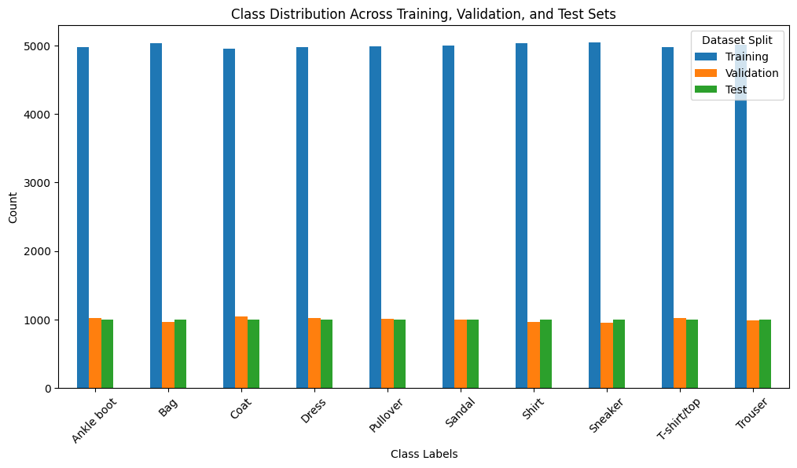
    


## <b>1.3</b>
### Print the range (minimum and maximum) of pixels in each part of the dataset. Scale the data by normalizing the pixel values.

As mentioned earlier, pixel values in Fashion MNIST are grayscale intensity values ranging from 0 (black) to 255 (white).


```python
print("\nOriginal Pixels Range:")
print("Training: Min =", X_train.min(), "Max =", X_train.max())
print("Validation: Min =", X_valid.min(), "Max =", X_valid.max())
print("Test: Min =", X_test.min(), "Max =", X_test.max())
```

    
    Original Pixels Range:
    Training: Min = 0 Max = 255
    Validation: Min = 0 Max = 255
    Test: Min = 0 Max = 255
    

Scale the pixel intensities down to the 0-1 range and convert them to floats, by dividing by 255


```python
X_train, X_valid, X_test = X_train / 255., X_valid / 255., X_test / 255.
```


```python
print("\nPixels Range After Scaling:")
print("Training: Min =", X_train.min(), "Max =", X_train.max())
print("Validation: Min =", X_valid.min(), "Max =", X_valid.max())
print("Test: Min =", X_test.min(), "Max =", X_test.max())
```

    
    Pixels Range After Scaling:
    Training: Min = 0.0 Max = 1.0
    Validation: Min = 0.0 Max = 1.0
    Test: Min = 0.0 Max = 1.0
    

Visualize the first image before and after normalization, side by side, for visual comparison. We verify that normalization does not distort the image.


```python
import matplotlib.pyplot as plt


fig, ax = plt.subplots(1, 2, figsize=(8, 4)) # Create a figure with 1 row and 2 columns of subplots, setting the figure size to 8x4

# Plot the first image from the full training set before normalization
ax[0].imshow(X_train_full[0], cmap="gray")
ax[0].set_title("Before Normalization")
ax[0].axis("off")
    
# Plot the first image from the normalized training set after normalization
ax[1].imshow(X_train[0], cmap="gray")
ax[1].set_title("After Normalization")
ax[1].axis("off")
    
plt.show()


```


    
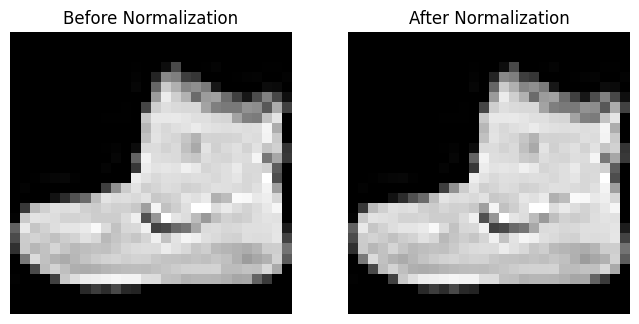
    


## <b>1.4</b>
### Create two data variants:
- ### The first will retain only the top half (upper portion) of each image.
- ### The second will retain the bottom half (lower portion) of each image.
### Crop each image along the height axis to create these two distinct representations.

Each image is stored in a NumPy array with shape <b>(number of samples, height of each image (28), width of each image (28))</b>. Therefore, to extract the top half of each image we use <b>[:, :14, :]</b> which selects <b>[ all samples, top 14 rows, all columns]</b>. Similarly <b>[:, 14:, :]</b> for the bottom half.


```python
X_train_top = X_train[:, :14, :]
X_train_bottom = X_train[:, 14:, :]

X_valid_top = X_valid[:, :14, :]
X_valid_bottom = X_valid[:, 14:, :]

X_test_top = X_test[:, :14, :]
X_test_bottom = X_test[:, 14:, :]
```

Print their shapes for verification


```python
print("\nShapes of Cropped Datasets:")
print("Training Top Half:", X_train_top.shape)
print("Training Bottom Half:", X_train_bottom.shape)
print("Validation Top Half:", X_valid_top.shape)
print("Validation Bottom Half:", X_valid_bottom.shape)
print("Test Top Half:", X_test_top.shape)
print("Test Bottom Half:", X_test_bottom.shape)
```

    
    Shapes of Cropped Datasets:
    Training Top Half: (50000, 14, 28)
    Training Bottom Half: (50000, 14, 28)
    Validation Top Half: (10000, 14, 28)
    Validation Bottom Half: (10000, 14, 28)
    Test Top Half: (10000, 14, 28)
    Test Bottom Half: (10000, 14, 28)
    


```python
fig, ax = plt.subplots(2, 2, figsize=(8, 8)) # Create a figure with 2 rows and 2 columns of subplots, setting the figure size to 8x8

# Plot the first image of the top half of the training set
ax[0, 0].imshow(X_train_top[0], cmap="gray")
ax[0, 0].set_title("Top Half")
ax[0, 0].axis("off")

# Plot the first image of the bottom half of the training set
ax[0, 1].imshow(X_train_bottom[0], cmap="gray")
ax[0, 1].set_title("Bottom Half")
ax[0, 1].axis("off")

# Plot the first image of the top half of the test set
ax[1, 0].imshow(X_test_top[0], cmap="gray")
ax[1, 0].set_title("Test Top Half")
ax[1, 0].axis("off")

# Plot the first image of the bottom half of the test set
ax[1, 1].imshow(X_test_bottom[0], cmap="gray")
ax[1, 1].set_title("Test Bottom Half")
ax[1, 1].axis("off")

plt.show()

```


    
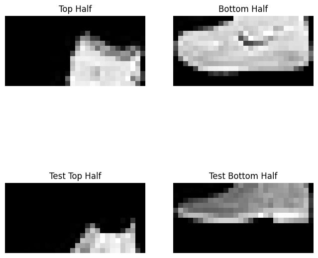
    


## <b>1.5</b>
### Visualize the first 20 instances from the training set for both variants. Use subplots with 4 rows and 5 columns to display them, verifying the correctness of your slicing process against a plot of the original images. [


```python
fig, axes = plt.subplots(4, 5, figsize=(10, 8)) # Create a figure with 4 rows and 5 columns of subplots, and set the figure size to 10x8
fig.suptitle("Original Images")

for i, ax in enumerate(axes.flat): # Loop over each subplot, flattening the 2D array of axes, and display the corresponding image from X_train
    ax.imshow(X_train[i], cmap="gray")
    ax.axis("off")
plt.show()
```


    
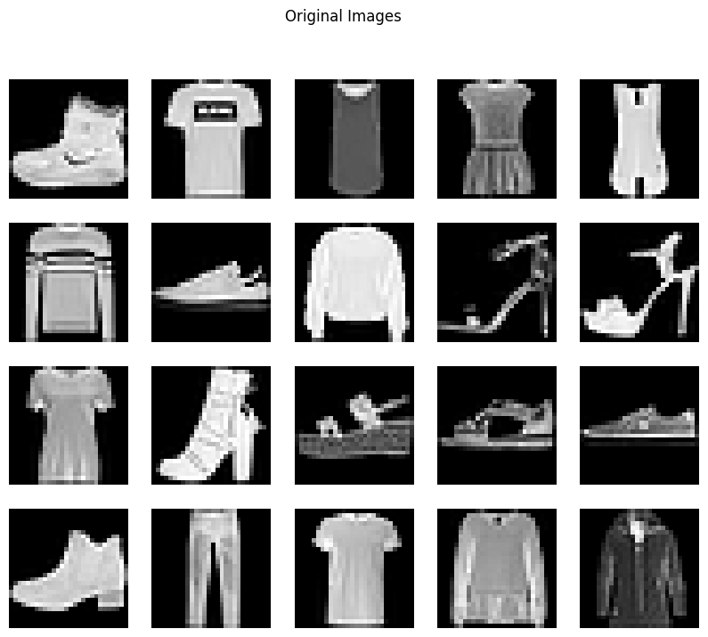
    


```python
fig, axes = plt.subplots(4, 5, figsize=(10, 8))
fig.suptitle("Top Half Images")
for i, ax in enumerate(axes.flat):
    ax.imshow(X_train_top[i], cmap="gray")
    ax.axis("off")
plt.show()
```


    
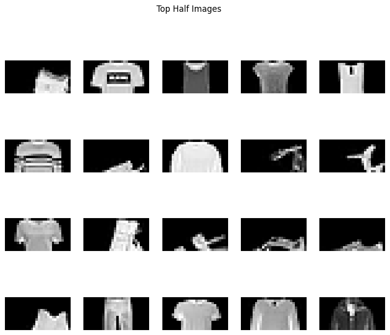
    


```python
fig, axes = plt.subplots(4, 5, figsize=(10, 8))
fig.suptitle("Bottom Half Images")
for i, ax in enumerate(axes.flat):
    ax.imshow(X_train_bottom[i], cmap="gray")
    ax.axis("off")
plt.show()
```


    
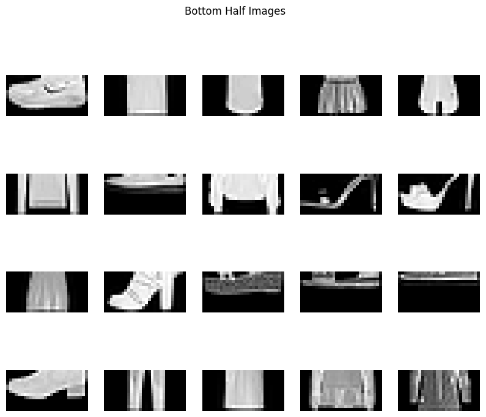
    


## <b>1.6</b>
### Build a neural network using Tensorflow/Keras for a multiclass classification task. The network should have two hidden dense layers with 128 and 64 nodes, and use ReLU as the activation function of each layer. The output layer should be compatible with multiclass classification. Compile the model using the SGD optimizer with a learning rate of $10^{-4}$ , sparse categorical cross-entropy as the loss function, and add classification accuracy to the metrics. Print a summary of the model.

Define a Sequential neural network model using Keras for multiclass classification. The model expects 28x28 grayscale images as input. It first flattens each image into a 1D vector, then passes it through two dense layers with 128 and 64 nodes respectively, both using ReLU activation. Finally, the output layer uses softmax activation to produce class probabilities for the 10 distinct classes.


```python
model_full = keras.Sequential([
    keras.layers.Input(shape=(28, 28)),
    keras.layers.Flatten(),
    keras.layers.Dense(128, activation="relu"), 
    keras.layers.Dense(64, activation="relu"),
    keras.layers.Dense(10, activation="softmax")
])
```

Compile the neural network model designed for cropped images. It uses the SGD optimizer with a learning rate of $10^{-4}$, applies sparse categorical crossentropy as the loss function (which is suitable when labels are provided as integers), and includes accuracy as a metric to evaluate the model's performance during training.


```python
model_full.compile(
    optimizer=keras.optimizers.SGD(learning_rate=1e-4),  # SGD optimizer with learning rate 10^(-4)
    loss="sparse_categorical_crossentropy",  # Loss function for multiclass classification
    metrics=["accuracy"]  # Classification accuracy
)
```


```python
model_full.summary()
```


<pre style="white-space:pre;overflow-x:auto;line-height:normal;font-family:Menlo,'DejaVu Sans Mono',consolas,'Courier New',monospace"><span style="font-weight: bold">Model: "sequential"</span>
</pre>


<pre style="white-space:pre;overflow-x:auto;line-height:normal;font-family:Menlo,'DejaVu Sans Mono',consolas,'Courier New',monospace">┏━━━━━━━━━━━━━━━━━━━━━━━━━━━━━━━━━━━━━━┳━━━━━━━━━━━━━━━━━━━━━━━━━━━━━┳━━━━━━━━━━━━━━━━━┓
┃<span style="font-weight: bold"> Layer (type)                         </span>┃<span style="font-weight: bold"> Output Shape                </span>┃<span style="font-weight: bold">         Param # </span>┃
┡━━━━━━━━━━━━━━━━━━━━━━━━━━━━━━━━━━━━━━╇━━━━━━━━━━━━━━━━━━━━━━━━━━━━━╇━━━━━━━━━━━━━━━━━┩
│ flatten (<span style="color: #0087ff; text-decoration-color: #0087ff">Flatten</span>)                    │ (<span style="color: #00d7ff; text-decoration-color: #00d7ff">None</span>, <span style="color: #00af00; text-decoration-color: #00af00">784</span>)                 │               <span style="color: #00af00; text-decoration-color: #00af00">0</span> │
├──────────────────────────────────────┼─────────────────────────────┼─────────────────┤
│ dense (<span style="color: #0087ff; text-decoration-color: #0087ff">Dense</span>)                        │ (<span style="color: #00d7ff; text-decoration-color: #00d7ff">None</span>, <span style="color: #00af00; text-decoration-color: #00af00">128</span>)                 │         <span style="color: #00af00; text-decoration-color: #00af00">100,480</span> │
├──────────────────────────────────────┼─────────────────────────────┼─────────────────┤
│ dense_1 (<span style="color: #0087ff; text-decoration-color: #0087ff">Dense</span>)                      │ (<span style="color: #00d7ff; text-decoration-color: #00d7ff">None</span>, <span style="color: #00af00; text-decoration-color: #00af00">64</span>)                  │           <span style="color: #00af00; text-decoration-color: #00af00">8,256</span> │
├──────────────────────────────────────┼─────────────────────────────┼─────────────────┤
│ dense_2 (<span style="color: #0087ff; text-decoration-color: #0087ff">Dense</span>)                      │ (<span style="color: #00d7ff; text-decoration-color: #00d7ff">None</span>, <span style="color: #00af00; text-decoration-color: #00af00">10</span>)                  │             <span style="color: #00af00; text-decoration-color: #00af00">650</span> │
└──────────────────────────────────────┴─────────────────────────────┴─────────────────┘
</pre>


<pre style="white-space:pre;overflow-x:auto;line-height:normal;font-family:Menlo,'DejaVu Sans Mono',consolas,'Courier New',monospace"><span style="font-weight: bold"> Total params: </span><span style="color: #00af00; text-decoration-color: #00af00">109,386</span> (427.29 KB)
</pre>


<pre style="white-space:pre;overflow-x:auto;line-height:normal;font-family:Menlo,'DejaVu Sans Mono',consolas,'Courier New',monospace"><span style="font-weight: bold"> Trainable params: </span><span style="color: #00af00; text-decoration-color: #00af00">109,386</span> (427.29 KB)
</pre>


<pre style="white-space:pre;overflow-x:auto;line-height:normal;font-family:Menlo,'DejaVu Sans Mono',consolas,'Courier New',monospace"><span style="font-weight: bold"> Non-trainable params: </span><span style="color: #00af00; text-decoration-color: #00af00">0</span> (0.00 B)
</pre>


The Param # column, indicates the number of trainable parameters in that layer:\
Flatten: 0 parameters because it only rearranges the data.\
Dense : Has 128 nodes, and each node is connected to all 784 inputs, plus one bias term per node. That results in $784 \cdot 128 + 128 = 100,480$ parameters.\
Dense_1 : Connects 128 nodes to 64 nodes. The parameters here are $128 \cdot 64 + 64 = 8,256$.\
Dense_2 : Maps 64 nodes to 10 classes, giving $64 \cdot 10 + 10 = 650$ parameters.


```python
# pip install pydot
```


```python
keras.utils.plot_model(model_full, "my_fashion_mnist_model_FULL.png", show_shapes=True, dpi=100)
```


    
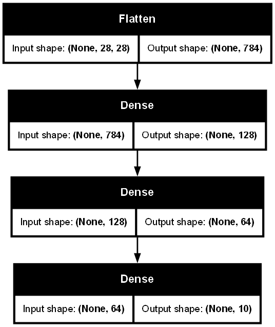
    


Define a Sequential model designed to work with cropped images of shape 14x28, which is half the height of the original 28x28 images. The model flattens the 2D input into a 1D vector, then passes it through two dense layers with 128 and 64 neurons respectively, both using ReLU activation. The final output layer uses softmax activation to produce probabilities for each of the 10 classes.


```python
model_cropped = keras.Sequential([
    keras.layers.Input(shape=(14, 28)),
    keras.layers.Flatten(),
    keras.layers.Dense(128, activation="relu"),
    keras.layers.Dense(64, activation="relu"),
    keras.layers.Dense(10, activation="softmax")
])
```


```python
model_cropped.compile(
    optimizer=keras.optimizers.SGD(learning_rate=1e-4),
    loss="sparse_categorical_crossentropy",
    metrics=["accuracy"]
)
```


```python
model_cropped.summary()
```


<pre style="white-space:pre;overflow-x:auto;line-height:normal;font-family:Menlo,'DejaVu Sans Mono',consolas,'Courier New',monospace"><span style="font-weight: bold">Model: "sequential_1"</span>
</pre>


<pre style="white-space:pre;overflow-x:auto;line-height:normal;font-family:Menlo,'DejaVu Sans Mono',consolas,'Courier New',monospace">┏━━━━━━━━━━━━━━━━━━━━━━━━━━━━━━━━━━━━━━┳━━━━━━━━━━━━━━━━━━━━━━━━━━━━━┳━━━━━━━━━━━━━━━━━┓
┃<span style="font-weight: bold"> Layer (type)                         </span>┃<span style="font-weight: bold"> Output Shape                </span>┃<span style="font-weight: bold">         Param # </span>┃
┡━━━━━━━━━━━━━━━━━━━━━━━━━━━━━━━━━━━━━━╇━━━━━━━━━━━━━━━━━━━━━━━━━━━━━╇━━━━━━━━━━━━━━━━━┩
│ flatten_1 (<span style="color: #0087ff; text-decoration-color: #0087ff">Flatten</span>)                  │ (<span style="color: #00d7ff; text-decoration-color: #00d7ff">None</span>, <span style="color: #00af00; text-decoration-color: #00af00">392</span>)                 │               <span style="color: #00af00; text-decoration-color: #00af00">0</span> │
├──────────────────────────────────────┼─────────────────────────────┼─────────────────┤
│ dense_3 (<span style="color: #0087ff; text-decoration-color: #0087ff">Dense</span>)                      │ (<span style="color: #00d7ff; text-decoration-color: #00d7ff">None</span>, <span style="color: #00af00; text-decoration-color: #00af00">128</span>)                 │          <span style="color: #00af00; text-decoration-color: #00af00">50,304</span> │
├──────────────────────────────────────┼─────────────────────────────┼─────────────────┤
│ dense_4 (<span style="color: #0087ff; text-decoration-color: #0087ff">Dense</span>)                      │ (<span style="color: #00d7ff; text-decoration-color: #00d7ff">None</span>, <span style="color: #00af00; text-decoration-color: #00af00">64</span>)                  │           <span style="color: #00af00; text-decoration-color: #00af00">8,256</span> │
├──────────────────────────────────────┼─────────────────────────────┼─────────────────┤
│ dense_5 (<span style="color: #0087ff; text-decoration-color: #0087ff">Dense</span>)                      │ (<span style="color: #00d7ff; text-decoration-color: #00d7ff">None</span>, <span style="color: #00af00; text-decoration-color: #00af00">10</span>)                  │             <span style="color: #00af00; text-decoration-color: #00af00">650</span> │
└──────────────────────────────────────┴─────────────────────────────┴─────────────────┘
</pre>


<pre style="white-space:pre;overflow-x:auto;line-height:normal;font-family:Menlo,'DejaVu Sans Mono',consolas,'Courier New',monospace"><span style="font-weight: bold"> Total params: </span><span style="color: #00af00; text-decoration-color: #00af00">59,210</span> (231.29 KB)
</pre>


<pre style="white-space:pre;overflow-x:auto;line-height:normal;font-family:Menlo,'DejaVu Sans Mono',consolas,'Courier New',monospace"><span style="font-weight: bold"> Trainable params: </span><span style="color: #00af00; text-decoration-color: #00af00">59,210</span> (231.29 KB)
</pre>


<pre style="white-space:pre;overflow-x:auto;line-height:normal;font-family:Menlo,'DejaVu Sans Mono',consolas,'Courier New',monospace"><span style="font-weight: bold"> Non-trainable params: </span><span style="color: #00af00; text-decoration-color: #00af00">0</span> (0.00 B)
</pre>


```python
keras.utils.plot_model(model_cropped, "my_fashion_mnist_model_CROPPED.png", show_shapes=True, dpi=100)
```


    

    


## <b>1.7</b>
### Train one model for each data variant, ensuring consistent weight initialization across both experiments. Hint: Store the initial random weights of the model in a variable. Train the model on the first data variant, and then reset the weights of the model to the stored weights. Train each model for 10 epochs with batches of 32 samples. Apply each trained model to the corresponding test set and export the classification report for each model using the scikit-learn library. Comment on the most important differences in the models’ performance per class.

Store initial random weights


```python
initial_weights = model_cropped.get_weights()
```

Train on the first variant - Top Half


```python
history_top = model_cropped.fit(X_train_top, y_train, epochs=10, batch_size=32, validation_data=(X_valid_top, y_valid))
```

    Epoch 1/10
    1563/1563 ━━━━━━━━━━━━━━━━━━━━ 2s 994us/step - accuracy: 0.1745 - loss: 2.2363 - val_accuracy: 0.2189 - val_loss: 2.1019
    Epoch 2/10
    1563/1563 ━━━━━━━━━━━━━━━━━━━━ 1s 923us/step - accuracy: 0.2482 - loss: 2.0709 - val_accuracy: 0.3503 - val_loss: 1.9744
    Epoch 3/10
    1563/1563 ━━━━━━━━━━━━━━━━━━━━ 1s 941us/step - accuracy: 0.3720 - loss: 1.9532 - val_accuracy: 0.4246 - val_loss: 1.8681
    Epoch 4/10
    1563/1563 ━━━━━━━━━━━━━━━━━━━━ 2s 949us/step - accuracy: 0.4332 - loss: 1.8484 - val_accuracy: 0.4583 - val_loss: 1.7746
    Epoch 5/10
    1563/1563 ━━━━━━━━━━━━━━━━━━━━ 1s 930us/step - accuracy: 0.4617 - loss: 1.7573 - val_accuracy: 0.4885 - val_loss: 1.6906
    Epoch 6/10
    1563/1563 ━━━━━━━━━━━━━━━━━━━━ 1s 927us/step - accuracy: 0.4955 - loss: 1.6763 - val_accuracy: 0.5239 - val_loss: 1.6157
    Epoch 7/10
    1563/1563 ━━━━━━━━━━━━━━━━━━━━ 1s 932us/step - accuracy: 0.5309 - loss: 1.5999 - val_accuracy: 0.5493 - val_loss: 1.5478
    Epoch 8/10
    1563/1563 ━━━━━━━━━━━━━━━━━━━━ 1s 937us/step - accuracy: 0.5526 - loss: 1.5348 - val_accuracy: 0.5681 - val_loss: 1.4860
    Epoch 9/10
    1563/1563 ━━━━━━━━━━━━━━━━━━━━ 1s 936us/step - accuracy: 0.5655 - loss: 1.4766 - val_accuracy: 0.5801 - val_loss: 1.4294
    Epoch 10/10
    1563/1563 ━━━━━━━━━━━━━━━━━━━━ 1s 921us/step - accuracy: 0.5806 - loss: 1.4189 - val_accuracy: 0.5902 - val_loss: 1.3780
    

Evaluate on test set


```python
from sklearn.metrics import classification_report

y_pred_top = model_cropped.predict(X_test_top).argmax(axis=1)
print("Classification Report for Top Half Model:")
print(classification_report(y_test, y_pred_top, target_names=labels))
```

    313/313 ━━━━━━━━━━━━━━━━━━━━ 0s 622us/step
    Classification Report for Top Half Model:
                  precision    recall  f1-score   support
    
     T-shirt/top       0.62      0.66      0.64      1000
         Trouser       0.66      0.92      0.77      1000
        Pullover       0.47      0.35      0.41      1000
           Dress       0.61      0.48      0.54      1000
            Coat       0.40      0.70      0.51      1000
          Sandal       0.89      0.01      0.02      1000
           Shirt       0.30      0.12      0.18      1000
         Sneaker       0.67      0.76      0.71      1000
             Bag       0.70      0.74      0.72      1000
      Ankle boot       0.59      0.98      0.74      1000
    
        accuracy                           0.57     10000
       macro avg       0.59      0.57      0.52     10000
    weighted avg       0.59      0.57      0.52     10000
    
    

Reset to the initial weights


```python
model_cropped.set_weights(initial_weights)
```

Train on the second variant - Bottom Half


```python
history_bottom = model_cropped.fit(X_train_bottom, y_train, epochs=10, batch_size=32, validation_data=(X_valid_bottom, y_valid))
```

    Epoch 1/10
    1563/1563 ━━━━━━━━━━━━━━━━━━━━ 1s 940us/step - accuracy: 0.1439 - loss: 2.3284 - val_accuracy: 0.1889 - val_loss: 2.1965
    Epoch 2/10
    1563/1563 ━━━━━━━━━━━━━━━━━━━━ 1s 939us/step - accuracy: 0.2090 - loss: 2.1672 - val_accuracy: 0.2785 - val_loss: 2.0723
    Epoch 3/10
    1563/1563 ━━━━━━━━━━━━━━━━━━━━ 1s 919us/step - accuracy: 0.3056 - loss: 2.0491 - val_accuracy: 0.3737 - val_loss: 1.9640
    Epoch 4/10
    1563/1563 ━━━━━━━━━━━━━━━━━━━━ 1s 912us/step - accuracy: 0.3909 - loss: 1.9448 - val_accuracy: 0.4418 - val_loss: 1.8651
    Epoch 5/10
    1563/1563 ━━━━━━━━━━━━━━━━━━━━ 1s 923us/step - accuracy: 0.4467 - loss: 1.8524 - val_accuracy: 0.4901 - val_loss: 1.7732
    Epoch 6/10
    1563/1563 ━━━━━━━━━━━━━━━━━━━━ 1s 919us/step - accuracy: 0.4925 - loss: 1.7607 - val_accuracy: 0.5176 - val_loss: 1.6894
    Epoch 7/10
    1563/1563 ━━━━━━━━━━━━━━━━━━━━ 1s 917us/step - accuracy: 0.5192 - loss: 1.6787 - val_accuracy: 0.5367 - val_loss: 1.6153
    Epoch 8/10
    1563/1563 ━━━━━━━━━━━━━━━━━━━━ 1s 923us/step - accuracy: 0.5328 - loss: 1.6078 - val_accuracy: 0.5452 - val_loss: 1.5501
    Epoch 9/10
    1563/1563 ━━━━━━━━━━━━━━━━━━━━ 1s 940us/step - accuracy: 0.5411 - loss: 1.5473 - val_accuracy: 0.5522 - val_loss: 1.4928
    Epoch 10/10
    1563/1563 ━━━━━━━━━━━━━━━━━━━━ 1s 929us/step - accuracy: 0.5554 - loss: 1.4841 - val_accuracy: 0.5565 - val_loss: 1.4424
    

Evaluate on test set


```python
y_pred_bottom = model_cropped.predict(X_test_bottom).argmax(axis=1)
print("Classification Report for Bottom Half Model:")
print(classification_report(y_test, y_pred_bottom, target_names=labels))
```

    313/313 ━━━━━━━━━━━━━━━━━━━━ 0s 558us/step
    Classification Report for Bottom Half Model:
                  precision    recall  f1-score   support
    
     T-shirt/top       0.54      0.78      0.63      1000
         Trouser       0.95      0.81      0.87      1000
        Pullover       0.43      0.34      0.38      1000
           Dress       0.67      0.68      0.68      1000
            Coat       0.32      0.52      0.39      1000
          Sandal       0.58      0.01      0.02      1000
           Shirt       0.21      0.06      0.09      1000
         Sneaker       0.54      0.89      0.67      1000
             Bag       0.57      0.54      0.55      1000
      Ankle boot       0.66      0.90      0.76      1000
    
        accuracy                           0.55     10000
       macro avg       0.55      0.55      0.51     10000
    weighted avg       0.55      0.55      0.51     10000
    
    


```python
# Extra code. Not requested.
import pandas as pd

data = {
    "Class": ["T-shirt/top", "Trouser", "Pullover", "Dress", "Coat", 
              "Sandal", "Shirt", "Sneaker", "Bag", "Ankle boot"],
    "Precision Top": [0.58, 0.60, 0.44, 0.52, 0.44, 0.92, 0.50, 0.75, 0.64, 0.58],
    "Recall Top":    [0.65, 0.91, 0.55, 0.31, 0.68, 0.01, 0.05, 0.69, 0.76, 0.99],
    "F1 Top":        [0.61, 0.72, 0.49, 0.39, 0.53, 0.02, 0.09, 0.72, 0.69, 0.73],
    "Precision Bottom": [0.53, 0.94, 0.47, 0.60, 0.29, 0.94, 0.15, 0.57, 0.46, 0.64],
    "Recall Bottom":    [0.69, 0.82, 0.52, 0.78, 0.31, 0.01, 0.02, 0.88, 0.57, 0.89],
    "F1 Bottom":        [0.60, 0.88, 0.49, 0.68, 0.30, 0.03, 0.03, 0.69, 0.51, 0.75],
}

df_results = pd.DataFrame(data).set_index("Class")

df_results = df_results[["Precision Top", "Precision Bottom", 
                         "Recall Top", "Recall Bottom", 
                         "F1 Top", "F1 Bottom"]]

def highlight_improved(row):
    styles = []
    for metric in ["Precision", "Recall", "F1"]:
        top_val = row[f"{metric} Top"]
        bottom_val = row[f"{metric} Bottom"]
        if top_val > bottom_val:
            styles.extend(["background-color: lightgreen", ""])  # highlight Top cell
        elif bottom_val > top_val:
            styles.extend(["", "background-color: lightgreen"])  # highlight Bottom cell
        else:
            styles.extend(["", ""])
    return styles

styled_df = df_results.style.apply(highlight_improved, axis=1).format("{:.2f}")

styled_df

```


<style type="text/css">
#T_aa605_row0_col0, #T_aa605_row0_col3, #T_aa605_row0_col4, #T_aa605_row1_col1, #T_aa605_row1_col2, #T_aa605_row1_col5, #T_aa605_row2_col1, #T_aa605_row2_col2, #T_aa605_row3_col1, #T_aa605_row3_col3, #T_aa605_row3_col5, #T_aa605_row4_col0, #T_aa605_row4_col2, #T_aa605_row4_col4, #T_aa605_row5_col1, #T_aa605_row5_col5, #T_aa605_row6_col0, #T_aa605_row6_col2, #T_aa605_row6_col4, #T_aa605_row7_col0, #T_aa605_row7_col3, #T_aa605_row7_col4, #T_aa605_row8_col0, #T_aa605_row8_col2, #T_aa605_row8_col4, #T_aa605_row9_col1, #T_aa605_row9_col2, #T_aa605_row9_col5 {
  background-color: lightgreen;
}
</style>
<table id="T_aa605">
  <thead>
    <tr>
      <th class="blank level0" >&nbsp;</th>
      <th id="T_aa605_level0_col0" class="col_heading level0 col0" >Precision Top</th>
      <th id="T_aa605_level0_col1" class="col_heading level0 col1" >Precision Bottom</th>
      <th id="T_aa605_level0_col2" class="col_heading level0 col2" >Recall Top</th>
      <th id="T_aa605_level0_col3" class="col_heading level0 col3" >Recall Bottom</th>
      <th id="T_aa605_level0_col4" class="col_heading level0 col4" >F1 Top</th>
      <th id="T_aa605_level0_col5" class="col_heading level0 col5" >F1 Bottom</th>
    </tr>
    <tr>
      <th class="index_name level0" >Class</th>
      <th class="blank col0" >&nbsp;</th>
      <th class="blank col1" >&nbsp;</th>
      <th class="blank col2" >&nbsp;</th>
      <th class="blank col3" >&nbsp;</th>
      <th class="blank col4" >&nbsp;</th>
      <th class="blank col5" >&nbsp;</th>
    </tr>
  </thead>
  <tbody>
    <tr>
      <th id="T_aa605_level0_row0" class="row_heading level0 row0" >T-shirt/top</th>
      <td id="T_aa605_row0_col0" class="data row0 col0" >0.58</td>
      <td id="T_aa605_row0_col1" class="data row0 col1" >0.53</td>
      <td id="T_aa605_row0_col2" class="data row0 col2" >0.65</td>
      <td id="T_aa605_row0_col3" class="data row0 col3" >0.69</td>
      <td id="T_aa605_row0_col4" class="data row0 col4" >0.61</td>
      <td id="T_aa605_row0_col5" class="data row0 col5" >0.60</td>
    </tr>
    <tr>
      <th id="T_aa605_level0_row1" class="row_heading level0 row1" >Trouser</th>
      <td id="T_aa605_row1_col0" class="data row1 col0" >0.60</td>
      <td id="T_aa605_row1_col1" class="data row1 col1" >0.94</td>
      <td id="T_aa605_row1_col2" class="data row1 col2" >0.91</td>
      <td id="T_aa605_row1_col3" class="data row1 col3" >0.82</td>
      <td id="T_aa605_row1_col4" class="data row1 col4" >0.72</td>
      <td id="T_aa605_row1_col5" class="data row1 col5" >0.88</td>
    </tr>
    <tr>
      <th id="T_aa605_level0_row2" class="row_heading level0 row2" >Pullover</th>
      <td id="T_aa605_row2_col0" class="data row2 col0" >0.44</td>
      <td id="T_aa605_row2_col1" class="data row2 col1" >0.47</td>
      <td id="T_aa605_row2_col2" class="data row2 col2" >0.55</td>
      <td id="T_aa605_row2_col3" class="data row2 col3" >0.52</td>
      <td id="T_aa605_row2_col4" class="data row2 col4" >0.49</td>
      <td id="T_aa605_row2_col5" class="data row2 col5" >0.49</td>
    </tr>
    <tr>
      <th id="T_aa605_level0_row3" class="row_heading level0 row3" >Dress</th>
      <td id="T_aa605_row3_col0" class="data row3 col0" >0.52</td>
      <td id="T_aa605_row3_col1" class="data row3 col1" >0.60</td>
      <td id="T_aa605_row3_col2" class="data row3 col2" >0.31</td>
      <td id="T_aa605_row3_col3" class="data row3 col3" >0.78</td>
      <td id="T_aa605_row3_col4" class="data row3 col4" >0.39</td>
      <td id="T_aa605_row3_col5" class="data row3 col5" >0.68</td>
    </tr>
    <tr>
      <th id="T_aa605_level0_row4" class="row_heading level0 row4" >Coat</th>
      <td id="T_aa605_row4_col0" class="data row4 col0" >0.44</td>
      <td id="T_aa605_row4_col1" class="data row4 col1" >0.29</td>
      <td id="T_aa605_row4_col2" class="data row4 col2" >0.68</td>
      <td id="T_aa605_row4_col3" class="data row4 col3" >0.31</td>
      <td id="T_aa605_row4_col4" class="data row4 col4" >0.53</td>
      <td id="T_aa605_row4_col5" class="data row4 col5" >0.30</td>
    </tr>
    <tr>
      <th id="T_aa605_level0_row5" class="row_heading level0 row5" >Sandal</th>
      <td id="T_aa605_row5_col0" class="data row5 col0" >0.92</td>
      <td id="T_aa605_row5_col1" class="data row5 col1" >0.94</td>
      <td id="T_aa605_row5_col2" class="data row5 col2" >0.01</td>
      <td id="T_aa605_row5_col3" class="data row5 col3" >0.01</td>
      <td id="T_aa605_row5_col4" class="data row5 col4" >0.02</td>
      <td id="T_aa605_row5_col5" class="data row5 col5" >0.03</td>
    </tr>
    <tr>
      <th id="T_aa605_level0_row6" class="row_heading level0 row6" >Shirt</th>
      <td id="T_aa605_row6_col0" class="data row6 col0" >0.50</td>
      <td id="T_aa605_row6_col1" class="data row6 col1" >0.15</td>
      <td id="T_aa605_row6_col2" class="data row6 col2" >0.05</td>
      <td id="T_aa605_row6_col3" class="data row6 col3" >0.02</td>
      <td id="T_aa605_row6_col4" class="data row6 col4" >0.09</td>
      <td id="T_aa605_row6_col5" class="data row6 col5" >0.03</td>
    </tr>
    <tr>
      <th id="T_aa605_level0_row7" class="row_heading level0 row7" >Sneaker</th>
      <td id="T_aa605_row7_col0" class="data row7 col0" >0.75</td>
      <td id="T_aa605_row7_col1" class="data row7 col1" >0.57</td>
      <td id="T_aa605_row7_col2" class="data row7 col2" >0.69</td>
      <td id="T_aa605_row7_col3" class="data row7 col3" >0.88</td>
      <td id="T_aa605_row7_col4" class="data row7 col4" >0.72</td>
      <td id="T_aa605_row7_col5" class="data row7 col5" >0.69</td>
    </tr>
    <tr>
      <th id="T_aa605_level0_row8" class="row_heading level0 row8" >Bag</th>
      <td id="T_aa605_row8_col0" class="data row8 col0" >0.64</td>
      <td id="T_aa605_row8_col1" class="data row8 col1" >0.46</td>
      <td id="T_aa605_row8_col2" class="data row8 col2" >0.76</td>
      <td id="T_aa605_row8_col3" class="data row8 col3" >0.57</td>
      <td id="T_aa605_row8_col4" class="data row8 col4" >0.69</td>
      <td id="T_aa605_row8_col5" class="data row8 col5" >0.51</td>
    </tr>
    <tr>
      <th id="T_aa605_level0_row9" class="row_heading level0 row9" >Ankle boot</th>
      <td id="T_aa605_row9_col0" class="data row9 col0" >0.58</td>
      <td id="T_aa605_row9_col1" class="data row9 col1" >0.64</td>
      <td id="T_aa605_row9_col2" class="data row9 col2" >0.99</td>
      <td id="T_aa605_row9_col3" class="data row9 col3" >0.89</td>
      <td id="T_aa605_row9_col4" class="data row9 col4" >0.73</td>
      <td id="T_aa605_row9_col5" class="data row9 col5" >0.75</td>
    </tr>
  </tbody>
</table>


Analyzing the two classification reports, we can draw some conclusions regarding which half of the image contributes more discriminative information for certain calsses. \
<i>We will mark TH for Top-Half and BH for Bottom-Half.</i>

The most notable differences appear in :
### <b> 1) Trouser and Dress: </b>
The bottom-half (BH) model shows a major improvement on these classes. Trouser precision jumnps from 0.60 (TH) to 0.94 (BH) and the f1-score improves from 0.72 to 0.88. Similarly, the Dress f1-score jumps from 0.39 (TH) to 0.68 (BH). This indicates that <b>the lower part of the images carry critical features for identifying trousers and dresses.</b> 

### <b> 2) Coat and Bag: </b>
In contrast, the top-half (TH) model performs notably better for Coat and Bag with their f1-scores jumping from 0.30 and 0.51, to 0.53 and 0.69 respectively. This suggests that <b>the upper part of the images contain more discriminative information for coats and bags.</b>

Other notable conclusions

### <b> Ankle Boots:</b> 
BH has higher precision (0.64 vs 0.58) and a slightly better f1-score (0.75 vs 0.73). However, we note that TH model, with 0.99 recall vs 0.89, is able to capture 99% of the images belonging to that class.

### <b> Sneaker:</b> 
Whilte TH model has better precision (0.75 vs 0.57) meaning it is more accurate in its captures, it has lower Recall (0.69 vs 0.88) meaning it captures less images belonging in that class than the BH model. F1-score gives a slight edge to the TH model 0.72 vs 0.69.

### <b> Shirt:</b> 
While both models struggle, when TH model identifies an item from this class, it is significantly more frequently correct than the BH model (0.50 vs 0.15).

### <b><u>Overall: </b></u>
Classes that rely heavily on lower-body features like Trouser, Dress, Ankle Boots, see a clear advantage when trained on the BH model. \
Upper-body related classes like Coat, Bag, T-shirt, seem to benefit from the TH model. \
Some classes like Shirts and Sandals are hard to classify in both halves. \
Pullover is a tie, seeing no difference among the two halves.

## <b>1.8</b>
### Identify test instances where one model correctly predicts the correct class, but the other model makes an incorrect prediction. For each case, display the first 5 instances along with the actual labels and the incorrect predictions from the competitor model.


```python
y_pred_top[:10], y_test[:10]
```


    (array([9, 2, 1, 1, 2, 1, 4, 4, 8, 7], dtype=int64),
     array([9, 2, 1, 1, 6, 1, 4, 6, 5, 7], dtype=uint8))


```python
y_pred_bottom[:10], y_test[:10]
```


    (array([9, 4, 1, 1, 6, 0, 8, 2, 7, 7], dtype=int64),
     array([9, 2, 1, 1, 6, 1, 4, 6, 5, 7], dtype=uint8))


```python
incorrect_labels_top = (y_pred_top != y_test)
incorrect_labels_bottom = (y_pred_bottom != y_test)
correct_labels_top = ~incorrect_labels_top
correct_labels_bottom = ~incorrect_labels_bottom
incorrect_labels_top, incorrect_labels_bottom
```


    (array([False, False, False, ...,  True, False,  True]),
     array([False,  True, False, ...,  True, False,  True]))


Cases labeled correctly by a single model


```python
disagreement_cases = np.where(correct_labels_top & incorrect_labels_bottom)[0]  # find the indices of instances where two conditions are met simultaneously
disagreement_cases
```


    array([   1,    5,    6, ..., 9988, 9989, 9991], dtype=int64)


```python
fig, axes = plt.subplots(1, 5, figsize=(15, 5))
for i, idx in enumerate(disagreement_cases[:5]):
    axes[i].imshow(X_test[idx], cmap="gray")
    axes[i].set_title(f"True: {labels[y_test[idx]]}\nBottom Pred: {labels[y_pred_bottom[idx]]}")
    axes[i].axis("off")
plt.show()
```


    
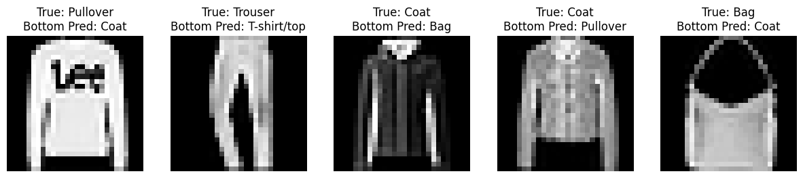
    


# Problem 2

#### In this task, you will explore strategies to help neural network architectures mitigate issues such as overfitting. To do this, you will leverage the dataset splits created in Problem 1. Your goal is to analyze the impact of each strategy when applied to a deep network architecture.

#### Apply the following models to the data that retain only the top half (upper portion) of each image of the Fashion MNIST database as generated up to the fourth step of Problem 1.

#### Train each model using an Adam optimizer, for 15 epochs with a batch size of 32, sparse categorical cross entropy as the loss function, and add accuracy as a metric. Ensure the output layer is appropriately configured for a multiclass problem.

#### For each of the four questions in this problem, print the model summary of each created model and generate a classification report using the scikit-learn library. Moreover, plot the training and the validation loss along with the training and the validation accuracy. In the same figure pinpoint the best epoch. Finally, comment on the obtained results. Did you notice any significant differences in performance?

## <b>2.1</b>
### Create and train a base model using Tensorflow/Keras library with three hidden layers of 128, 64, and 32 nodes, respectively, and add ReLU as their activation function


```python
from tensorflow import keras
```

Define the base neural network model. The model is designed to work with cropped images (top half) of shape 14x28. It flattens the 2D input into a 1D vector and passes it through three hidden dense layers with 128, 64, and 32 neurons respectively, all using ReLU activation. The output layer uses softmax activation to produce probabilities for the 10 classes.


```python
base_model = keras.Sequential([
    keras.layers.Input(shape=(14, 28)),
    keras.layers.Flatten(),
    keras.layers.Dense(128, activation="relu"),
    keras.layers.Dense(64, activation="relu"),
    keras.layers.Dense(32, activation="relu"),
    keras.layers.Dense(10, activation="softmax")
])
```

Compile the base neural network model using the Adam optimizer, sparse categorical crossentropy as the loss function, and accuracy as the evaluation metric. This configuration is appropriate for multiclass classification tasks where the labels are provided as integers.


```python
base_model.compile(
    optimizer=keras.optimizers.Adam(), 
    loss="sparse_categorical_crossentropy", 
    metrics=["accuracy"]
)
```


```python
base_model.summary()
```


<pre style="white-space:pre;overflow-x:auto;line-height:normal;font-family:Menlo,'DejaVu Sans Mono',consolas,'Courier New',monospace"><span style="font-weight: bold">Model: "sequential_6"</span>
</pre>


<pre style="white-space:pre;overflow-x:auto;line-height:normal;font-family:Menlo,'DejaVu Sans Mono',consolas,'Courier New',monospace">┏━━━━━━━━━━━━━━━━━━━━━━━━━━━━━━━━━━━━━━┳━━━━━━━━━━━━━━━━━━━━━━━━━━━━━┳━━━━━━━━━━━━━━━━━┓
┃<span style="font-weight: bold"> Layer (type)                         </span>┃<span style="font-weight: bold"> Output Shape                </span>┃<span style="font-weight: bold">         Param # </span>┃
┡━━━━━━━━━━━━━━━━━━━━━━━━━━━━━━━━━━━━━━╇━━━━━━━━━━━━━━━━━━━━━━━━━━━━━╇━━━━━━━━━━━━━━━━━┩
│ flatten_6 (<span style="color: #0087ff; text-decoration-color: #0087ff">Flatten</span>)                  │ (<span style="color: #00d7ff; text-decoration-color: #00d7ff">None</span>, <span style="color: #00af00; text-decoration-color: #00af00">392</span>)                 │               <span style="color: #00af00; text-decoration-color: #00af00">0</span> │
├──────────────────────────────────────┼─────────────────────────────┼─────────────────┤
│ dense_22 (<span style="color: #0087ff; text-decoration-color: #0087ff">Dense</span>)                     │ (<span style="color: #00d7ff; text-decoration-color: #00d7ff">None</span>, <span style="color: #00af00; text-decoration-color: #00af00">128</span>)                 │          <span style="color: #00af00; text-decoration-color: #00af00">50,304</span> │
├──────────────────────────────────────┼─────────────────────────────┼─────────────────┤
│ dense_23 (<span style="color: #0087ff; text-decoration-color: #0087ff">Dense</span>)                     │ (<span style="color: #00d7ff; text-decoration-color: #00d7ff">None</span>, <span style="color: #00af00; text-decoration-color: #00af00">64</span>)                  │           <span style="color: #00af00; text-decoration-color: #00af00">8,256</span> │
├──────────────────────────────────────┼─────────────────────────────┼─────────────────┤
│ dense_24 (<span style="color: #0087ff; text-decoration-color: #0087ff">Dense</span>)                     │ (<span style="color: #00d7ff; text-decoration-color: #00d7ff">None</span>, <span style="color: #00af00; text-decoration-color: #00af00">32</span>)                  │           <span style="color: #00af00; text-decoration-color: #00af00">2,080</span> │
├──────────────────────────────────────┼─────────────────────────────┼─────────────────┤
│ dense_25 (<span style="color: #0087ff; text-decoration-color: #0087ff">Dense</span>)                     │ (<span style="color: #00d7ff; text-decoration-color: #00d7ff">None</span>, <span style="color: #00af00; text-decoration-color: #00af00">10</span>)                  │             <span style="color: #00af00; text-decoration-color: #00af00">330</span> │
└──────────────────────────────────────┴─────────────────────────────┴─────────────────┘
</pre>


<pre style="white-space:pre;overflow-x:auto;line-height:normal;font-family:Menlo,'DejaVu Sans Mono',consolas,'Courier New',monospace"><span style="font-weight: bold"> Total params: </span><span style="color: #00af00; text-decoration-color: #00af00">60,970</span> (238.16 KB)
</pre>


<pre style="white-space:pre;overflow-x:auto;line-height:normal;font-family:Menlo,'DejaVu Sans Mono',consolas,'Courier New',monospace"><span style="font-weight: bold"> Trainable params: </span><span style="color: #00af00; text-decoration-color: #00af00">60,970</span> (238.16 KB)
</pre>


<pre style="white-space:pre;overflow-x:auto;line-height:normal;font-family:Menlo,'DejaVu Sans Mono',consolas,'Courier New',monospace"><span style="font-weight: bold"> Non-trainable params: </span><span style="color: #00af00; text-decoration-color: #00af00">0</span> (0.00 B)
</pre>


Train the base neural network model using the top half images (X_train_top) and the corresponding training labels (y_train). The model is trained for 15 epochs with a batch size of 32. Validation is performed on the validation set (X_valid_top, y_valid) after each epoch, and the training history is stored in the variable `history_base`.


```python
history_base=base_model.fit(X_train_top, y_train, epochs=15, batch_size=32, validation_data=(X_valid_top, y_valid))
```

    Epoch 1/15
    1563/1563 ━━━━━━━━━━━━━━━━━━━━ 2s 1ms/step - accuracy: 0.7094 - loss: 0.8241 - val_accuracy: 0.8059 - val_loss: 0.5126
    Epoch 2/15
    1563/1563 ━━━━━━━━━━━━━━━━━━━━ 2s 1ms/step - accuracy: 0.8126 - loss: 0.4987 - val_accuracy: 0.8247 - val_loss: 0.4672
    Epoch 3/15
    1563/1563 ━━━━━━━━━━━━━━━━━━━━ 2s 1ms/step - accuracy: 0.8270 - loss: 0.4603 - val_accuracy: 0.8270 - val_loss: 0.4549
    Epoch 4/15
    1563/1563 ━━━━━━━━━━━━━━━━━━━━ 2s 1ms/step - accuracy: 0.8367 - loss: 0.4289 - val_accuracy: 0.8284 - val_loss: 0.4638
    Epoch 5/15
    1563/1563 ━━━━━━━━━━━━━━━━━━━━ 2s 1ms/step - accuracy: 0.8395 - loss: 0.4176 - val_accuracy: 0.8311 - val_loss: 0.4548
    Epoch 6/15
    1563/1563 ━━━━━━━━━━━━━━━━━━━━ 2s 1ms/step - accuracy: 0.8455 - loss: 0.4010 - val_accuracy: 0.8286 - val_loss: 0.4523
    Epoch 7/15
    1563/1563 ━━━━━━━━━━━━━━━━━━━━ 2s 1ms/step - accuracy: 0.8517 - loss: 0.3843 - val_accuracy: 0.8411 - val_loss: 0.4248
    Epoch 8/15
    1563/1563 ━━━━━━━━━━━━━━━━━━━━ 2s 1ms/step - accuracy: 0.8574 - loss: 0.3679 - val_accuracy: 0.8365 - val_loss: 0.4323
    Epoch 9/15
    1563/1563 ━━━━━━━━━━━━━━━━━━━━ 2s 1ms/step - accuracy: 0.8572 - loss: 0.3684 - val_accuracy: 0.8461 - val_loss: 0.4167
    Epoch 10/15
    1563/1563 ━━━━━━━━━━━━━━━━━━━━ 2s 1ms/step - accuracy: 0.8660 - loss: 0.3482 - val_accuracy: 0.8414 - val_loss: 0.4322
    Epoch 11/15
    1563/1563 ━━━━━━━━━━━━━━━━━━━━ 2s 1ms/step - accuracy: 0.8654 - loss: 0.3483 - val_accuracy: 0.8358 - val_loss: 0.4550
    Epoch 12/15
    1563/1563 ━━━━━━━━━━━━━━━━━━━━ 2s 1ms/step - accuracy: 0.8698 - loss: 0.3383 - val_accuracy: 0.8414 - val_loss: 0.4429
    Epoch 13/15
    1563/1563 ━━━━━━━━━━━━━━━━━━━━ 2s 1ms/step - accuracy: 0.8713 - loss: 0.3273 - val_accuracy: 0.8492 - val_loss: 0.4202
    Epoch 14/15
    1563/1563 ━━━━━━━━━━━━━━━━━━━━ 2s 1ms/step - accuracy: 0.8753 - loss: 0.3193 - val_accuracy: 0.8414 - val_loss: 0.4542
    Epoch 15/15
    1563/1563 ━━━━━━━━━━━━━━━━━━━━ 2s 1ms/step - accuracy: 0.8820 - loss: 0.3070 - val_accuracy: 0.8521 - val_loss: 0.4222
    

Evaluate the model on the test set


```python
y_pred_base = base_model.predict(X_test_top).argmax(axis=1)
print("Classification Report for Base Model:")
print(classification_report(y_test, y_pred_base, target_names=labels))
```

    313/313 ━━━━━━━━━━━━━━━━━━━━ 0s 663us/step
    Classification Report for Base Model:
                  precision    recall  f1-score   support
    
     T-shirt/top       0.82      0.78      0.80      1000
         Trouser       0.99      0.94      0.96      1000
        Pullover       0.74      0.74      0.74      1000
           Dress       0.82      0.90      0.86      1000
            Coat       0.70      0.74      0.72      1000
          Sandal       0.96      0.94      0.95      1000
           Shirt       0.63      0.59      0.61      1000
         Sneaker       0.91      0.93      0.92      1000
             Bag       0.96      0.96      0.96      1000
      Ankle boot       0.92      0.93      0.92      1000
    
        accuracy                           0.85     10000
       macro avg       0.85      0.85      0.85     10000
    weighted avg       0.85      0.85      0.85     10000
    
    


```python
plt.figure(figsize=(10, 5))
# Loop over each key in the training history dictionary and assign a style for plotting. The zip pairs each key with a corresponding line style.
for key, style in zip(history_base.history, ["r--", "r--.", "b-", "b-*"]):  
    # The validation error is computed at the end of each epoch, while the training error is computed using a running mean during each epoch, 
    # so the training curve should be shifted by half an epoch to the left.
    # Adjust epochs: if key is for validation (starts with 'val_'), no shift. For training keys, shift by -0.5 for better visibility
    epochs = np.array(history_base.epoch) + (0 if key.startswith("val_") else -0.5)
    # Plot the history values for this key with the specified style and label it with the key
    plt.plot(epochs, history_base.history[key], style, label=key)

# Determine the epoch index where the validation loss is minimum
best_epoch = np.argmin(history_base.history['val_loss'])
# Draw a vertical line at the best epoch (add 1 to counter for Python's zero-indexing) with an orange dashed line
plt.axvline(best_epoch, color='orange', linestyle='--', label=f'Best Epoch: {best_epoch + 1}')

# Set the x-ticks to represent each epoch (starting at 1) using the number of epochs in the training history
plt.xticks(ticks=np.arange(len(history_base.epoch)), labels=np.arange(1, len(history_base.epoch) + 1))
plt.xlabel("Epoch")
plt.ylabel("Loss / Accuracy")
plt.legend(loc="right")
plt.grid()
plt.title("Training & Validation History with Shifted Training Curve")
plt.show()
```


    
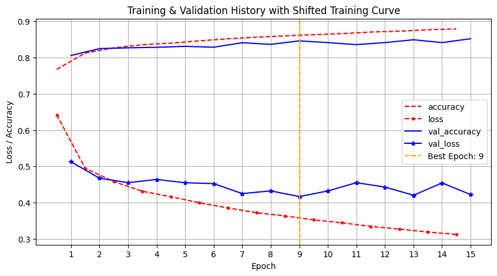
    


<b>Best Epoch: 9</b> \
The training accuracy is steadily increasing reaching around 88%. The model learns the training data well.\
The validation accuracy remains around 85% suggesting mild overfitting since the gap between training and validation performance is notable\
The training loss decreases steadily, indicating that the model is effectively minimizing the error on training data\
The validation loss remains steadily high, showing no major improvement. The fact that it doesn't continue decreasing in sync with training loss, means that the model learns training-specific patterns that do not help reduce calidaiton loss, which supports the observation of overfitting. \
#### <b>Summary</b>
The base model sets a good baseline, achieving decent performance but also demonstrating a classic overfitting pattern.


## <b>2.2</b>
### Rebuild and train the base model after adding an early stopping mechanism, with a patience argument of 3, and track the validation loss.

Set up an early stopping mechanism for training the model. The EarlyStopping callback monitors the validation loss and stops training if it does not improve for 3 consecutive epochs (`patience=3`). Additionally, it restores the model weights from the epoch with the best validation loss by setting `restore_best_weights=True`.


```python
early_stopping = keras.callbacks.EarlyStopping(monitor='val_loss', patience=3, restore_best_weights=True)
```

Define a Sequential model using early stopping.


```python
model_early_stopping = keras.Sequential([
    keras.layers.Input(shape=(14,28)),
    keras.layers.Flatten(),
    keras.layers.Dense(128, activation="relu"),
    keras.layers.Dense(64, activation="relu"),
    keras.layers.Dense(32, activation="relu"),
    keras.layers.Dense(10, activation="softmax")
])    
```

Compile the model


```python
model_early_stopping.compile(
    optimizer=keras.optimizers.Adam(),
    loss="sparse_categorical_crossentropy",
    metrics=["accuracy"]
)
```


```python
model_early_stopping.summary()
```


<pre style="white-space:pre;overflow-x:auto;line-height:normal;font-family:Menlo,'DejaVu Sans Mono',consolas,'Courier New',monospace"><span style="font-weight: bold">Model: "sequential_7"</span>
</pre>


<pre style="white-space:pre;overflow-x:auto;line-height:normal;font-family:Menlo,'DejaVu Sans Mono',consolas,'Courier New',monospace">┏━━━━━━━━━━━━━━━━━━━━━━━━━━━━━━━━━━━━━━┳━━━━━━━━━━━━━━━━━━━━━━━━━━━━━┳━━━━━━━━━━━━━━━━━┓
┃<span style="font-weight: bold"> Layer (type)                         </span>┃<span style="font-weight: bold"> Output Shape                </span>┃<span style="font-weight: bold">         Param # </span>┃
┡━━━━━━━━━━━━━━━━━━━━━━━━━━━━━━━━━━━━━━╇━━━━━━━━━━━━━━━━━━━━━━━━━━━━━╇━━━━━━━━━━━━━━━━━┩
│ flatten_7 (<span style="color: #0087ff; text-decoration-color: #0087ff">Flatten</span>)                  │ (<span style="color: #00d7ff; text-decoration-color: #00d7ff">None</span>, <span style="color: #00af00; text-decoration-color: #00af00">392</span>)                 │               <span style="color: #00af00; text-decoration-color: #00af00">0</span> │
├──────────────────────────────────────┼─────────────────────────────┼─────────────────┤
│ dense_26 (<span style="color: #0087ff; text-decoration-color: #0087ff">Dense</span>)                     │ (<span style="color: #00d7ff; text-decoration-color: #00d7ff">None</span>, <span style="color: #00af00; text-decoration-color: #00af00">128</span>)                 │          <span style="color: #00af00; text-decoration-color: #00af00">50,304</span> │
├──────────────────────────────────────┼─────────────────────────────┼─────────────────┤
│ dense_27 (<span style="color: #0087ff; text-decoration-color: #0087ff">Dense</span>)                     │ (<span style="color: #00d7ff; text-decoration-color: #00d7ff">None</span>, <span style="color: #00af00; text-decoration-color: #00af00">64</span>)                  │           <span style="color: #00af00; text-decoration-color: #00af00">8,256</span> │
├──────────────────────────────────────┼─────────────────────────────┼─────────────────┤
│ dense_28 (<span style="color: #0087ff; text-decoration-color: #0087ff">Dense</span>)                     │ (<span style="color: #00d7ff; text-decoration-color: #00d7ff">None</span>, <span style="color: #00af00; text-decoration-color: #00af00">32</span>)                  │           <span style="color: #00af00; text-decoration-color: #00af00">2,080</span> │
├──────────────────────────────────────┼─────────────────────────────┼─────────────────┤
│ dense_29 (<span style="color: #0087ff; text-decoration-color: #0087ff">Dense</span>)                     │ (<span style="color: #00d7ff; text-decoration-color: #00d7ff">None</span>, <span style="color: #00af00; text-decoration-color: #00af00">10</span>)                  │             <span style="color: #00af00; text-decoration-color: #00af00">330</span> │
└──────────────────────────────────────┴─────────────────────────────┴─────────────────┘
</pre>


<pre style="white-space:pre;overflow-x:auto;line-height:normal;font-family:Menlo,'DejaVu Sans Mono',consolas,'Courier New',monospace"><span style="font-weight: bold"> Total params: </span><span style="color: #00af00; text-decoration-color: #00af00">60,970</span> (238.16 KB)
</pre>


<pre style="white-space:pre;overflow-x:auto;line-height:normal;font-family:Menlo,'DejaVu Sans Mono',consolas,'Courier New',monospace"><span style="font-weight: bold"> Trainable params: </span><span style="color: #00af00; text-decoration-color: #00af00">60,970</span> (238.16 KB)
</pre>


<pre style="white-space:pre;overflow-x:auto;line-height:normal;font-family:Menlo,'DejaVu Sans Mono',consolas,'Courier New',monospace"><span style="font-weight: bold"> Non-trainable params: </span><span style="color: #00af00; text-decoration-color: #00af00">0</span> (0.00 B)
</pre>


Train the model with early stoping on top-half images


```python
history_early_stopping=model_early_stopping.fit(X_train_top, y_train, epochs=15, batch_size=32,
                                                validation_data=(X_valid_top, y_valid), callbacks=[early_stopping])
```

    Epoch 1/15
    1563/1563 ━━━━━━━━━━━━━━━━━━━━ 3s 1ms/step - accuracy: 0.7066 - loss: 0.8286 - val_accuracy: 0.8025 - val_loss: 0.5231
    Epoch 2/15
    1563/1563 ━━━━━━━━━━━━━━━━━━━━ 2s 1ms/step - accuracy: 0.8109 - loss: 0.5021 - val_accuracy: 0.8231 - val_loss: 0.4782
    Epoch 3/15
    1563/1563 ━━━━━━━━━━━━━━━━━━━━ 2s 1ms/step - accuracy: 0.8270 - loss: 0.4541 - val_accuracy: 0.8193 - val_loss: 0.4798
    Epoch 4/15
    1563/1563 ━━━━━━━━━━━━━━━━━━━━ 2s 1ms/step - accuracy: 0.8373 - loss: 0.4328 - val_accuracy: 0.8348 - val_loss: 0.4395
    Epoch 5/15
    1563/1563 ━━━━━━━━━━━━━━━━━━━━ 2s 1ms/step - accuracy: 0.8447 - loss: 0.4106 - val_accuracy: 0.8377 - val_loss: 0.4287
    Epoch 6/15
    1563/1563 ━━━━━━━━━━━━━━━━━━━━ 2s 1ms/step - accuracy: 0.8493 - loss: 0.3973 - val_accuracy: 0.8366 - val_loss: 0.4389
    Epoch 7/15
    1563/1563 ━━━━━━━━━━━━━━━━━━━━ 2s 1ms/step - accuracy: 0.8519 - loss: 0.3844 - val_accuracy: 0.8347 - val_loss: 0.4520
    Epoch 8/15
    1563/1563 ━━━━━━━━━━━━━━━━━━━━ 2s 1ms/step - accuracy: 0.8568 - loss: 0.3702 - val_accuracy: 0.8363 - val_loss: 0.4385
    

Evaluate the model on the test set


```python
y_pred_early_stopping = model_early_stopping.predict(X_test_top).argmax(axis=1)
print("Classification Report for Early Stopping Model")
print(classification_report(y_test, y_pred_early_stopping,target_names=labels))
```

    313/313 ━━━━━━━━━━━━━━━━━━━━ 0s 647us/step
    Classification Report for Early Stopping Model
                  precision    recall  f1-score   support
    
     T-shirt/top       0.83      0.73      0.78      1000
         Trouser       0.98      0.93      0.95      1000
        Pullover       0.71      0.69      0.70      1000
           Dress       0.83      0.86      0.85      1000
            Coat       0.67      0.72      0.70      1000
          Sandal       0.96      0.93      0.94      1000
           Shirt       0.56      0.60      0.58      1000
         Sneaker       0.87      0.95      0.90      1000
             Bag       0.96      0.96      0.96      1000
      Ankle boot       0.94      0.88      0.91      1000
    
        accuracy                           0.83     10000
       macro avg       0.83      0.83      0.83     10000
    weighted avg       0.83      0.83      0.83     10000
    
    

Plot training history


```python
plt.figure(figsize=(10,5))
for key, style in zip(history_early_stopping.history, ["r--", "r--.", "b-", "b-*"]):
    epochs = np.array(history_early_stopping.epoch) + (0 if key.startswith("val_") else -0.5)
    plt.plot(epochs, history_early_stopping.history[key], style, label=key)

best_epoch_early = np.argmin(history_early_stopping.history['val_loss'])
plt.axvline(best_epoch_early, color='orange', linestyle='--', label=f'Best Epoch: {best_epoch_early + 1}')

plt.xticks(ticks=np.arange(len(history_base.epoch)), labels=np.arange(1, len(history_base.epoch) + 1))
plt.xlabel("Epoch")
plt.ylabel("Loss / Accuracy")
plt.legend(loc="lower right")
plt.grid()
plt.title("Training & Validation History with Early Stopping and Shifted Training Curve")
plt.show()
```


    
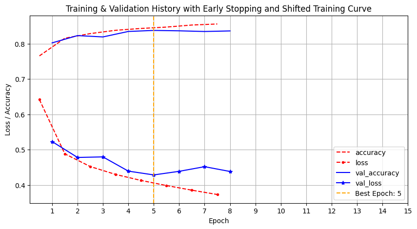
    


<b>Best Epoch: 5</b> \
The early stopping was triggered at epoch 5, preventing unecessary training, even though it may stop before the highest training accuracy is reached. \
The training accuracy steadily increases, approaching 85%. This means it does not achieve the same higher training accuracy as the base model, but avoids overfitting. \
The validation accuracy maintained around 83%, which is still good, even though it is lower than the base model. The smaller gap between training and validation accuracy suggests a better generalization. \
The training loss decreases quickly. Once it starts flattening out, the early stopping kicks in. The quick drop suggests that the model learns the main patterns quickly. \
The validation loss drops fast unil around 43%, then followed by three epochs with no improvement, setting off the early stopping. 

#### <b>Summary</b>
Early stopping is beneficial for preventing unnecessary training and overfitting. While the final validation accuracy is close to the base model, this approach saves training time and typically produces a model that generalizes well without over-tailoring to the training set.

## <b>2.3</b>
### Rebuild and train the base model after incorporating a batch normalization layer after each dense layer (do not use early stopping, and ensure the use bias argument of dense layers is set to False).  

Define a Sequential model that incorporates batch normalization after each dense layer.


```python
model_batch_normalization = keras.Sequential([
    keras.layers.Input(shape=(14, 28)),
    keras.layers.Flatten(),
    keras.layers.Dense(128, activation="relu", use_bias=False),
    keras.layers.BatchNormalization(),
    keras.layers.Dense(64, activation="relu", use_bias=False),
    keras.layers.BatchNormalization(),
    keras.layers.Dense(32, activation="relu", use_bias=False),
    keras.layers.BatchNormalization(),
    keras.layers.Dense(10, activation="softmax")
])
```

Compile the model


```python
model_batch_normalization.compile(
    optimizer=keras.optimizers.Adam(),
    loss="sparse_categorical_crossentropy",
    metrics=["accuracy"]
)
```


```python
model_batch_normalization.summary()
```


<pre style="white-space:pre;overflow-x:auto;line-height:normal;font-family:Menlo,'DejaVu Sans Mono',consolas,'Courier New',monospace"><span style="font-weight: bold">Model: "sequential_8"</span>
</pre>


<pre style="white-space:pre;overflow-x:auto;line-height:normal;font-family:Menlo,'DejaVu Sans Mono',consolas,'Courier New',monospace">┏━━━━━━━━━━━━━━━━━━━━━━━━━━━━━━━━━━━━━━┳━━━━━━━━━━━━━━━━━━━━━━━━━━━━━┳━━━━━━━━━━━━━━━━━┓
┃<span style="font-weight: bold"> Layer (type)                         </span>┃<span style="font-weight: bold"> Output Shape                </span>┃<span style="font-weight: bold">         Param # </span>┃
┡━━━━━━━━━━━━━━━━━━━━━━━━━━━━━━━━━━━━━━╇━━━━━━━━━━━━━━━━━━━━━━━━━━━━━╇━━━━━━━━━━━━━━━━━┩
│ flatten_8 (<span style="color: #0087ff; text-decoration-color: #0087ff">Flatten</span>)                  │ (<span style="color: #00d7ff; text-decoration-color: #00d7ff">None</span>, <span style="color: #00af00; text-decoration-color: #00af00">392</span>)                 │               <span style="color: #00af00; text-decoration-color: #00af00">0</span> │
├──────────────────────────────────────┼─────────────────────────────┼─────────────────┤
│ dense_30 (<span style="color: #0087ff; text-decoration-color: #0087ff">Dense</span>)                     │ (<span style="color: #00d7ff; text-decoration-color: #00d7ff">None</span>, <span style="color: #00af00; text-decoration-color: #00af00">128</span>)                 │          <span style="color: #00af00; text-decoration-color: #00af00">50,176</span> │
├──────────────────────────────────────┼─────────────────────────────┼─────────────────┤
│ batch_normalization_3                │ (<span style="color: #00d7ff; text-decoration-color: #00d7ff">None</span>, <span style="color: #00af00; text-decoration-color: #00af00">128</span>)                 │             <span style="color: #00af00; text-decoration-color: #00af00">512</span> │
│ (<span style="color: #0087ff; text-decoration-color: #0087ff">BatchNormalization</span>)                 │                             │                 │
├──────────────────────────────────────┼─────────────────────────────┼─────────────────┤
│ dense_31 (<span style="color: #0087ff; text-decoration-color: #0087ff">Dense</span>)                     │ (<span style="color: #00d7ff; text-decoration-color: #00d7ff">None</span>, <span style="color: #00af00; text-decoration-color: #00af00">64</span>)                  │           <span style="color: #00af00; text-decoration-color: #00af00">8,192</span> │
├──────────────────────────────────────┼─────────────────────────────┼─────────────────┤
│ batch_normalization_4                │ (<span style="color: #00d7ff; text-decoration-color: #00d7ff">None</span>, <span style="color: #00af00; text-decoration-color: #00af00">64</span>)                  │             <span style="color: #00af00; text-decoration-color: #00af00">256</span> │
│ (<span style="color: #0087ff; text-decoration-color: #0087ff">BatchNormalization</span>)                 │                             │                 │
├──────────────────────────────────────┼─────────────────────────────┼─────────────────┤
│ dense_32 (<span style="color: #0087ff; text-decoration-color: #0087ff">Dense</span>)                     │ (<span style="color: #00d7ff; text-decoration-color: #00d7ff">None</span>, <span style="color: #00af00; text-decoration-color: #00af00">32</span>)                  │           <span style="color: #00af00; text-decoration-color: #00af00">2,048</span> │
├──────────────────────────────────────┼─────────────────────────────┼─────────────────┤
│ batch_normalization_5                │ (<span style="color: #00d7ff; text-decoration-color: #00d7ff">None</span>, <span style="color: #00af00; text-decoration-color: #00af00">32</span>)                  │             <span style="color: #00af00; text-decoration-color: #00af00">128</span> │
│ (<span style="color: #0087ff; text-decoration-color: #0087ff">BatchNormalization</span>)                 │                             │                 │
├──────────────────────────────────────┼─────────────────────────────┼─────────────────┤
│ dense_33 (<span style="color: #0087ff; text-decoration-color: #0087ff">Dense</span>)                     │ (<span style="color: #00d7ff; text-decoration-color: #00d7ff">None</span>, <span style="color: #00af00; text-decoration-color: #00af00">10</span>)                  │             <span style="color: #00af00; text-decoration-color: #00af00">330</span> │
└──────────────────────────────────────┴─────────────────────────────┴─────────────────┘
</pre>


<pre style="white-space:pre;overflow-x:auto;line-height:normal;font-family:Menlo,'DejaVu Sans Mono',consolas,'Courier New',monospace"><span style="font-weight: bold"> Total params: </span><span style="color: #00af00; text-decoration-color: #00af00">61,642</span> (240.79 KB)
</pre>


<pre style="white-space:pre;overflow-x:auto;line-height:normal;font-family:Menlo,'DejaVu Sans Mono',consolas,'Courier New',monospace"><span style="font-weight: bold"> Trainable params: </span><span style="color: #00af00; text-decoration-color: #00af00">61,194</span> (239.04 KB)
</pre>


<pre style="white-space:pre;overflow-x:auto;line-height:normal;font-family:Menlo,'DejaVu Sans Mono',consolas,'Courier New',monospace"><span style="font-weight: bold"> Non-trainable params: </span><span style="color: #00af00; text-decoration-color: #00af00">448</span> (1.75 KB)
</pre>


Train the model with batch normalization on top-half images


```python
history_batch_normalization = model_batch_normalization.fit(
    X_train_top, y_train, epochs=15, batch_size=32,
    validation_data=(X_valid_top, y_valid)
)
```

    Epoch 1/15
    1563/1563 ━━━━━━━━━━━━━━━━━━━━ 3s 1ms/step - accuracy: 0.7235 - loss: 0.8007 - val_accuracy: 0.7896 - val_loss: 0.5570
    Epoch 2/15
    1563/1563 ━━━━━━━━━━━━━━━━━━━━ 2s 1ms/step - accuracy: 0.8031 - loss: 0.5287 - val_accuracy: 0.8102 - val_loss: 0.5142
    Epoch 3/15
    1563/1563 ━━━━━━━━━━━━━━━━━━━━ 2s 1ms/step - accuracy: 0.8143 - loss: 0.4944 - val_accuracy: 0.8137 - val_loss: 0.4895
    Epoch 4/15
    1563/1563 ━━━━━━━━━━━━━━━━━━━━ 2s 1ms/step - accuracy: 0.8225 - loss: 0.4763 - val_accuracy: 0.8264 - val_loss: 0.4556
    Epoch 5/15
    1563/1563 ━━━━━━━━━━━━━━━━━━━━ 2s 1ms/step - accuracy: 0.8314 - loss: 0.4490 - val_accuracy: 0.8324 - val_loss: 0.4500
    Epoch 6/15
    1563/1563 ━━━━━━━━━━━━━━━━━━━━ 2s 1ms/step - accuracy: 0.8345 - loss: 0.4373 - val_accuracy: 0.8315 - val_loss: 0.4541
    Epoch 7/15
    1563/1563 ━━━━━━━━━━━━━━━━━━━━ 2s 1ms/step - accuracy: 0.8358 - loss: 0.4312 - val_accuracy: 0.8281 - val_loss: 0.4591
    Epoch 8/15
    1563/1563 ━━━━━━━━━━━━━━━━━━━━ 2s 1ms/step - accuracy: 0.8450 - loss: 0.4162 - val_accuracy: 0.8315 - val_loss: 0.4440
    Epoch 9/15
    1563/1563 ━━━━━━━━━━━━━━━━━━━━ 2s 1ms/step - accuracy: 0.8486 - loss: 0.4036 - val_accuracy: 0.8334 - val_loss: 0.4368
    Epoch 10/15
    1563/1563 ━━━━━━━━━━━━━━━━━━━━ 2s 1ms/step - accuracy: 0.8486 - loss: 0.4038 - val_accuracy: 0.8398 - val_loss: 0.4357
    Epoch 11/15
    1563/1563 ━━━━━━━━━━━━━━━━━━━━ 2s 1ms/step - accuracy: 0.8524 - loss: 0.3860 - val_accuracy: 0.8403 - val_loss: 0.4286
    Epoch 12/15
    1563/1563 ━━━━━━━━━━━━━━━━━━━━ 2s 1ms/step - accuracy: 0.8547 - loss: 0.3840 - val_accuracy: 0.8342 - val_loss: 0.4460
    Epoch 13/15
    1563/1563 ━━━━━━━━━━━━━━━━━━━━ 2s 1ms/step - accuracy: 0.8554 - loss: 0.3761 - val_accuracy: 0.8363 - val_loss: 0.4548
    Epoch 14/15
    1563/1563 ━━━━━━━━━━━━━━━━━━━━ 2s 1ms/step - accuracy: 0.8592 - loss: 0.3705 - val_accuracy: 0.8427 - val_loss: 0.4298
    Epoch 15/15
    1563/1563 ━━━━━━━━━━━━━━━━━━━━ 2s 1ms/step - accuracy: 0.8595 - loss: 0.3656 - val_accuracy: 0.8377 - val_loss: 0.4413
    

Evaluate the model on the test set


```python
y_pred_batch_normalization = model_batch_normalization.predict(X_test_top).argmax(axis=1)
print("Classification Report for Batch Normalization Model")
print(classification_report(y_test, y_pred_batch_normalization, target_names=labels))
```

    313/313 ━━━━━━━━━━━━━━━━━━━━ 0s 747us/step
    Classification Report for Batch Normalization Model
                  precision    recall  f1-score   support
    
     T-shirt/top       0.80      0.77      0.79      1000
         Trouser       0.96      0.95      0.96      1000
        Pullover       0.62      0.87      0.72      1000
           Dress       0.82      0.88      0.85      1000
            Coat       0.74      0.69      0.71      1000
          Sandal       0.96      0.94      0.95      1000
           Shirt       0.69      0.44      0.54      1000
         Sneaker       0.91      0.91      0.91      1000
             Bag       0.97      0.96      0.96      1000
      Ankle boot       0.91      0.93      0.92      1000
    
        accuracy                           0.83     10000
       macro avg       0.84      0.83      0.83     10000
    weighted avg       0.84      0.83      0.83     10000
    
    

Plot training history


```python
plt.figure(figsize=(10,5))
for key, style in zip(history_batch_normalization.history, ["r--", "r--.", "b-", "b-*"]):
    epochs = np.array(history_batch_normalization.epoch) + (0 if key.startswith("val_") else -0.5)
    plt.plot(epochs, history_batch_normalization.history[key], style, label=key)

best_epoch_batch_normalization = np.argmin(history_batch_normalization.history['val_loss'])
plt.axvline(best_epoch_batch_normalization, color='orange', linestyle='--', label=f'Best Epoch: {best_epoch_batch_normalization + 1}')

plt.xticks(ticks=np.arange(len(history_base.epoch)), labels=np.arange(1, len(history_base.epoch) + 1))
plt.xlabel("Epoch")
plt.ylabel("Loss / Accuracy")
plt.legend(loc="right")
plt.grid()
plt.title("Training and Validation History with Batch Normalization")
plt.show()
```


    
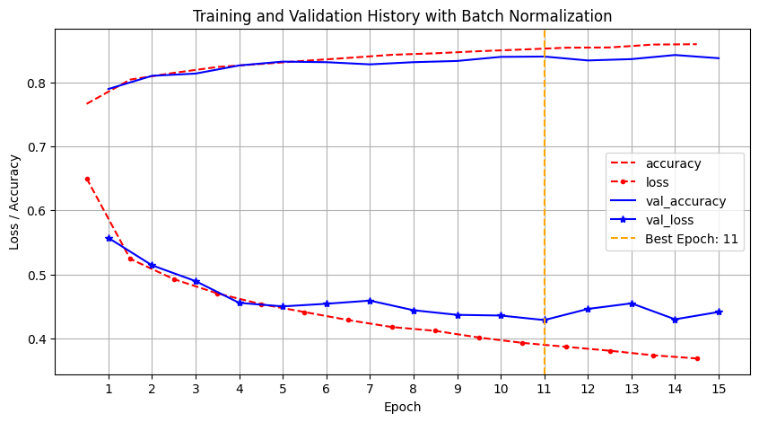
    


<b>Best Epoch: 11</b> \
The training accuracy steadily increases, approaching 88%. This is similar to the base model. \
The validation accuracy maintained around 85% which is similar with the best validation accuracy seen in the base model. It often remains more stable and smooth due to batch normalization.\
The training loss decreases smoothly, and consistently, reflecting the stabilizing effect of batch normalization. When activations are normalized, gradients flow more predictably, and the network often avoids erratic jumps in loss. \
The validation loss Gradually declines to about 45%, mirroring the consistent improvement in validation accuracy. This indicates a more stable learning curve compared to the base model, which sometimes shows a plateau or fluctuations earlier.
#### <b>Summary</b>
Batch normalization often leads to a smoother and sometimes quicker convergence because it normalizes activations layer by layer. Here, it yields performance roughly comparable to the base model in terms of final accuracy, but it’s typically more robust, and less sensitive to initial conditions.

## <b>2.4</b>
### Rebuild and train the base model after adding a dropout layer with a rate of 0.50 after each dense layer (do not use early stopping or batch normalization)

Define a Sequential model that incorporates dropout layers to help reduce overfitting.


```python
model_dropout = keras.Sequential([
    keras.layers.Input(shape=(14, 28)),
    keras.layers.Flatten(),
    keras.layers.Dense(128, activation="relu"),
    keras.layers.Dropout(0.5),
    keras.layers.Dense(64, activation="relu"),
    keras.layers.Dropout(0.5),
    keras.layers.Dense(32, activation="relu"),
    keras.layers.Dropout(0.5),
    keras.layers.Dense(10, activation="softmax")
])
```

Compile the model


```python
model_dropout.compile(
    optimizer=keras.optimizers.Adam(),
    loss="sparse_categorical_crossentropy",
    metrics=["accuracy"]
)
```

Train the model on top-half images


```python
history_dropout = model_dropout.fit(
    X_train_top, y_train, epochs=15, batch_size=32,
    validation_data=(X_valid_top, y_valid)
)
```

    Epoch 1/15
    1563/1563 ━━━━━━━━━━━━━━━━━━━━ 3s 1ms/step - accuracy: 0.3950 - loss: 1.6067 - val_accuracy: 0.7516 - val_loss: 0.7003
    Epoch 2/15
    1563/1563 ━━━━━━━━━━━━━━━━━━━━ 2s 1ms/step - accuracy: 0.6661 - loss: 0.8987 - val_accuracy: 0.7667 - val_loss: 0.6312
    Epoch 3/15
    1563/1563 ━━━━━━━━━━━━━━━━━━━━ 2s 1ms/step - accuracy: 0.7093 - loss: 0.8088 - val_accuracy: 0.7755 - val_loss: 0.6021
    Epoch 4/15
    1563/1563 ━━━━━━━━━━━━━━━━━━━━ 2s 1ms/step - accuracy: 0.7223 - loss: 0.7745 - val_accuracy: 0.7791 - val_loss: 0.5784
    Epoch 5/15
    1563/1563 ━━━━━━━━━━━━━━━━━━━━ 2s 1ms/step - accuracy: 0.7324 - loss: 0.7482 - val_accuracy: 0.7805 - val_loss: 0.5750
    Epoch 6/15
    1563/1563 ━━━━━━━━━━━━━━━━━━━━ 2s 1ms/step - accuracy: 0.7381 - loss: 0.7261 - val_accuracy: 0.7899 - val_loss: 0.5699
    Epoch 7/15
    1563/1563 ━━━━━━━━━━━━━━━━━━━━ 2s 1ms/step - accuracy: 0.7423 - loss: 0.7269 - val_accuracy: 0.7904 - val_loss: 0.5557
    Epoch 8/15
    1563/1563 ━━━━━━━━━━━━━━━━━━━━ 2s 1ms/step - accuracy: 0.7501 - loss: 0.7000 - val_accuracy: 0.7916 - val_loss: 0.5483
    Epoch 9/15
    1563/1563 ━━━━━━━━━━━━━━━━━━━━ 2s 1ms/step - accuracy: 0.7488 - loss: 0.6973 - val_accuracy: 0.8045 - val_loss: 0.5399
    Epoch 10/15
    1563/1563 ━━━━━━━━━━━━━━━━━━━━ 2s 1ms/step - accuracy: 0.7569 - loss: 0.6810 - val_accuracy: 0.8055 - val_loss: 0.5436
    Epoch 11/15
    1563/1563 ━━━━━━━━━━━━━━━━━━━━ 2s 1ms/step - accuracy: 0.7599 - loss: 0.6711 - val_accuracy: 0.7986 - val_loss: 0.5481
    Epoch 12/15
    1563/1563 ━━━━━━━━━━━━━━━━━━━━ 2s 1ms/step - accuracy: 0.7609 - loss: 0.6713 - val_accuracy: 0.8023 - val_loss: 0.5305
    Epoch 13/15
    1563/1563 ━━━━━━━━━━━━━━━━━━━━ 2s 1ms/step - accuracy: 0.7641 - loss: 0.6635 - val_accuracy: 0.8021 - val_loss: 0.5344
    Epoch 14/15
    1563/1563 ━━━━━━━━━━━━━━━━━━━━ 2s 1ms/step - accuracy: 0.7681 - loss: 0.6650 - val_accuracy: 0.8102 - val_loss: 0.5205
    Epoch 15/15
    1563/1563 ━━━━━━━━━━━━━━━━━━━━ 2s 1ms/step - accuracy: 0.7667 - loss: 0.6626 - val_accuracy: 0.8097 - val_loss: 0.5268
    

Evaluate the model on the test set


```python
y_pred_dropout = model_dropout.predict(X_test_top).argmax(axis=1)
print("Classification Report for Dropout Regularization Model")
print(classification_report(y_test, y_pred_dropout, target_names=labels))
```

    313/313 ━━━━━━━━━━━━━━━━━━━━ 0s 651us/step
    Classification Report for Dropout Regularization Model
                  precision    recall  f1-score   support
    
     T-shirt/top       0.78      0.77      0.77      1000
         Trouser       0.96      0.92      0.94      1000
        Pullover       0.63      0.66      0.64      1000
           Dress       0.84      0.79      0.81      1000
            Coat       0.55      0.85      0.67      1000
          Sandal       0.95      0.93      0.94      1000
           Shirt       0.51      0.26      0.35      1000
         Sneaker       0.90      0.91      0.90      1000
             Bag       0.94      0.95      0.95      1000
      Ankle boot       0.91      0.93      0.92      1000
    
        accuracy                           0.80     10000
       macro avg       0.80      0.80      0.79     10000
    weighted avg       0.80      0.80      0.79     10000
    
    

Plot training history


```python
plt.figure(figsize=(10,5))
for key, style in zip(history_dropout.history, ["r--", "r--.", "b-", "b-*"]):
    epochs = np.array(history_dropout.epoch) + (0 if key.startswith("val_") else -0.5)
    plt.plot(epochs, history_dropout.history[key], style, label=key)

best_epoch_dropout = np.argmin(history_dropout.history['val_loss'])
plt.axvline(best_epoch_dropout, color='orange', linestyle='--', label=f'Best Epoch: {best_epoch_dropout + 1}')

plt.xticks(ticks=np.arange(len(history_base.epoch)), labels=np.arange(1, len(history_base.epoch) + 1))
plt.xlabel("Epoch")
plt.ylabel("Loss / Accuracy")
plt.legend(loc="upper center")
plt.grid()
plt.title("Training and Validation History with Dropout Regularization")
plt.show()
```


    
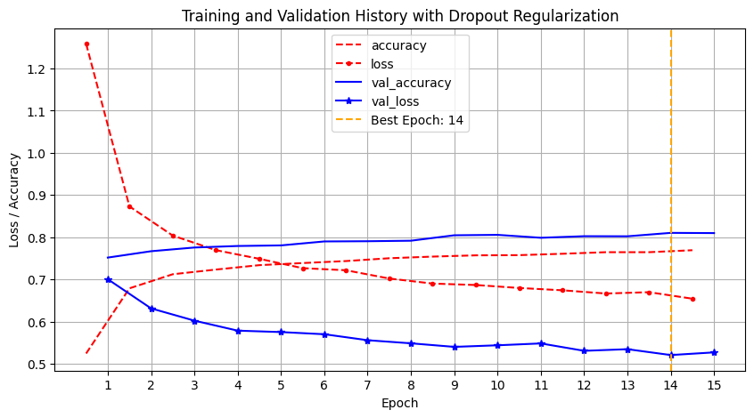
    


<b>Best Epoch: 14</b> \
The training accuracy stays behind the other models, ending up around 78%. This lower value is due to the aggressive 50% dropout rate, which prevents the model from fully learning the data by randomly deactivating half of the neurons with each forward pass. \
The validation accuracy shows a gradual improvement, eventually reaching around 80%. This suggests that although the model is constrained by dropout during training, it manages to generalize reasonably well to unseen data.\
The training loss drops quickly in the early epochs and continues to decline, stabilizing at approximately 65$ by the final epoch. This indicates that despite the regularization, the model is effectively minimizing the error on the training data. \
The validation loss decreases in a smooth, steady manner over the epochs, which is indicative of a consistent learning process and stable generalization performance throughout training.
#### <b>Summary</b>
The dropout model, with a 50% dropout rate after each dense layer, significantly restricts the network’s capacity, as evidenced by the training accuracy staying below 78%. Nevertheless, the model is able to achieve a validation accuracy of about 80%, demonstrating that the dropout is effective at tackling overfitting. The rapid initial drop in training loss, which then levels off at around 0.65, along with the smoothly declining validation loss, highlights the trade-off: while dropout helps maintain a stable learning curve and good generalization, it also limits the ultimate learning capacity of the model.
