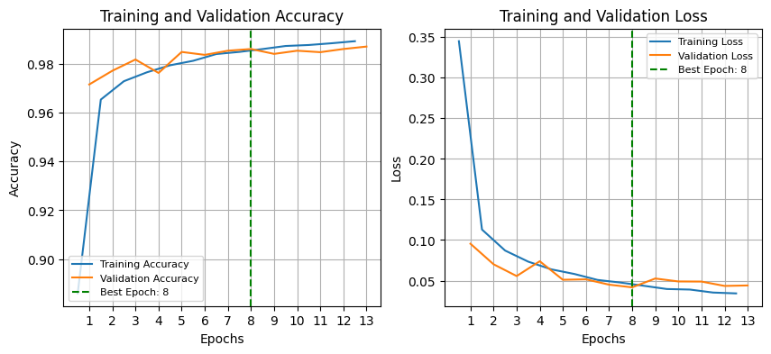
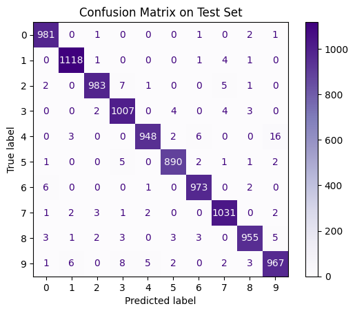

# HW5: Unsupervised Learning and Clustering

**Project:** Machine Learning Assignment 5  
**Course:** DAMA61 - Data Science & Machine Learning  
**Date:** 2024  
**Technologies:** Python, Scikit-learn, TensorFlow, Keras, NumPy, Matplotlib  
**Dataset:** MNIST

## Project Description

This project focuses on unsupervised learning techniques including clustering and dimensionality reduction on the MNIST dataset. The assignment involves:

- Loading and preprocessing the MNIST dataset
- Applying clustering algorithms (K-means, DBSCAN, Hierarchical clustering)
- Using dimensionality reduction techniques (PCA, t-SNE)
- Evaluating clustering performance and visualization
- Comparing different clustering approaches
- Analyzing cluster quality and interpretability

The project demonstrates how unsupervised learning can discover patterns and structure in unlabeled data, particularly useful for exploratory data analysis and feature learning.

## Key Results

- **Techniques:** K-means, DBSCAN, Hierarchical Clustering, PCA, t-SNE
- **Dataset:** MNIST (custom split: 5/7 train, 1/7 validation, 1/7 test)
- **Focus:** Clustering, dimensionality reduction, unsupervised learning
- **Evaluation:** Silhouette score, inertia, cluster visualization

---

# Problem 1
### Work with the MNIST dataset and:


## <b>1.1 </b>
### Split and normalize the data into a training (5/7), a validation (1/7), and a test (1/7) set.

Load mnist dataset


```python
from tensorflow.keras.datasets import mnist

(X_train_full, y_train_full), (X_test_full, y_test_full) = mnist.load_data()
```

Concatenate to extend the dataset and create custom splits.


```python
import numpy as np

X_full = np.concatenate([X_train_full, X_test_full], axis=0)
y_full = np.concatenate([y_train_full, y_test_full], axis=0)
```

Define the split sizes. Consider the full dataset split in 7 parts.


```python
train_size = 5/7
valid_size = 1/7
test_size = 1/7
```

Export the test set by splitting on the full sets. We keep $\frac{1}{7}\cdot{dataset}$.


```python
from sklearn.model_selection import train_test_split

X_temp, X_test, y_temp, y_test = train_test_split(X_full, y_full, test_size=test_size, random_state=42, stratify=y_full)
```

Having kept $\frac{1}{7}\cdot{dataset}$, we now want to export from the remaining $\frac{6}{7}\cdot{dataset}$, another $\frac{1}{7}\cdot{dataset}$. Therefore we will use a ratio of $\frac{\frac{1}{7}}{\frac{5}{7}+\frac{1}{7}}=\frac{\frac{1}{7}}{\frac{6}{7}}=\frac{1}{6}\cdot{temp\_dataset}$.


```python
valid_ratio_adjusted = valid_size / (train_size + valid_size)

X_train, X_valid, y_train, y_valid = train_test_split(X_temp, y_temp, test_size=valid_ratio_adjusted, random_state=42, stratify=y_temp)
```

Normalize pixel values 0-255 to 0-1. Setting the datatype explicitly is important for TensorFlow/Keras models since they expect float inputs to perform computations efficiently.


```python
X_train = X_train.astype("float32") / 255.
X_valid = X_valid.astype("float32") / 255.
X_test = X_test.astype("float32") / 255.
```

Print dataset shapes


```python
print(f'Train set shape: {X_train.shape}, Labels shape: {y_train.shape}')
print(f'Validation set shape: {X_valid.shape}, Labels shape: {y_valid.shape}')
print(f'Test set shape: {X_test.shape}, Labels shape: {y_test.shape}')
```

    Train set shape: (50000, 28, 28), Labels shape: (50000,)
    Validation set shape: (10000, 28, 28), Labels shape: (10000,)
    Test set shape: (10000, 28, 28), Labels shape: (10000,)
    

## <b>1.2</b>
### Convert the target values into one-hot vectors.

The labels (target values) are currently integers ranging from 0 to 9. We will convert them into one-hot vectors using tensorflow.keras utilities:


```python
from tensorflow.keras.utils import to_categorical

y_train_encoded = to_categorical(y_train, num_classes=10)
y_valid_encoded = to_categorical(y_valid, num_classes=10)
y_test_encoded = to_categorical(y_test, num_classes=10)
```

Check the shapes


```python
print(f'y_train_encoded shape: {y_train_encoded.shape}')
print(f'y_valid_encoded shape: {y_valid_encoded.shape}')
print(f'y_test_encoded shape: {y_test_encoded.shape}')
```

    y_train_encoded shape: (50000, 10)
    y_valid_encoded shape: (10000, 10)
    y_test_encoded shape: (10000, 10)
    

Check first 3 labels from the training set.


```python
print("Original labels:", y_train[:3])
print("One-hot encoded labels:\n", y_train_encoded[:3])
```

    Original labels: [6 8 4]
    One-hot encoded labels:
     [[0. 0. 0. 0. 0. 0. 1. 0. 0. 0.]
     [0. 0. 0. 0. 0. 0. 0. 0. 1. 0.]
     [0. 0. 0. 0. 1. 0. 0. 0. 0. 0.]]
    

## <b>1.3</b>
### Build a convolutional neural network (CNN). For the features extractor part of the CNN, create:
### $\bullet$ a 2D convolutional layer of 8, 5x5 kernels, add padding zeros to the image and move each kernel two pixels,
### $\bullet$ a 2x2 max pooling layer,
### $\bullet$ a 2D convolutional layer of 16, 3x3 kernels that retain the size of its input image,
### $\bullet$ a 2x2 max pooling layer,
### $\bullet$ a 2D convolutional layer of 32, 3x3 kernels that retain the size of its input image.
### For the classification part of your model, start with a 20% dropout layer and use two fully connected layers of 64 and 32 nodes, in addition to the output layer.

As explained in p.556 in "Hands-On Machine Learning with Scikit-Learn, Keras, and TensorFlow" by Aurelien Geron, "All recurrent layers in Keras expect 3D inputs of shape [batch size, time steps, dimensionality]. Without reshaping, our data would have shape (num_samples, 28, 28) and TensorFlow would raise an error because it expects the fourth dimension (channel). Therefore, we will reshape so that : \
$\bullet$ 1st Dimension (-1): Number of samples (images). Setting -1 tells numpy to automatically calculate this number based on the total number of elements.\
$\bullet$ 2nd Dimension (28): Image height (pixels).\
$\bullet$ 3rd Dimension (28): Image width (pixels).\
$\bullet$ 4th Dimension (1): Channel dimension (depth). In grayscale images, this is 1, as each pixel only has one intensity value. For RGB images this number would be 3, for red, green, and blue channels.


```python
X_train_cnn = X_train.reshape(-1, 28, 28, 1)
X_valid_cnn = X_valid.reshape(-1, 28, 28, 1)
X_test_cnn = X_test.reshape(-1, 28, 28, 1)
```

Now let's build the CNN model.

Define a default convolutional layer using partial


```python
from functools import partial
from tensorflow.keras.layers import Conv2D

DefaultConv2D = partial(Conv2D, padding="same", activation="relu")
```


```python
from tensorflow.keras.models import Sequential
from tensorflow.keras.layers import Input, MaxPooling2D, Flatten, Dense, Dropout

model = Sequential([
    Input(shape=[28, 28, 1]),
    DefaultConv2D(filters=8, kernel_size=5, strides=2),
    MaxPooling2D(pool_size=(2,2)),
    
    DefaultConv2D(filters=16, kernel_size=3),
    MaxPooling2D(pool_size=(2,2)),
    
    DefaultConv2D(filters=32, kernel_size=3),
    
    Flatten(),
    Dropout(0.2),
    Dense(64, activation='relu'),
    Dense(32, activation='relu'),
    Dense(10, activation='softmax')
])

model.summary()
```


<pre style="white-space:pre;overflow-x:auto;line-height:normal;font-family:Menlo,'DejaVu Sans Mono',consolas,'Courier New',monospace"><span style="font-weight: bold">Model: "sequential"</span>
</pre>


<pre style="white-space:pre;overflow-x:auto;line-height:normal;font-family:Menlo,'DejaVu Sans Mono',consolas,'Courier New',monospace">┏━━━━━━━━━━━━━━━━━━━━━━━━━━━━━━━━━━━━━━┳━━━━━━━━━━━━━━━━━━━━━━━━━━━━━┳━━━━━━━━━━━━━━━━━┓
┃<span style="font-weight: bold"> Layer (type)                         </span>┃<span style="font-weight: bold"> Output Shape                </span>┃<span style="font-weight: bold">         Param # </span>┃
┡━━━━━━━━━━━━━━━━━━━━━━━━━━━━━━━━━━━━━━╇━━━━━━━━━━━━━━━━━━━━━━━━━━━━━╇━━━━━━━━━━━━━━━━━┩
│ conv2d (<span style="color: #0087ff; text-decoration-color: #0087ff">Conv2D</span>)                      │ (<span style="color: #00d7ff; text-decoration-color: #00d7ff">None</span>, <span style="color: #00af00; text-decoration-color: #00af00">14</span>, <span style="color: #00af00; text-decoration-color: #00af00">14</span>, <span style="color: #00af00; text-decoration-color: #00af00">8</span>)           │             <span style="color: #00af00; text-decoration-color: #00af00">208</span> │
├──────────────────────────────────────┼─────────────────────────────┼─────────────────┤
│ max_pooling2d (<span style="color: #0087ff; text-decoration-color: #0087ff">MaxPooling2D</span>)         │ (<span style="color: #00d7ff; text-decoration-color: #00d7ff">None</span>, <span style="color: #00af00; text-decoration-color: #00af00">7</span>, <span style="color: #00af00; text-decoration-color: #00af00">7</span>, <span style="color: #00af00; text-decoration-color: #00af00">8</span>)             │               <span style="color: #00af00; text-decoration-color: #00af00">0</span> │
├──────────────────────────────────────┼─────────────────────────────┼─────────────────┤
│ conv2d_1 (<span style="color: #0087ff; text-decoration-color: #0087ff">Conv2D</span>)                    │ (<span style="color: #00d7ff; text-decoration-color: #00d7ff">None</span>, <span style="color: #00af00; text-decoration-color: #00af00">7</span>, <span style="color: #00af00; text-decoration-color: #00af00">7</span>, <span style="color: #00af00; text-decoration-color: #00af00">16</span>)            │           <span style="color: #00af00; text-decoration-color: #00af00">1,168</span> │
├──────────────────────────────────────┼─────────────────────────────┼─────────────────┤
│ max_pooling2d_1 (<span style="color: #0087ff; text-decoration-color: #0087ff">MaxPooling2D</span>)       │ (<span style="color: #00d7ff; text-decoration-color: #00d7ff">None</span>, <span style="color: #00af00; text-decoration-color: #00af00">3</span>, <span style="color: #00af00; text-decoration-color: #00af00">3</span>, <span style="color: #00af00; text-decoration-color: #00af00">16</span>)            │               <span style="color: #00af00; text-decoration-color: #00af00">0</span> │
├──────────────────────────────────────┼─────────────────────────────┼─────────────────┤
│ conv2d_2 (<span style="color: #0087ff; text-decoration-color: #0087ff">Conv2D</span>)                    │ (<span style="color: #00d7ff; text-decoration-color: #00d7ff">None</span>, <span style="color: #00af00; text-decoration-color: #00af00">3</span>, <span style="color: #00af00; text-decoration-color: #00af00">3</span>, <span style="color: #00af00; text-decoration-color: #00af00">32</span>)            │           <span style="color: #00af00; text-decoration-color: #00af00">4,640</span> │
├──────────────────────────────────────┼─────────────────────────────┼─────────────────┤
│ flatten (<span style="color: #0087ff; text-decoration-color: #0087ff">Flatten</span>)                    │ (<span style="color: #00d7ff; text-decoration-color: #00d7ff">None</span>, <span style="color: #00af00; text-decoration-color: #00af00">288</span>)                 │               <span style="color: #00af00; text-decoration-color: #00af00">0</span> │
├──────────────────────────────────────┼─────────────────────────────┼─────────────────┤
│ dropout (<span style="color: #0087ff; text-decoration-color: #0087ff">Dropout</span>)                    │ (<span style="color: #00d7ff; text-decoration-color: #00d7ff">None</span>, <span style="color: #00af00; text-decoration-color: #00af00">288</span>)                 │               <span style="color: #00af00; text-decoration-color: #00af00">0</span> │
├──────────────────────────────────────┼─────────────────────────────┼─────────────────┤
│ dense (<span style="color: #0087ff; text-decoration-color: #0087ff">Dense</span>)                        │ (<span style="color: #00d7ff; text-decoration-color: #00d7ff">None</span>, <span style="color: #00af00; text-decoration-color: #00af00">64</span>)                  │          <span style="color: #00af00; text-decoration-color: #00af00">18,496</span> │
├──────────────────────────────────────┼─────────────────────────────┼─────────────────┤
│ dense_1 (<span style="color: #0087ff; text-decoration-color: #0087ff">Dense</span>)                      │ (<span style="color: #00d7ff; text-decoration-color: #00d7ff">None</span>, <span style="color: #00af00; text-decoration-color: #00af00">32</span>)                  │           <span style="color: #00af00; text-decoration-color: #00af00">2,080</span> │
├──────────────────────────────────────┼─────────────────────────────┼─────────────────┤
│ dense_2 (<span style="color: #0087ff; text-decoration-color: #0087ff">Dense</span>)                      │ (<span style="color: #00d7ff; text-decoration-color: #00d7ff">None</span>, <span style="color: #00af00; text-decoration-color: #00af00">10</span>)                  │             <span style="color: #00af00; text-decoration-color: #00af00">330</span> │
└──────────────────────────────────────┴─────────────────────────────┴─────────────────┘
</pre>


<pre style="white-space:pre;overflow-x:auto;line-height:normal;font-family:Menlo,'DejaVu Sans Mono',consolas,'Courier New',monospace"><span style="font-weight: bold"> Total params: </span><span style="color: #00af00; text-decoration-color: #00af00">26,922</span> (105.16 KB)
</pre>


<pre style="white-space:pre;overflow-x:auto;line-height:normal;font-family:Menlo,'DejaVu Sans Mono',consolas,'Courier New',monospace"><span style="font-weight: bold"> Trainable params: </span><span style="color: #00af00; text-decoration-color: #00af00">26,922</span> (105.16 KB)
</pre>


<pre style="white-space:pre;overflow-x:auto;line-height:normal;font-family:Menlo,'DejaVu Sans Mono',consolas,'Courier New',monospace"><span style="font-weight: bold"> Non-trainable params: </span><span style="color: #00af00; text-decoration-color: #00af00">0</span> (0.00 B)
</pre>


## <b>1.4</b>
### Compile the model using the Adam optimizer, a loss function of your choice, and add accuracy in your metrics

In classification tasks involving multiple classes, like MNIST with 10 classes, a suitable loss function is usually <b>categorical cross-entropy</b>. The Adam optimizer is good default choice due to its adaptive learning capabilities.


```python
model.compile(
    optimizer='adam',
    loss='categorical_crossentropy',
    metrics=['accuracy']
)
```

## <b>1.5</b>
### Fit the model on the training data (allow 100 epochs) and use early stopping with patience 5 epochs to monitor the validation set


```python
from tensorflow.keras.callbacks import EarlyStopping

early_stopping_cb = EarlyStopping(monitor='val_loss', patience=5, restore_best_weights=True, verbose=1)
```


```python
history = model.fit(
    X_train_cnn, y_train_encoded,
    epochs=100,
    validation_data=(X_valid_cnn, y_valid_encoded),
    callbacks=[early_stopping_cb]
)
```

    Epoch 1/100
    1563/1563 ━━━━━━━━━━━━━━━━━━━━ 5s 2ms/step - accuracy: 0.7441 - loss: 0.7345 - val_accuracy: 0.9715 - val_loss: 0.0954
    Epoch 2/100
    1563/1563 ━━━━━━━━━━━━━━━━━━━━ 3s 2ms/step - accuracy: 0.9641 - loss: 0.1202 - val_accuracy: 0.9771 - val_loss: 0.0701
    Epoch 3/100
    1563/1563 ━━━━━━━━━━━━━━━━━━━━ 3s 2ms/step - accuracy: 0.9718 - loss: 0.0889 - val_accuracy: 0.9817 - val_loss: 0.0556
    Epoch 4/100
    1563/1563 ━━━━━━━━━━━━━━━━━━━━ 3s 2ms/step - accuracy: 0.9764 - loss: 0.0729 - val_accuracy: 0.9762 - val_loss: 0.0739
    Epoch 5/100
    1563/1563 ━━━━━━━━━━━━━━━━━━━━ 3s 2ms/step - accuracy: 0.9788 - loss: 0.0649 - val_accuracy: 0.9848 - val_loss: 0.0510
    Epoch 6/100
    1563/1563 ━━━━━━━━━━━━━━━━━━━━ 3s 2ms/step - accuracy: 0.9815 - loss: 0.0574 - val_accuracy: 0.9836 - val_loss: 0.0515
    Epoch 7/100
    1563/1563 ━━━━━━━━━━━━━━━━━━━━ 4s 2ms/step - accuracy: 0.9839 - loss: 0.0517 - val_accuracy: 0.9853 - val_loss: 0.0450
    Epoch 8/100
    1563/1563 ━━━━━━━━━━━━━━━━━━━━ 4s 2ms/step - accuracy: 0.9854 - loss: 0.0458 - val_accuracy: 0.9860 - val_loss: 0.0417
    Epoch 9/100
    1563/1563 ━━━━━━━━━━━━━━━━━━━━ 4s 3ms/step - accuracy: 0.9870 - loss: 0.0418 - val_accuracy: 0.9840 - val_loss: 0.0526
    Epoch 10/100
    1563/1563 ━━━━━━━━━━━━━━━━━━━━ 4s 2ms/step - accuracy: 0.9880 - loss: 0.0376 - val_accuracy: 0.9853 - val_loss: 0.0490
    Epoch 11/100
    1563/1563 ━━━━━━━━━━━━━━━━━━━━ 3s 2ms/step - accuracy: 0.9886 - loss: 0.0372 - val_accuracy: 0.9847 - val_loss: 0.0488
    Epoch 12/100
    1563/1563 ━━━━━━━━━━━━━━━━━━━━ 3s 2ms/step - accuracy: 0.9884 - loss: 0.0360 - val_accuracy: 0.9860 - val_loss: 0.0434
    Epoch 13/100
    1563/1563 ━━━━━━━━━━━━━━━━━━━━ 3s 2ms/step - accuracy: 0.9896 - loss: 0.0329 - val_accuracy: 0.9870 - val_loss: 0.0440
    Epoch 13: early stopping
    Restoring model weights from the end of the best epoch: 8.
    

## <b>1.6</b>
### Plot the history of the loss and accuracy of the training process for the training and validation sets.


```python
import matplotlib.pyplot as plt

epochs = np.arange(len(history.epoch))
best_epoch = np.argmin(history.history['val_loss'])

plt.figure(figsize=(10,4))
plt.subplot(1,2,1)
plt.plot(epochs - 0.5, history.history['accuracy'], label='Training Accuracy')
plt.plot(epochs, history.history['val_accuracy'], label='Validation Accuracy')
plt.axvline(best_epoch, color='green', linestyle='--', label=f'Best Epoch: {best_epoch + 1}')
plt.title('Training and Validation Accuracy')
plt.xlabel('Epochs')
plt.xticks(ticks=epochs, labels=epochs + 1)
plt.ylabel('Accuracy')
plt.grid()
plt.legend(loc='lower left', fontsize=8)

# Plot training and validation loss
plt.subplot(1,2,2)
plt.plot(epochs - 0.5, history.history['loss'], label='Training Loss')
plt.plot(epochs, history.history['val_loss'], label='Validation Loss')
plt.axvline(best_epoch, color='green', linestyle='--', label=f'Best Epoch: {best_epoch + 1}')
plt.title('Training and Validation Loss')
plt.xlabel('Epochs')
plt.xticks(ticks=epochs, labels=epochs + 1)
plt.ylabel('Loss')
plt.grid()
plt.legend(loc='upper right', fontsize=8)

plt.show()

```


    

    


The plots show a clear upward trend in both training and validation accuracy, while the loss steadily decreases. Early stopping successfully halted training when the validation loss stopped improving, helping to prevent overfitting. The training and validation curves remain close throughout, indicating that the model generalizes well. Shifting the training curves by half an epoch clarifies the timing difference between training updates and validation evaluations.

## <b>1.7</b>
### Plot the confusion matrix and the accuracy of your model on the test set.

Predict on the test set


```python
y_pred_probs = model.predict(X_test_cnn)
y_pred = np.argmax(y_pred_probs, axis=1)
y_true = np.argmax(y_test_encoded, axis=1)
```

    313/313 ━━━━━━━━━━━━━━━━━━━━ 0s 1ms/step  
    

Compute the accuracy


```python
from sklearn.metrics import accuracy_score

test_accuracy = accuracy_score(y_true, y_pred)
print(f"Test Accuracy: {test_accuracy:.4f}")
```

    Test Accuracy: 0.9853
    

Compute the confusion matrix


```python
from sklearn.metrics import confusion_matrix, ConfusionMatrixDisplay

cm = confusion_matrix(y_true, y_pred)
plt.figure(figsize=(8,6))
ConfusionMatrixDisplay(cm).plot(cmap='Purples', values_format='d')
plt.title('Confusion Matrix on Test Set')
plt.grid(False)
plt.show()
```


    <Figure size 800x600 with 0 Axes>


    

    


```python

```

