# Problem 2

### This problem concentrates on training a Neural Network model for time series forecasting. The dataset at hand corresponds to the Monthly Mean Sunspots spanning from 1749 to 2019. Thus it includes 3252 samples. The goal of this analysis is to build a Multilayer Neural Network that can forecast accurately the number of sunspots several months into the future (multi-step ahead forecast). You are required to do the following:

# <b>2.1</b>
### Open a Jupyter-notebook load the the sunspots.csv file. Print and observe the structure of the data. Extract the appropriate column that is of interest to the analysis.

Set Seed for Reproducibility


```python
import tensorflow as tf
import numpy as np
import random

seed = 42
tf.random.set_seed(seed)
np.random.seed(seed)
random.seed(seed)
```

Load the dataset


```python
import pandas as pd

sunspots_df = pd.read_csv("sunspots.csv")
sunspots_df.head()
```


<div>
<style scoped>
    .dataframe tbody tr th:only-of-type {
        vertical-align: middle;
    }

    .dataframe tbody tr th {
        vertical-align: top;
    }

    .dataframe thead th {
        text-align: right;
    }
</style>
<table border="1" class="dataframe">
  <thead>
    <tr style="text-align: right;">
      <th></th>
      <th>Unnamed: 0</th>
      <th>Date</th>
      <th>Monthly Mean Total Sunspot Number</th>
    </tr>
  </thead>
  <tbody>
    <tr>
      <th>0</th>
      <td>0</td>
      <td>1749-01-31</td>
      <td>96.7</td>
    </tr>
    <tr>
      <th>1</th>
      <td>1</td>
      <td>1749-02-28</td>
      <td>104.3</td>
    </tr>
    <tr>
      <th>2</th>
      <td>2</td>
      <td>1749-03-31</td>
      <td>116.7</td>
    </tr>
    <tr>
      <th>3</th>
      <td>3</td>
      <td>1749-04-30</td>
      <td>92.8</td>
    </tr>
    <tr>
      <th>4</th>
      <td>4</td>
      <td>1749-05-31</td>
      <td>141.7</td>
    </tr>
  </tbody>
</table>
</div>


Inspect data structure


```python
sunspots_df.info()
```

    <class 'pandas.core.frame.DataFrame'>
    RangeIndex: 3252 entries, 0 to 3251
    Data columns (total 3 columns):
     #   Column                             Non-Null Count  Dtype  
    ---  ------                             --------------  -----  
     0   Unnamed: 0                         3252 non-null   int64  
     1   Date                               3252 non-null   object 
     2   Monthly Mean Total Sunspot Number  3252 non-null   float64
    dtypes: float64(1), int64(1), object(1)
    memory usage: 76.3+ KB
    

Extract the time series


```python
series = sunspots_df["Monthly Mean Total Sunspot Number"]
series
```


    0        96.7
    1       104.3
    2       116.7
    3        92.8
    4       141.7
            ...  
    3247      0.5
    3248      1.1
    3249      0.4
    3250      0.5
    3251      1.6
    Name: Monthly Mean Total Sunspot Number, Length: 3252, dtype: float64


# <b>2.2</b>
###  Check the sanity and appropriateness of the data. Search for missing values and print descriptive statistics. Cast the data into a numpy array. Plot the data. 

Search for missing values


```python
print("Missing values per column:")
print(sunspots_df.isnull().sum())
```

    Missing values per column:
    Unnamed: 0                           0
    Date                                 0
    Monthly Mean Total Sunspot Number    0
    dtype: int64
    

Check the descriptive statistics


```python
sunspots_df.describe()
```


<div>
<style scoped>
    .dataframe tbody tr th:only-of-type {
        vertical-align: middle;
    }

    .dataframe tbody tr th {
        vertical-align: top;
    }

    .dataframe thead th {
        text-align: right;
    }
</style>
<table border="1" class="dataframe">
  <thead>
    <tr style="text-align: right;">
      <th></th>
      <th>Unnamed: 0</th>
      <th>Monthly Mean Total Sunspot Number</th>
    </tr>
  </thead>
  <tbody>
    <tr>
      <th>count</th>
      <td>3252.000000</td>
      <td>3252.000000</td>
    </tr>
    <tr>
      <th>mean</th>
      <td>1625.500000</td>
      <td>82.070695</td>
    </tr>
    <tr>
      <th>std</th>
      <td>938.915864</td>
      <td>67.864736</td>
    </tr>
    <tr>
      <th>min</th>
      <td>0.000000</td>
      <td>0.000000</td>
    </tr>
    <tr>
      <th>25%</th>
      <td>812.750000</td>
      <td>24.200000</td>
    </tr>
    <tr>
      <th>50%</th>
      <td>1625.500000</td>
      <td>67.750000</td>
    </tr>
    <tr>
      <th>75%</th>
      <td>2438.250000</td>
      <td>122.700000</td>
    </tr>
    <tr>
      <th>max</th>
      <td>3251.000000</td>
      <td>398.200000</td>
    </tr>
  </tbody>
</table>
</div>


Cast the time series into a NumPy array to optimize performance and ensure compatibility with ML tools


```python
sunspots_series = sunspots_df["Monthly Mean Total Sunspot Number"].values.astype(np.float32)
print("Shape of series:", sunspots_series.shape, type(sunspots_series))
```

    Shape of series: (3252,) <class 'numpy.ndarray'>
    

Visualize the Time Series to observe trends, cycles, and seasonality.


```python
import matplotlib.pyplot as plt

plt.figure(figsize=(15, 4))
plt.plot(series, linewidth=0.8)
plt.title("Monthly Mean Sunspots (1749–2019)")
plt.xlabel("Months since Jan 1749")
plt.ylabel("Sunspot Count")
plt.grid(True)
plt.show()
```


    
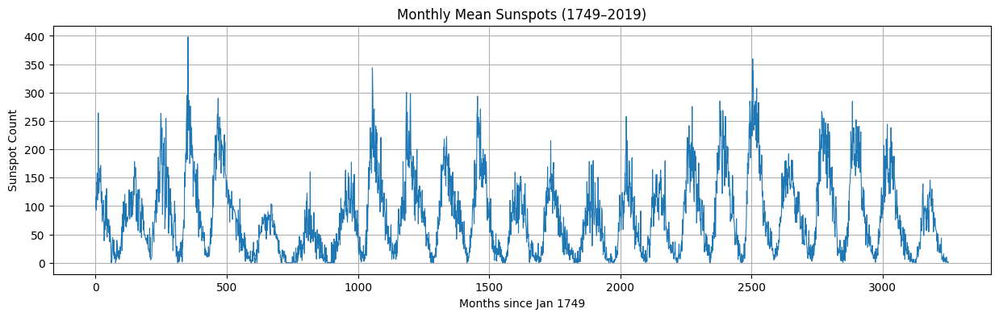
    


The plot confirms that the sunspot series is periodic with non-constant amplitude, making it a great candidate for time series forecasting with models capable of learning long-term dependencies and handling sequence dynamics, like GRUs or LSTMs.

## Extra Analysis

### 2.2 Ex1. Reveal Dominant Sunspot Cycles Using Fast Fourier Transform (FFT)


```python
from scipy.fft import rfft, rfftfreq

# Apply FFT
n = len(sunspots_series)
timestep = 1  # months
fft_values = rfft(sunspots_series)
fft_freqs = rfftfreq(n, d=timestep)

# Convert frequency to period (in months)
periods = 1 / fft_freqs[1:]  # exclude zero freq to avoid div/0
power = np.abs(fft_values[1:])  # magnitude of FFT, skip freq=0

# Find the dominant period
peak_idx = np.argmax(power)
dominant_period = periods[peak_idx]

plt.figure(figsize=(12, 5))
plt.plot(periods, power)
plt.axvline(x=dominant_period, color='orange', linestyle='--', label=f"Peak: {dominant_period:.1f} months")
plt.xlim(0, 300)
plt.title("Dominant Periods via FFT")
plt.xlabel("Period (Months)")
plt.ylabel("Power (Magnitude)")
plt.legend()
plt.grid(True)
plt.tight_layout()
plt.show()

```


    
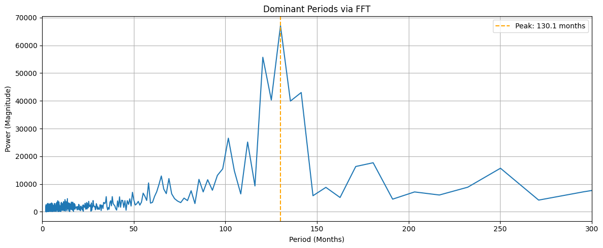
    


The sharp peak around 130.1 months confirms the presence of a dominant ~11-year solar cycle, which aligns with scientific understanding of solar activity. Let's round it up to exactly 11 years (132 months).

### 2.2 Ex2. Seasonal Decomposition of Sunspot Activity (11-Year Cycle)

Decompose the series


```python
from matplotlib.lines import Line2D
from statsmodels.tsa.seasonal import seasonal_decompose

decomposition = seasonal_decompose(sunspots_series, model='additive', period=132)

fig, axs = plt.subplots(4, 1, figsize=(14, 10), sharex=True)

components = ['Observed', 'Trend', 'Seasonal', 'Residual']
data = [decomposition.observed, decomposition.trend, decomposition.seasonal, decomposition.resid]

# Cycle boundary positions
cycle_length = 132
cycle_boundaries = range(0, len(sunspots_series), cycle_length)

for ax, comp, d in zip(axs, components, data):
    ax.plot(d, linewidth=0.8)
    for start in cycle_boundaries:
        ax.axvline(start, color='red', linestyle='--', alpha=0.4)
    ax.set_title(comp)
    ax.grid(True)

# Legend
cycle_line = Line2D([0], [0], color='red', linestyle='--', alpha=0.4, label='11-Year Cycle (132 months)')
axs[0].legend(handles=[cycle_line], loc='upper right')

plt.xlabel("Months since Jan 1749")
plt.tight_layout()
plt.show()

```


    
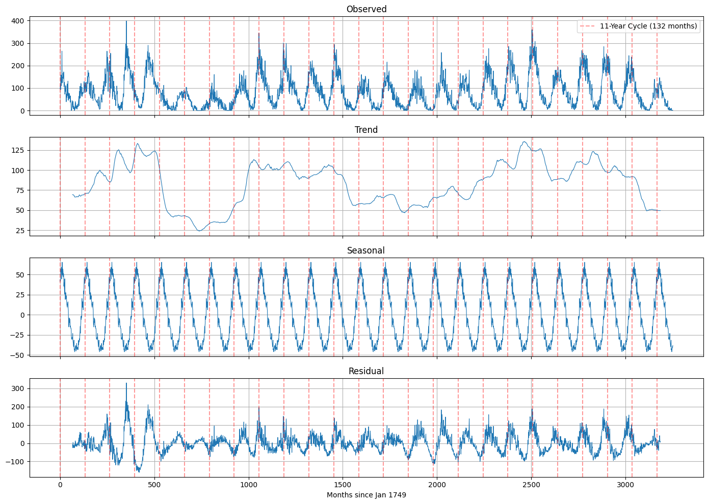
    


This plot breaks down the original sunspot time series into its key components: Observed, Trend, Seasonal, and Residual. The Seasonal component clearly reveals a repeating pattern that confirms the well-known ~11-year (132-month) solar cycle. The Trend component shows longer-term changes in sunspot intensity over time, while the Residual captures the remaining noise and irregular fluctuations not explained by the trend or seasonal structure. Overall, the decomposition highlights the dominant cyclical nature of sunspot activity and supports the selection of 132 months as a reasonable seasonal period.

### 2.2 Ex3. Autocorrelation of Sunspot Activity to check whether past sunspot activity helps predict future activity


```python
from statsmodels.graphics.tsaplots import plot_acf
import matplotlib.pyplot as plt

fig, ax = plt.subplots(figsize=(12, 5))
plot_acf(sunspots_series, lags=500, ax=ax)

for line in ax.lines:
    line.set_markersize(1)
    line.set_linewidth(0.5)

plt.title("Autocorrelation of Sunspot Activity (lag 500)")
plt.grid(True)
plt.tight_layout()
plt.show()
```


    
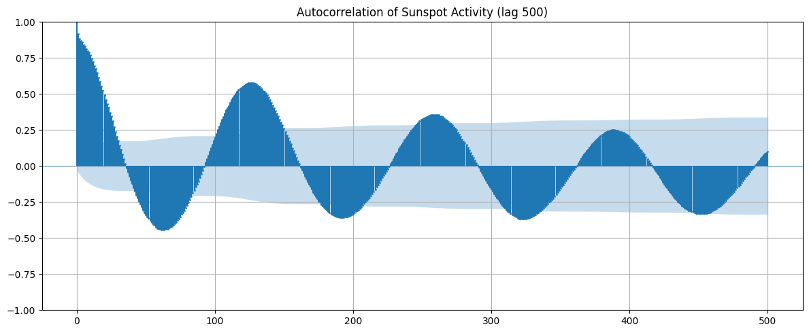
    


We observe : 
- The wave-like pattern shows that sunspot activity repeats over time with regular cycles.
- Strong positive autocorrelation at small lags
- Repeated peaks occur roughly every 132 lags, suggesting that sunspot activity at a given time is highly correlated with activity about 132 months (11 years) later.
- Negative correlations in between imply that if the sunspot count is high now, it’s likely to be low halfway through the cycle.
- As the lag increases, the autocorrelation decreases in magnitude, indicating that long-term predictions become less certain, but the cycle is still visible

This validates the 11-year cycle hypothesis using statistical evidence.

# <b>2.3</b>
### Scale all data in the interval [0,1]. Choose a window parameter of 40 timesteps. Split the resulting reformed data into train and test parts such that 90% of the samples in retained in the training set. The output of the Neural Network should be a vector of size equal to length of the test set (forecasting horizon). This horizon should be constructed with one input sample (sequence-to-vector).

It's important to scale the time series data. Neural networks often perform much better when all input features have similar ranges. A common choice is to use MinMax scaling to map the values to the [0, 1] range. To train a neural network for time series forecasting, we need to convert the 1D series into a supervised learning problem. Each input will be a window of 40 consecutive past values (40 months), and the corresponding output will be a vector of future values. In our case, the entire 326-month test set.


```python
from sklearn.preprocessing import MinMaxScaler

scaler = MinMaxScaler()
scaled_series = scaler.fit_transform(sunspots_series.reshape(-1, 1)).flatten()
```

Define window and forecast parameters


```python
window_size = 40
total_samples = len(scaled_series)
train_size = int(0.9 * total_samples)
forecast_horizon = total_samples - train_size
print("Train size =",train_size, ", Forecast Horizon =",forecast_horizon)
```

    Train size = 2926 , Forecast Horizon = 326
    

Build the training dataset


```python
X_train = []
y_train = []

for i in range(train_size - window_size - forecast_horizon + 1): # 2926-40-326+1 = 2561 training samples. This ensures we don't run out of data 
                                                                 # when slicing the input window and the 326 month forecast
    window = scaled_series[i:i + window_size] 
    target = scaled_series[i + window_size:i + window_size + forecast_horizon]
    X_train.append(window)
    y_train.append(target)
```


```python
X_train = np.array(X_train)
y_train = np.array(y_train)
```

Prepare the test input (X_test) and true labels (y_test)


```python
X_test = scaled_series[train_size - window_size:train_size].reshape(1, window_size)
y_test = scaled_series[train_size:].reshape(forecast_horizon,)
```


```python
print(f"X_train shape: {X_train.shape}  <- Input windows for training (n_samples, window_size)")
print(f"y_train shape: {y_train.shape}  <- Corresponding forecast vectors (n_samples, forecast_horizon)")
print(f"X_test shape:  {X_test.shape}   <- Single test input (1, window_size)")
print(f"y_test shape:  {y_test.shape}   <- True future values for comparison (forecast_horizon,)")
```

    X_train shape: (2561, 40)  <- Input windows for training (n_samples, window_size)
    y_train shape: (2561, 326)  <- Corresponding forecast vectors (n_samples, forecast_horizon)
    X_test shape:  (1, 40)   <- Single test input (1, window_size)
    y_test shape:  (326,)   <- True future values for comparison (forecast_horizon,)
    

## Extra analysis

### 2.3 Ex4. Visualizing the dataset's split in training and test sets.


```python
plt.figure(figsize=(14, 5))

plt.plot(range(train_size), scaled_series[:train_size], label="Training Set", linewidth = 1)

plt.plot(range(train_size, len(scaled_series)), scaled_series[train_size:], label="Test Set", linewidth = 1)

plt.title("Sunspot Series: Training vs Test Split")
plt.xlabel("Months since Jan 1749")
plt.ylabel("Scaled Sunspot Count")
plt.legend()
plt.grid(True)
plt.tight_layout()
plt.show()

```


    
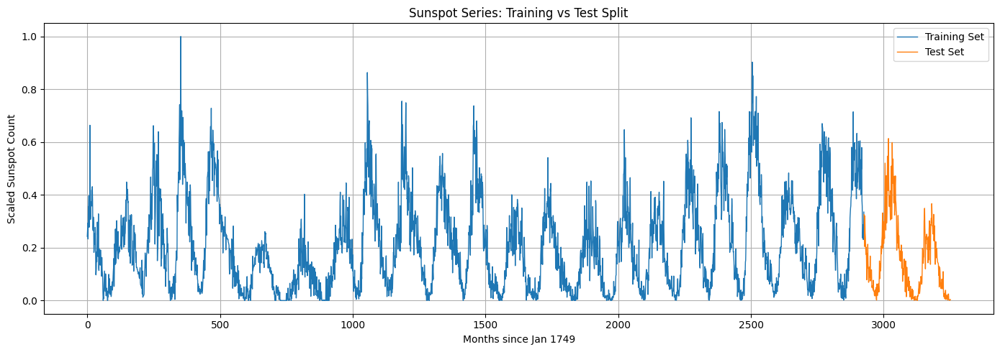
    


### 2.3 Ex5. A visual representation of the rolling window mechanism, showing the training input windows (X) and their corresponding forecast targets (y) for samples starting at indices 1, 400, and 600 (random picks).


```python
fig, axs = plt.subplots(3, 1, figsize=(14, 15), sharex=True)

window_indices = [0, 399, 599]

for idx, i in enumerate(window_indices):
    ax = axs[idx]
    x_start = i
    x_end = x_start + window_size
    y_start = x_end
    y_end = y_start + forecast_horizon

    ax.plot(range(1000), scaled_series[:1000], label="Zoomed Series", linewidth=1)
    ax.plot(range(x_start, x_end), scaled_series[x_start:x_end], '--', label=f"X({i+1})", linewidth=1)
    ax.plot(range(y_start, y_end), scaled_series[y_start:y_end], label=f"y({i+1})", linewidth=1)

    ax.set_title(f"Input-Output Window {i+1}: X({i+1}) and y({i+1})")
    ax.set_ylabel("Scaled Sunspot Count")
    ax.legend()
    ax.grid(True)

axs[-1].set_xlabel("Months since Jan 1749")
plt.tight_layout()
plt.show()

```


    
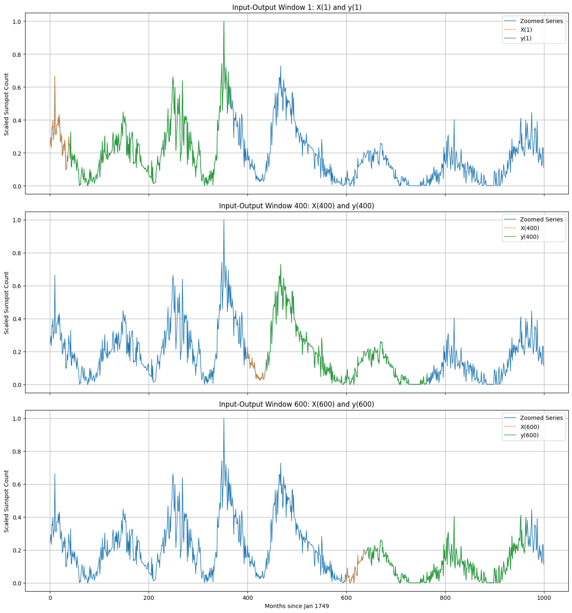
    


# <b>2.4</b>
### Build a Multilayer Percepton Model with the following sequence of layers: 
### a) Batch Normalization Layer
### b) Dense layer with 50 neurons utilizing Lecun Normal initiliazation and SELU activation
### c) Dense layer with 25 neurons utilizing Lecun Normal initiliazation and SELU activation
### d) An output layer
### The model should be compiled with MSE loss and ADAMW optimizer. Add MAE to the model’s metrics. Train the model for 30 epochs with a batch size set to 32 and with a validation split set to 10% of the training set. You have to utilize early stopping with patience of 2 iterations and the ability to restore the best weights. Print the model summary and explain the number of parameters and where they come from. Measure the training time and print. 

Build the MLP Model\
We construct a simple Multilayer Perceptron (MLP) for sequence-to-vector time series forecasting. The architecture includes:
- Batch Normalization
- Dense layers with SELU activation and Lecun Normal initialization
- A final output layer matching the test set length (326 months)


```python
from tensorflow.keras.models import Sequential
from tensorflow.keras.layers import BatchNormalization, Dense
from tensorflow.keras import Input

model = Sequential([
    Input(shape=(40,)),
    BatchNormalization(),
    Dense(50, activation="selu", kernel_initializer="lecun_normal"),
    Dense(25, activation="selu", kernel_initializer="lecun_normal"),
    Dense(y_train.shape[1]) # Output size = forecast horizon
])
```

Compile the model


```python
from tensorflow.keras.optimizers import AdamW

model.compile(
    loss="mse",
    optimizer=AdamW(),
    metrics=["mae"]
)
```

Configure Early Stopping


```python
from tensorflow.keras.callbacks import EarlyStopping

early_stopping = EarlyStopping(
    monitor="val_loss",
    patience=2,
    restore_best_weights=True
)
```

Train the model for up to 30 epochs, while also measuring the training time.


```python
import time

start = time.time()
history = model.fit(
    X_train, y_train,
    epochs=30,
    batch_size=32,
    validation_split=0.1,
    callbacks=[early_stopping],
    verbose=1
)
end = time.time()
training_time = end - start
print(f"MLP training time: {training_time:.2f} seconds")
```

    Epoch 1/30
    72/72 ━━━━━━━━━━━━━━━━━━━━ 1s 3ms/step - loss: 0.0959 - mae: 0.2370 - val_loss: 0.0410 - val_mae: 0.1572
    Epoch 2/30
    72/72 ━━━━━━━━━━━━━━━━━━━━ 0s 1ms/step - loss: 0.0306 - mae: 0.1353 - val_loss: 0.0319 - val_mae: 0.1368
    Epoch 3/30
    72/72 ━━━━━━━━━━━━━━━━━━━━ 0s 1ms/step - loss: 0.0249 - mae: 0.1206 - val_loss: 0.0293 - val_mae: 0.1293
    Epoch 4/30
    72/72 ━━━━━━━━━━━━━━━━━━━━ 0s 1ms/step - loss: 0.0236 - mae: 0.1171 - val_loss: 0.0271 - val_mae: 0.1224
    Epoch 5/30
    72/72 ━━━━━━━━━━━━━━━━━━━━ 0s 1ms/step - loss: 0.0229 - mae: 0.1152 - val_loss: 0.0253 - val_mae: 0.1169
    Epoch 6/30
    72/72 ━━━━━━━━━━━━━━━━━━━━ 0s 1ms/step - loss: 0.0225 - mae: 0.1140 - val_loss: 0.0239 - val_mae: 0.1130
    Epoch 7/30
    72/72 ━━━━━━━━━━━━━━━━━━━━ 0s 1ms/step - loss: 0.0222 - mae: 0.1132 - val_loss: 0.0231 - val_mae: 0.1106
    Epoch 8/30
    72/72 ━━━━━━━━━━━━━━━━━━━━ 0s 1ms/step - loss: 0.0220 - mae: 0.1126 - val_loss: 0.0227 - val_mae: 0.1092
    Epoch 9/30
    72/72 ━━━━━━━━━━━━━━━━━━━━ 0s 1ms/step - loss: 0.0219 - mae: 0.1120 - val_loss: 0.0225 - val_mae: 0.1083
    Epoch 10/30
    72/72 ━━━━━━━━━━━━━━━━━━━━ 0s 1ms/step - loss: 0.0217 - mae: 0.1116 - val_loss: 0.0224 - val_mae: 0.1078
    Epoch 11/30
    72/72 ━━━━━━━━━━━━━━━━━━━━ 0s 1ms/step - loss: 0.0216 - mae: 0.1112 - val_loss: 0.0223 - val_mae: 0.1074
    Epoch 12/30
    72/72 ━━━━━━━━━━━━━━━━━━━━ 0s 1ms/step - loss: 0.0215 - mae: 0.1109 - val_loss: 0.0222 - val_mae: 0.1072
    Epoch 13/30
    72/72 ━━━━━━━━━━━━━━━━━━━━ 0s 1ms/step - loss: 0.0214 - mae: 0.1106 - val_loss: 0.0223 - val_mae: 0.1072
    Epoch 14/30
    72/72 ━━━━━━━━━━━━━━━━━━━━ 0s 1ms/step - loss: 0.0214 - mae: 0.1104 - val_loss: 0.0223 - val_mae: 0.1072
    MLP training time: 2.71 seconds
    


```python
model.summary()
```


<pre style="white-space:pre;overflow-x:auto;line-height:normal;font-family:Menlo,'DejaVu Sans Mono',consolas,'Courier New',monospace"><span style="font-weight: bold">Model: "sequential"</span>
</pre>


<pre style="white-space:pre;overflow-x:auto;line-height:normal;font-family:Menlo,'DejaVu Sans Mono',consolas,'Courier New',monospace">┏━━━━━━━━━━━━━━━━━━━━━━━━━━━━━━━━━━━━━━┳━━━━━━━━━━━━━━━━━━━━━━━━━━━━━┳━━━━━━━━━━━━━━━━━┓
┃<span style="font-weight: bold"> Layer (type)                         </span>┃<span style="font-weight: bold"> Output Shape                </span>┃<span style="font-weight: bold">         Param # </span>┃
┡━━━━━━━━━━━━━━━━━━━━━━━━━━━━━━━━━━━━━━╇━━━━━━━━━━━━━━━━━━━━━━━━━━━━━╇━━━━━━━━━━━━━━━━━┩
│ batch_normalization                  │ (<span style="color: #00d7ff; text-decoration-color: #00d7ff">None</span>, <span style="color: #00af00; text-decoration-color: #00af00">40</span>)                  │             <span style="color: #00af00; text-decoration-color: #00af00">160</span> │
│ (<span style="color: #0087ff; text-decoration-color: #0087ff">BatchNormalization</span>)                 │                             │                 │
├──────────────────────────────────────┼─────────────────────────────┼─────────────────┤
│ dense (<span style="color: #0087ff; text-decoration-color: #0087ff">Dense</span>)                        │ (<span style="color: #00d7ff; text-decoration-color: #00d7ff">None</span>, <span style="color: #00af00; text-decoration-color: #00af00">50</span>)                  │           <span style="color: #00af00; text-decoration-color: #00af00">2,050</span> │
├──────────────────────────────────────┼─────────────────────────────┼─────────────────┤
│ dense_1 (<span style="color: #0087ff; text-decoration-color: #0087ff">Dense</span>)                      │ (<span style="color: #00d7ff; text-decoration-color: #00d7ff">None</span>, <span style="color: #00af00; text-decoration-color: #00af00">25</span>)                  │           <span style="color: #00af00; text-decoration-color: #00af00">1,275</span> │
├──────────────────────────────────────┼─────────────────────────────┼─────────────────┤
│ dense_2 (<span style="color: #0087ff; text-decoration-color: #0087ff">Dense</span>)                      │ (<span style="color: #00d7ff; text-decoration-color: #00d7ff">None</span>, <span style="color: #00af00; text-decoration-color: #00af00">326</span>)                 │           <span style="color: #00af00; text-decoration-color: #00af00">8,476</span> │
└──────────────────────────────────────┴─────────────────────────────┴─────────────────┘
</pre>


<pre style="white-space:pre;overflow-x:auto;line-height:normal;font-family:Menlo,'DejaVu Sans Mono',consolas,'Courier New',monospace"><span style="font-weight: bold"> Total params: </span><span style="color: #00af00; text-decoration-color: #00af00">35,725</span> (139.55 KB)
</pre>


<pre style="white-space:pre;overflow-x:auto;line-height:normal;font-family:Menlo,'DejaVu Sans Mono',consolas,'Courier New',monospace"><span style="font-weight: bold"> Trainable params: </span><span style="color: #00af00; text-decoration-color: #00af00">11,881</span> (46.41 KB)
</pre>


<pre style="white-space:pre;overflow-x:auto;line-height:normal;font-family:Menlo,'DejaVu Sans Mono',consolas,'Courier New',monospace"><span style="font-weight: bold"> Non-trainable params: </span><span style="color: #00af00; text-decoration-color: #00af00">80</span> (320.00 B)
</pre>


<pre style="white-space:pre;overflow-x:auto;line-height:normal;font-family:Menlo,'DejaVu Sans Mono',consolas,'Courier New',monospace"><span style="font-weight: bold"> Optimizer params: </span><span style="color: #00af00; text-decoration-color: #00af00">23,764</span> (92.83 KB)
</pre>


<b>Model Parameters Breakdown</b>
- BatchNorm: We are feeding $40$ input features in the model. The BatchNormalization() layer has 2 trainable parameters per input unit: One scale factor and one shift factor for each input. So, with $40$ features, it's $2$ x $40 = 80$ trainable parameters. Keras however, also tracks moving averages of the mean and variance for each feature, used during prediction time. These are non-trainable, but still counted. So we add $80$ non-trainable, for a total  of $80+80= 160$ parameters.
- Dense: This layer takes the $40$ inputs and passes them to $50$ neurons. Eache of those neurons needs $40$ weights and $1$ bias term. Therefore, $40$ x $50$ $+$ $50=2,050$ parameters
- Dense_1: This layer takes the $50$ outputs from the previous layer and connects them to $25$ neurons. Each neuron has $50$ weights and $1$ bias term. Therefore, \
$50$ x $25$ + $25=1,275$ parameters.
- Dense_2 : The final Output Layer outputs a prediction for the next 326 months. Each of the $326$ output neurons takes $25$ weights from the previous $25$ neurons and $1$ bias term. Therefore, $25$ x $326$ + $326=8,476$ parameters. \
\
Summing up, we get $80+2,050+1,275+8,476=11,881$ trainable and $80$ non-trainable, for a total of $11,961$ parameters. \
In addition to these, there are also $23,764$ internal variables used by AdamW to track weight updates, bringing the total number or parameters to $23,764 + 11,961=35,725$.

# <b>2.5</b>
### Plot the training loss with respect to the epochs in a semi logarithic diagram for both training and validation. Print the RMSE and MAE for training and test. Discuss the results.


```python
best_epoch = np.argmin(history.history['val_loss'])


plt.figure(figsize=(10, 5))
plt.semilogy(history.history["loss"], color='red', label="Training Loss")
plt.semilogy(history.history["val_loss"], color='blue', label="Validation Loss")
plt.axvline(best_epoch, color='orange', linestyle='--', label=f"Best Epoch: {best_epoch}")

plt.xlabel("Epochs")
plt.ylabel("Loss (log scale)")
plt.title("Training and Validation Loss (Semi-Log)")
plt.legend()
plt.grid(True)
plt.tight_layout()
plt.show()
```


    
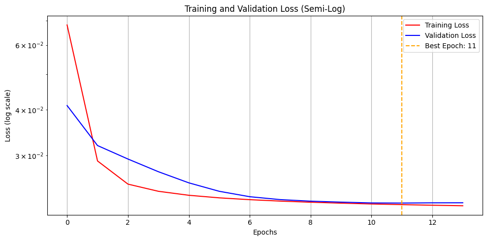
    


```python
from sklearn.metrics import mean_squared_error, mean_absolute_error

# Predictions
y_train_pred = model.predict(X_train)
y_test_pred = model.predict(X_test)

# Compute metrics
train_rmse = np.sqrt(mean_squared_error(y_train, y_train_pred))
train_mae = mean_absolute_error(y_train, y_train_pred)

test_rmse = np.sqrt(mean_squared_error(y_test, y_test_pred.flatten()))
test_mae = mean_absolute_error(y_test, y_test_pred.flatten())

mlp_training_time = training_time
mlp_test_RMSE = test_rmse
mlp_test_MAE = test_mae
print(f"Train RMSE: {train_rmse:.4f}, Train MAE: {train_mae:.4f}")
print(f"Test RMSE: {test_rmse:.4f}, Test MAE: {test_mae:.4f}")

```

    81/81 ━━━━━━━━━━━━━━━━━━━━ 0s 950us/step
    1/1 ━━━━━━━━━━━━━━━━━━━━ 0s 22ms/step
    Train RMSE: 0.1471, Train MAE: 0.1103
    Test RMSE: 0.0985, Test MAE: 0.0821
    

The Multilayer Perceptron model produced smooth training and validation curves, with early stopping activating at epoch 11 to avoid overfitting. It achieved relatively low RMSE (0.0985) and MAE (0.0821) on the test set, suggesting it learned the general shape of the sunspot cycle. However, due to the sequence-to-vector setup and minor data leakage near the train-test boundary, these results should be interpreted with caution. The model is fast and stable, making it a reasonable starting point for more realistic forecasting strategies.

# <b>2.6</b>
### Compute predictions based on test inputs. Plot the actuals corresponding to the test set along with the predictions and discuss the results.

Predict future values using the trained model


```python
y_test_pred = model.predict(X_test).flatten()

plt.figure(figsize=(12, 6))
plt.plot(y_test, label="Actual", linewidth=1.5)
plt.plot(y_test_pred, label="Prediction", linestyle='-', linewidth=1.5)
plt.title("Actual vs Predicted Sunspot Counts (Scaled)")
plt.xlabel("Months Ahead")
plt.ylabel("Scaled Sunspot Count")
plt.legend()
plt.grid(True)
plt.tight_layout()
plt.show()
```

    1/1 ━━━━━━━━━━━━━━━━━━━━ 0s 22ms/step
    


    
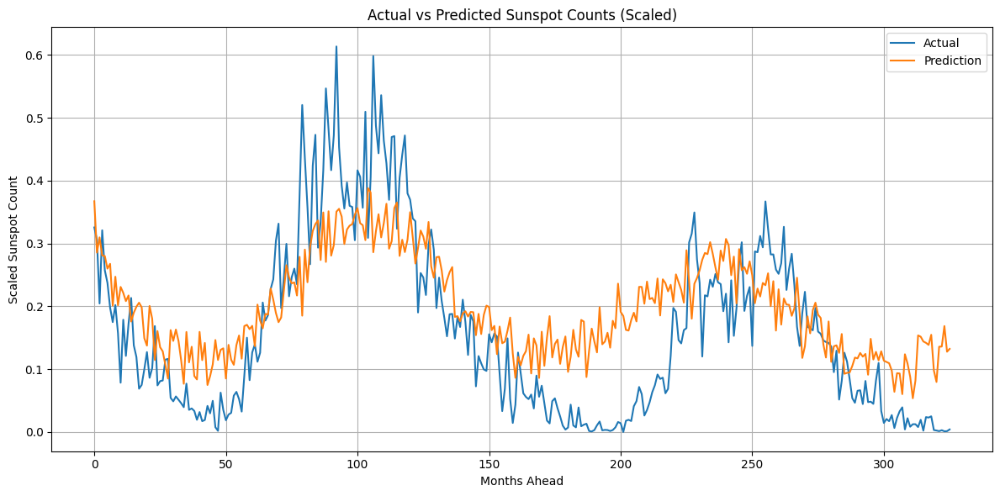
    


Inverse transform to original sunspot units


```python
y_test_actual = scaler.inverse_transform(y_test.reshape(-1, 1)).flatten()
y_test_pred_inv = scaler.inverse_transform(y_test_pred.reshape(-1, 1)).flatten()

plt.figure(figsize=(12, 6))
plt.plot(y_test_actual, label="Actual", linewidth=1.5, color = "darkcyan")
plt.plot(y_test_pred_inv, label="Prediction", linewidth=1.5, color = "chocolate")
plt.title("Actual vs Predicted Sunspot Counts (Original Scale)")
plt.xlabel("Months Ahead")
plt.ylabel("Monthly Mean Sunspot Number")
plt.legend()
plt.grid(True)
plt.tight_layout()
plt.show()

```


    
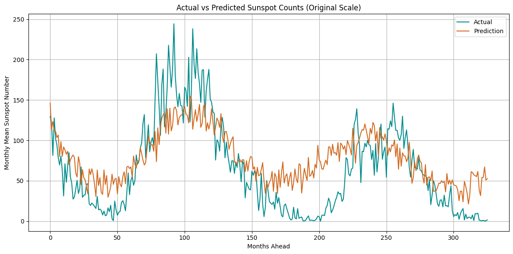
    


The model captures the cyclical nature of sunspot activity well, delivering stable and realistic long-term forecasts across the 326-month horizon. Although it slightly smooths sharp peaks and valleys and falls a little ahead or behind in time, it maintains the overall shape and timing of the cycles. This performance is expected given the sequence-to-vector approach, which compresses a large forecasting window into a single prediction without any corrective feedback. Although this limits accuracy in precise timing, the model serves as a solid baseline and a useful foundation for exploring more realistic forecasting methods, such as iterative or sequence-to-sequence architectures.

# <b>2.7</b>
### Create an additional model using two Gated Recurrent Unit (GRU) layers and the output layer of Q4. The parameters should be the same as those on Q4. Compare the new model with the existing one with respect to training times RMSE and MAE of the predictions on the test set. Additionaly, the early stopping criterion should check if the minimum change in the monitored quantity is above 0.0005. Discuss your results.

Reshape for RNN input: (samples, timesteps, features)


```python
X_train_gru = X_train.reshape(X_train.shape[0], X_train.shape[1], 1)
X_test_gru = X_test.reshape(X_test.shape[0], X_test.shape[1], 1)
```

Define the GRU Mode


```python
from tensorflow.keras.layers import GRU

gru_model = Sequential([
    Input(shape=(window_size,1)),
    GRU(50, return_sequences=True,),
    GRU(25),
    Dense(y_train.shape[1])  # Output size = forecast horizon
])
```

Compile and Configure Early Stopping


```python
gru_model.compile(
    loss="mse",
    optimizer=AdamW(),
    metrics=["mae"]
)

early_stopping_gru = EarlyStopping(
    monitor="val_loss",
    patience=2,
    restore_best_weights=True,
    min_delta=0.0005
)

```

Train the GRU Model


```python
start = time.time()
gru_history = gru_model.fit(
    X_train_gru, y_train,
    epochs=30,
    batch_size=32,
    validation_split=0.1,
    callbacks=[early_stopping_gru],
    verbose=1
)
end = time.time()
gru_training_time = end - start
print(f"GRU training time: {gru_training_time:.2f} seconds")
```

    Epoch 1/30
    72/72 ━━━━━━━━━━━━━━━━━━━━ 2s 12ms/step - loss: 0.0491 - mae: 0.1672 - val_loss: 0.0419 - val_mae: 0.1632
    Epoch 2/30
    72/72 ━━━━━━━━━━━━━━━━━━━━ 1s 8ms/step - loss: 0.0278 - mae: 0.1336 - val_loss: 0.0386 - val_mae: 0.1522
    Epoch 3/30
    72/72 ━━━━━━━━━━━━━━━━━━━━ 1s 8ms/step - loss: 0.0261 - mae: 0.1276 - val_loss: 0.0336 - val_mae: 0.1398
    Epoch 4/30
    72/72 ━━━━━━━━━━━━━━━━━━━━ 1s 8ms/step - loss: 0.0252 - mae: 0.1244 - val_loss: 0.0332 - val_mae: 0.1383
    Epoch 5/30
    72/72 ━━━━━━━━━━━━━━━━━━━━ 1s 8ms/step - loss: 0.0250 - mae: 0.1236 - val_loss: 0.0322 - val_mae: 0.1352
    Epoch 6/30
    72/72 ━━━━━━━━━━━━━━━━━━━━ 1s 8ms/step - loss: 0.0246 - mae: 0.1218 - val_loss: 0.0288 - val_mae: 0.1252
    Epoch 7/30
    72/72 ━━━━━━━━━━━━━━━━━━━━ 1s 8ms/step - loss: 0.0229 - mae: 0.1157 - val_loss: 0.0234 - val_mae: 0.1101
    Epoch 8/30
    72/72 ━━━━━━━━━━━━━━━━━━━━ 1s 8ms/step - loss: 0.0219 - mae: 0.1121 - val_loss: 0.0227 - val_mae: 0.1082
    Epoch 9/30
    72/72 ━━━━━━━━━━━━━━━━━━━━ 1s 8ms/step - loss: 0.0218 - mae: 0.1115 - val_loss: 0.0224 - val_mae: 0.1073
    Epoch 10/30
    72/72 ━━━━━━━━━━━━━━━━━━━━ 1s 8ms/step - loss: 0.0217 - mae: 0.1111 - val_loss: 0.0221 - val_mae: 0.1065
    Epoch 11/30
    72/72 ━━━━━━━━━━━━━━━━━━━━ 1s 9ms/step - loss: 0.0216 - mae: 0.1108 - val_loss: 0.0219 - val_mae: 0.1060
    Epoch 12/30
    72/72 ━━━━━━━━━━━━━━━━━━━━ 1s 9ms/step - loss: 0.0215 - mae: 0.1106 - val_loss: 0.0218 - val_mae: 0.1057
    GRU training time: 9.01 seconds
    

Make predictions


```python
y_test_gru_pred = gru_model.predict(X_test_gru).flatten()


gru_test_rmse = np.sqrt(mean_squared_error(y_test, y_test_gru_pred))
gru_test_mae = mean_absolute_error(y_test, y_test_gru_pred)

print(f"GRU Test RMSE: {gru_test_rmse:.4f}, Test MAE: {gru_test_mae:.4f}")
```

    1/1 ━━━━━━━━━━━━━━━━━━━━ 0s 192ms/step
    GRU Test RMSE: 0.0958, Test MAE: 0.0753
    

Construct comparison DataFrame


```python
comparison_df = pd.DataFrame({
    "Model": ["MLP", "GRU"],
    "Training Time (s)": [round(mlp_training_time,2), round(gru_training_time,2)],
    "Test RMSE": [mlp_test_RMSE, gru_test_rmse],
    "Test MAE": [mlp_test_MAE, gru_test_mae]
})

comparison_df
```


<div>
<style scoped>
    .dataframe tbody tr th:only-of-type {
        vertical-align: middle;
    }

    .dataframe tbody tr th {
        vertical-align: top;
    }

    .dataframe thead th {
        text-align: right;
    }
</style>
<table border="1" class="dataframe">
  <thead>
    <tr style="text-align: right;">
      <th></th>
      <th>Model</th>
      <th>Training Time (s)</th>
      <th>Test RMSE</th>
      <th>Test MAE</th>
    </tr>
  </thead>
  <tbody>
    <tr>
      <th>0</th>
      <td>MLP</td>
      <td>2.71</td>
      <td>0.098469</td>
      <td>0.082097</td>
    </tr>
    <tr>
      <th>1</th>
      <td>GRU</td>
      <td>9.01</td>
      <td>0.095764</td>
      <td>0.075310</td>
    </tr>
  </tbody>
</table>
</div>


The GRU-based model achieved comparable RMSE and MAE to the MLP, confirming that it was able to learn the general structure of the sunspot cycles. However, as expected, the GRU required a longer training time due to its recurrent architecture. Early stopping functioned correctly, halting training once improvements became negligible. However, the benefits of the GRU were not fully realized in this sequence-to-vector setup, where only one input window is used to predict the entire 326-month horizon. While GRUs are typically well-suited for capturing complex temporal dependencies, a sequence-to-sequence architecture or rolling prediction setup would have allowed the model to better leverage its strengths.

Predict the next 326 months using the GRU model


```python
y_test_gru_pred = gru_model.predict(X_test_gru).flatten()

plt.figure(figsize=(12, 6))
plt.plot(y_test, label="Actual", linewidth=1.5)
plt.plot(y_test_gru_pred, label="GRU Prediction", linestyle='-', linewidth=1.5, color='purple')
plt.title("GRU: Actual vs Predicted Sunspot Counts (Scaled)")
plt.xlabel("Months Ahead")
plt.ylabel("Scaled Sunspot Count")
plt.legend()
plt.grid(True)
plt.tight_layout()
plt.show()
```

    1/1 ━━━━━━━━━━━━━━━━━━━━ 0s 24ms/step
    


    
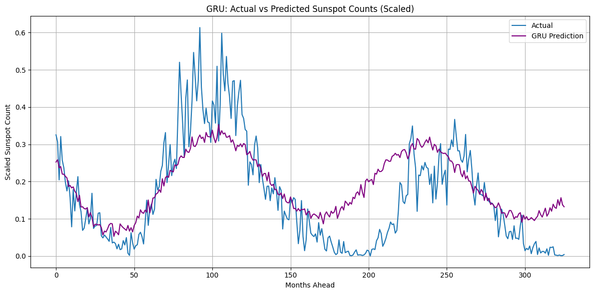
    


Inverse transform to original sunspot units


```python
y_test_actual = scaler.inverse_transform(y_test.reshape(-1, 1)).flatten()
y_test_gru_pred_inv = scaler.inverse_transform(y_test_gru_pred.reshape(-1, 1)).flatten()

plt.figure(figsize=(12, 6))
plt.plot(y_test_actual, label="Actual", linewidth=1.5, color="darkcyan")
plt.plot(y_test_gru_pred_inv, label="GRU Prediction", linestyle='-', linewidth=1.5, color='darkmagenta')
plt.title("GRU: Actual vs Predicted Sunspot Counts (Original Scale)")
plt.xlabel("Months Ahead")
plt.ylabel("Monthly Mean Sunspot Number")
plt.legend()
plt.grid(True)
plt.tight_layout()
plt.show()
```


    
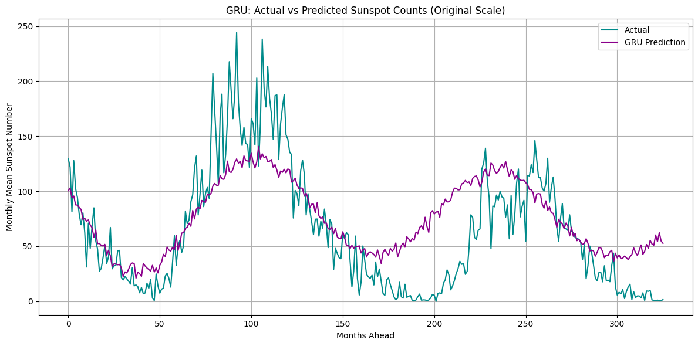
    


Below is a visual comparison between the predictions made by the MLP and the GRU models against the actual sunspot values over a 326-month forecast horizon.


```python
y_test_mlp_pred = y_test_pred

plt.figure(figsize=(15, 6))


plt.plot(y_test, label="Actual", color='blue', linewidth=1.5, alpha = 0.3)
plt.plot(y_test_mlp_pred, label="MLP Prediction", linestyle='-', color='red', linewidth=1.5)

plt.plot(y_test_gru_pred, label="GRU Prediction", linestyle='-', color='green', linewidth=1.5)

plt.title("MLP vs GRU: Actual vs Predicted Sunspot Counts (Scaled)")
plt.xlabel("Months Ahead")
plt.ylabel("Scaled Sunspot Count")
plt.legend()
plt.grid(True)
plt.tight_layout()
plt.show()

```


    
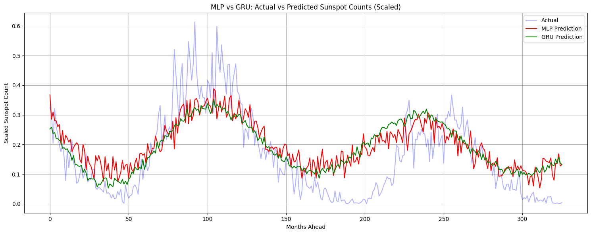
    


This graph confirms that both models capture the general structure of the sunspot time series. The MLP prediction is more responsive but appears noisier overall. In contrast, the GRU provides a smoother and more stable forecast, which would probably generalize better over time. These observations are consistent with the RMSE and MAE values and highlight GRU’s advantage in sequence modeling tasks with repeating cycles, like this one.

### Extra Analysis

### Ex6. Peak Analysis with phase shift visualization

It would be interesting to monitor the actual peaks in the graph, against the predicted ones. This would help measure how well the model predicts the timing of peaks in sunspot activity, not just whether it predicts the right shape or value, but whether it gets the peaks in the right place on the time axis.


Detect all local maxima


```python
from scipy.signal import find_peaks

actual_peaks, _ = find_peaks(y_test)
predicted_peaks, _ = find_peaks(y_test_pred)
```

Compare up to the number of matched peaks


```python
n = min(len(actual_peaks), len(predicted_peaks))
phase_shifts = predicted_peaks[:n] - actual_peaks[:n]

plt.figure(figsize=(12, 6))
plt.plot(y_test, label="Actual", linewidth=1)
plt.plot(y_test_pred, label="Prediction", linewidth=1)
plt.plot(actual_peaks, y_test[actual_peaks], 'o', label="Actual Peaks")
plt.plot(predicted_peaks, y_test_pred[predicted_peaks], 'x', label="Predicted Peaks")
plt.title("Peaks in Actual vs Predicted Sunspot Activity")
plt.xlabel("Months Ahead")
plt.ylabel("Scaled Sunspot Count")
plt.legend()
plt.grid(True)
plt.tight_layout()
plt.show()

# Shift summary
print(f"Mean Phase Shift: {np.mean(phase_shifts):.2f} months")
print(f"Std Deviation: {np.std(phase_shifts):.2f}")

```


    
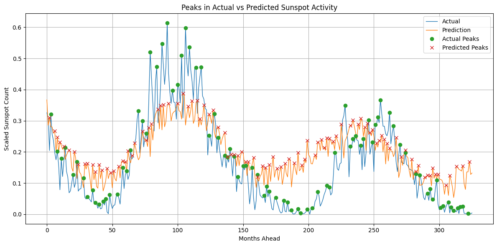
    


    Mean Phase Shift: -26.57 months
    Std Deviation: 15.80
    

This peak alignment analysis shows that while the model successfully captures the overall cyclical pattern of sunspot activity, it tends to predict major peaks approximately 2 years earlier than they actually occur. This consistent phase shift is a typical challenge in sequence-to-vector forecasting, where the model sees only one input window and has no corrective feedback. Still, the strong shape alignment and relatively low deviation (not terrible) suggest the model has learned the core periodic behavior.

### Ex7. Baseline model

We build a baseline model that makes a very simple prediction (naive approach): It assumes the future will be exactly like the last known value from the input window. This gives us a reference point. It is generally advised to include a baseline model in time series forecassting in order to expose weak models and quantify gain.


```python
y_baseline = np.full_like(y_test, X_test[0, -1]) # Naive baseline: repeat last value from input window

baseline_rmse = np.sqrt(mean_squared_error(y_test, y_baseline))
baseline_mae = mean_absolute_error(y_test, y_baseline)

print(f"Baseline RMSE: {baseline_rmse:.4f}, MAE: {baseline_mae:.4f}")

```

    Baseline RMSE: 0.2231, MAE: 0.1987
    


```python
baseline_row = {"Model" : "Naive Baseline",
                "Training Time (s)": 0.00,
                "Test RMSE": baseline_rmse,
                "Test MAE": baseline_mae
}

comparison_df = pd.concat([comparison_df, pd.DataFrame([baseline_row])], ignore_index=True)

comparison_df
```


<div>
<style scoped>
    .dataframe tbody tr th:only-of-type {
        vertical-align: middle;
    }

    .dataframe tbody tr th {
        vertical-align: top;
    }

    .dataframe thead th {
        text-align: right;
    }
</style>
<table border="1" class="dataframe">
  <thead>
    <tr style="text-align: right;">
      <th></th>
      <th>Model</th>
      <th>Training Time (s)</th>
      <th>Test RMSE</th>
      <th>Test MAE</th>
    </tr>
  </thead>
  <tbody>
    <tr>
      <th>0</th>
      <td>MLP</td>
      <td>2.71</td>
      <td>0.098469</td>
      <td>0.082097</td>
    </tr>
    <tr>
      <th>1</th>
      <td>GRU</td>
      <td>9.01</td>
      <td>0.095764</td>
      <td>0.075310</td>
    </tr>
    <tr>
      <th>2</th>
      <td>Naive Baseline</td>
      <td>0.00</td>
      <td>0.223144</td>
      <td>0.198702</td>
    </tr>
  </tbody>
</table>
</div>


Both the MLP and GRU models significantly outperform the Naive Baseline.

### Ex8. Errors distribution plot

Let's plot the residuals error distribution of our model predictions. Specifically, we visualize histograms of the differences between the actual sunspot values and the predictions. That way we can :
- Check if the errors are cenetered around 0, which will indicate an unbiased model
- Evaluate spread and skewness (tighter, more symmetric = better)
- Compare the two models directly
- Check for outliers or systematic prediction patterns.


```python
mlp_errors = y_test - y_test_pred.flatten()
gru_errors = y_test - y_test_gru_pred.flatten()

plt.figure(figsize=(12, 4))
plt.hist(mlp_errors, bins=40, alpha=0.6, label="MLP Errors")
plt.hist(gru_errors, bins=40, alpha=0.6, label="GRU Errors")
plt.axvline(0, color='black', linestyle='--')
plt.title("Prediction Error Distribution (Actual - Prediction)")
plt.xlabel("Error")
plt.ylabel("Frequency")
plt.legend()
plt.grid(True)
plt.tight_layout()
plt.show()
```


    
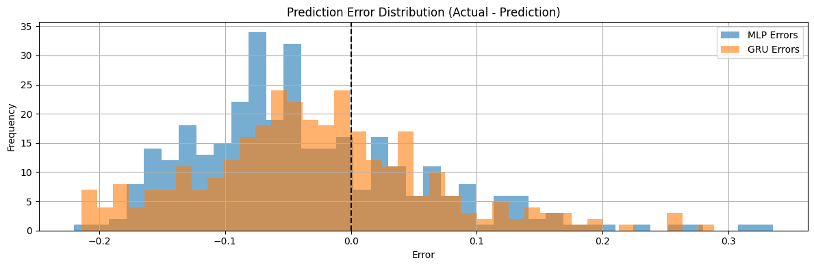
    


This histogram shows that both models are fairly well centered around 0, but the GRU model tends to produce more stable, less noisy errors. The MLP, while sharp, introduces more extreme under-predictions. These insights support the GRU's stronger generalization in your earlier visual and metric-based comparisons.

# <i>Final Thoughts on Problem 2

<i>This project offered a valuable opportunity to explore time series forecasting using neural networks on solar activity data. However, a few methodological choices depart from typical real-world practices.
- <i>We are treating a sequence-to-vector problem where we are forecasting ALL future points in one shot. This is unrealistic for forecasting tasks, as it assumes that the model has no need for feedback from intermediate preditctions. It would be a better choice to train a model to predict the next month, and then loop using predictions to generate full forecast.

- <i>The window size of 40 months was fixed without testing alternatives. Since the solar cycle is around 132 months, experimenting with different window lengths might have been a good idea.

- <i>Some data leakage occured in how the training windows were created near the test set. Because some training samples use data points that are right before the test period, the model may have indirectly gotten a glimpse of the future. In time series forecasting, it’s important to keep past and future completely separate to make the evaluation more realistic.
