# HW6: Autoencoders and Generative Adversarial Networks (GANs)

**Project:** Machine Learning Assignment 6  
**Course:** DAMA61 - Data Science & Machine Learning  
**Date:** 2024  
**Technologies:** Python, TensorFlow, Keras, NumPy, Matplotlib  
**Dataset:** Fashion MNIST (filtered: Sandal, Sneaker, Ankle boot)

## Project Description

This project explores generative models including autoencoders and GANs on the Fashion MNIST dataset. The assignment involves:

### Part 1: Autoencoders
- Building stacked autoencoders for image compression and reconstruction
- Implementing regular and sparse autoencoders with L1 regularization
- Training with different batch sizes and comparing performance
- Visualizing original vs reconstructed images
- Analyzing compression capabilities and reconstruction quality

### Part 2: Generative Adversarial Networks (GANs)
- Implementing a GAN from scratch using TensorFlow/Keras
- Training generator and discriminator networks adversarially
- Generating synthetic fashion item images
- Evaluating GAN performance and convergence

The project demonstrates advanced deep learning concepts including representation learning, generative modeling, and adversarial training.

## Key Results

- **Autoencoder Types:** Stacked Autoencoder, Sparse Autoencoder (L1 regularization)
- **GAN Architecture:** Generator + Discriminator with Binary Cross-Entropy loss
- **Dataset:** Fashion MNIST (filtered to 3 classes: Sandal, Sneaker, Ankle boot)
- **Training:** 50 epochs for autoencoders, 10 epochs for GAN
- **Batch Sizes:** 32 and 256 for autoencoders, 32 for GAN
- **Focus:** Generative models, representation learning, adversarial training

---

# Problem 1

### In this assignment, you will work with a filtered version of the Fashion MNIST dataset to explore the ability of autoencoders to compress and reconstruct image data. You will build and evaluate two autoencoder variants and compare their performance based on various experimental setups. Make sure to print any output you consider important to support your observations.

## <b>1.1</b>
### Load the Fashion MNIST dataset from the tensorflow.keras.datasets module. Keep only the instances that belong to the following three classes: ‘Sandal’, ‘Sneaker’, and ‘Ankle boot’. Split the filtered dataset into a training set (5/7), a validation set (1/7), and a test set (1/7). Make sure the split uses stratified sampling to preserve class balance. Scale all subsets so pixel values are in the range [0, 1]. Print the class distribution of each subset with clear, labeled messages.

Load Fashion MNIST


```python
from tensorflow.keras.datasets import fashion_mnist

(X_train_full, y_train_full), (X_test_full, y_test_full) = fashion_mnist.load_data()
```

Concatenate to extend the dataset and create custom splits.


```python
import numpy as np
X_full = np.concatenate([X_train_full, X_test_full], axis=0)
y_full = np.concatenate([y_train_full, y_test_full], axis=0)
```

Keep only classes: Sandal (5), Sneaker (7), Ankle boot (9) (The mapping of class indices to labels is standardized and documented)


```python
selected_classes = [5, 7, 9]
mask = np.isin(y_full, selected_classes)
X_full = X_full[mask]
y_full = y_full[mask]
```

Define the split sizes. Consider the full dataset split in 7 parts.


```python
train_size = 5/7
valid_size = 1/7
test_size = 1/7
```

Export the test set by splitting on the full sets. We keep $\frac{1}{7}\cdot{dataset}$.


```python
from sklearn.model_selection import train_test_split

X_temp, X_test, y_temp, y_test = train_test_split(X_full, y_full, test_size=test_size, random_state=42, stratify=y_full)
```

Having kept $\frac{1}{7}\cdot{dataset}$, we now want to export from the remaining $\frac{6}{7}\cdot{dataset}$, another $\frac{1}{7}\cdot{dataset}$. Therefore we will use a ratio of $\frac{\frac{1}{7}}{\frac{5}{7}+\frac{1}{7}}=\frac{\frac{1}{7}}{\frac{6}{7}}=\frac{1}{6}\cdot{temp\_dataset}$.


```python
valid_ratio_adjusted = valid_size / (train_size + valid_size)
X_train, X_valid, y_train, y_valid = train_test_split(X_temp, y_temp, test_size=valid_ratio_adjusted, random_state=42, stratify=y_temp)
```

Normalize pixel values 0-255 to 0-1. Setting the datatype explicitly is important for TensorFlow/Keras models since they expect float inputs to perform computations efficiently.


```python
X_train = X_train.astype("float32") / 255.
X_valid = X_valid.astype("float32") / 255.
X_test = X_test.astype("float32") / 255.
```

Print dataset shapes


```python
print(f'Train set shape: {X_train.shape}, Labels shape: {y_train.shape}')
print(f'Validation set shape: {X_valid.shape}, Labels shape: {y_valid.shape}')
print(f'Test set shape: {X_test.shape}, Labels shape: {y_test.shape}')
```

    Train set shape: (15000, 28, 28), Labels shape: (15000,)
    Validation set shape: (3000, 28, 28), Labels shape: (3000,)
    Test set shape: (3000, 28, 28), Labels shape: (3000,)
    

Verify that the stratified splitting preserved class balance


```python
import pandas as pd

def print_class_distribution(y, name):
    class_counts = pd.Series(y).value_counts().sort_index()
    class_names = {5: 'Sandal', 7: 'Sneaker', 9: 'Ankle boot'}
    print(f'\nClass distribution in {name} set:')
    for label, count in class_counts.items():
        print(f'{class_names[label]:<12}: {count}')

print_class_distribution(y_train, "Train")
print_class_distribution(y_valid, "Validation")
print_class_distribution(y_test, "Test")
```

    
    Class distribution in Train set:
    Sandal      : 5000
    Sneaker     : 5000
    Ankle boot  : 5000
    
    Class distribution in Validation set:
    Sandal      : 1000
    Sneaker     : 1000
    Ankle boot  : 1000
    
    Class distribution in Test set:
    Sandal      : 1000
    Sneaker     : 1000
    Ankle boot  : 1000
    

## <b>1.2</b>
### Build a stacked autoencoder with the following architecture: an encoder and a decoder part of two fully-connected (Dense) layers each. Use ReLU activation for all hidden layers, and sigmoid activation for the output layer. Flatten the input before feeding it to the encoder, and reshape the output to match the original image shape (28×28). Set the latent space (codings) size to 50, and all other hidden layers to 256 units. Compile the model using: Nadam optimizer with learning rate $10^{−4}$, adding binary cross-entropy as the loss function. Print the model summary of this autoencoder.

Define the constants


```python
img_height, img_width = 28, 28
flattened_dim = img_height * img_width
hidden_units = 256
latent_dim = 50
```

Build the stacked autoencoder


```python
from tensorflow.keras.models import Sequential
from tensorflow.keras.layers import Input, Flatten, Dense, Reshape

autoencoder = Sequential([
    Input(shape=(28, 28)),
    
    # Encoder
    Flatten(),
    Dense(hidden_units, activation='relu'),
    Dense(latent_dim, activation='relu'),
    
    # Decoder
    Dense(hidden_units, activation='relu'),
    Dense(flattened_dim, activation='sigmoid'),
    Reshape((28, 28))

])
```

Compile


```python
from tensorflow.keras.optimizers import Nadam

autoencoder.compile(optimizer=Nadam(learning_rate=10**(-4)), loss='binary_crossentropy')

autoencoder.summary()
```


<pre style="white-space:pre;overflow-x:auto;line-height:normal;font-family:Menlo,'DejaVu Sans Mono',consolas,'Courier New',monospace"><span style="font-weight: bold">Model: "sequential"</span>
</pre>


<pre style="white-space:pre;overflow-x:auto;line-height:normal;font-family:Menlo,'DejaVu Sans Mono',consolas,'Courier New',monospace">┏━━━━━━━━━━━━━━━━━━━━━━━━━━━━━━━━━━━━━━┳━━━━━━━━━━━━━━━━━━━━━━━━━━━━━┳━━━━━━━━━━━━━━━━━┓
┃<span style="font-weight: bold"> Layer (type)                         </span>┃<span style="font-weight: bold"> Output Shape                </span>┃<span style="font-weight: bold">         Param # </span>┃
┡━━━━━━━━━━━━━━━━━━━━━━━━━━━━━━━━━━━━━━╇━━━━━━━━━━━━━━━━━━━━━━━━━━━━━╇━━━━━━━━━━━━━━━━━┩
│ flatten (<span style="color: #0087ff; text-decoration-color: #0087ff">Flatten</span>)                    │ (<span style="color: #00d7ff; text-decoration-color: #00d7ff">None</span>, <span style="color: #00af00; text-decoration-color: #00af00">784</span>)                 │               <span style="color: #00af00; text-decoration-color: #00af00">0</span> │
├──────────────────────────────────────┼─────────────────────────────┼─────────────────┤
│ dense (<span style="color: #0087ff; text-decoration-color: #0087ff">Dense</span>)                        │ (<span style="color: #00d7ff; text-decoration-color: #00d7ff">None</span>, <span style="color: #00af00; text-decoration-color: #00af00">256</span>)                 │         <span style="color: #00af00; text-decoration-color: #00af00">200,960</span> │
├──────────────────────────────────────┼─────────────────────────────┼─────────────────┤
│ dense_1 (<span style="color: #0087ff; text-decoration-color: #0087ff">Dense</span>)                      │ (<span style="color: #00d7ff; text-decoration-color: #00d7ff">None</span>, <span style="color: #00af00; text-decoration-color: #00af00">50</span>)                  │          <span style="color: #00af00; text-decoration-color: #00af00">12,850</span> │
├──────────────────────────────────────┼─────────────────────────────┼─────────────────┤
│ dense_2 (<span style="color: #0087ff; text-decoration-color: #0087ff">Dense</span>)                      │ (<span style="color: #00d7ff; text-decoration-color: #00d7ff">None</span>, <span style="color: #00af00; text-decoration-color: #00af00">256</span>)                 │          <span style="color: #00af00; text-decoration-color: #00af00">13,056</span> │
├──────────────────────────────────────┼─────────────────────────────┼─────────────────┤
│ dense_3 (<span style="color: #0087ff; text-decoration-color: #0087ff">Dense</span>)                      │ (<span style="color: #00d7ff; text-decoration-color: #00d7ff">None</span>, <span style="color: #00af00; text-decoration-color: #00af00">784</span>)                 │         <span style="color: #00af00; text-decoration-color: #00af00">201,488</span> │
├──────────────────────────────────────┼─────────────────────────────┼─────────────────┤
│ reshape (<span style="color: #0087ff; text-decoration-color: #0087ff">Reshape</span>)                    │ (<span style="color: #00d7ff; text-decoration-color: #00d7ff">None</span>, <span style="color: #00af00; text-decoration-color: #00af00">28</span>, <span style="color: #00af00; text-decoration-color: #00af00">28</span>)              │               <span style="color: #00af00; text-decoration-color: #00af00">0</span> │
└──────────────────────────────────────┴─────────────────────────────┴─────────────────┘
</pre>


<pre style="white-space:pre;overflow-x:auto;line-height:normal;font-family:Menlo,'DejaVu Sans Mono',consolas,'Courier New',monospace"><span style="font-weight: bold"> Total params: </span><span style="color: #00af00; text-decoration-color: #00af00">428,354</span> (1.63 MB)
</pre>


<pre style="white-space:pre;overflow-x:auto;line-height:normal;font-family:Menlo,'DejaVu Sans Mono',consolas,'Courier New',monospace"><span style="font-weight: bold"> Trainable params: </span><span style="color: #00af00; text-decoration-color: #00af00">428,354</span> (1.63 MB)
</pre>


<pre style="white-space:pre;overflow-x:auto;line-height:normal;font-family:Menlo,'DejaVu Sans Mono',consolas,'Courier New',monospace"><span style="font-weight: bold"> Non-trainable params: </span><span style="color: #00af00; text-decoration-color: #00af00">0</span> (0.00 B)
</pre>


## <b>1.3</b>
### Now, build a second autoencoder that is identical in architecture to the one in Question 2, add l1 regularization to the latent space (the bottleneck layer), and use an activity regularizer with weight $10^{−6}$. Print the model summary for this sparse autoencoder.

Define constants


```python
img_height, img_width = 28, 28
flattened_dim = img_height * img_width
hidden_units = 256
latent_dim = 50
activity_reg_weight = 10**(-6)
```

Build the sparse autoencoder


```python
from tensorflow.keras.regularizers import l1

sparse_autoencoder = Sequential([
    Input(shape=(28, 28)),

    # Encoder
    Flatten(),
    Dense(hidden_units, activation='relu'),
    Dense(latent_dim, activation='relu', activity_regularizer=l1(activity_reg_weight)),
    
    # Decoder
    Dense(hidden_units, activation='relu'),
    Dense(flattened_dim, activation='sigmoid'),
    Reshape((28, 28))
])
```

Compile


```python
sparse_autoencoder.compile(optimizer=Nadam(learning_rate=10**(-4)), loss='binary_crossentropy')

sparse_autoencoder.summary()
```


<pre style="white-space:pre;overflow-x:auto;line-height:normal;font-family:Menlo,'DejaVu Sans Mono',consolas,'Courier New',monospace"><span style="font-weight: bold">Model: "sequential_1"</span>
</pre>


<pre style="white-space:pre;overflow-x:auto;line-height:normal;font-family:Menlo,'DejaVu Sans Mono',consolas,'Courier New',monospace">┏━━━━━━━━━━━━━━━━━━━━━━━━━━━━━━━━━━━━━━┳━━━━━━━━━━━━━━━━━━━━━━━━━━━━━┳━━━━━━━━━━━━━━━━━┓
┃<span style="font-weight: bold"> Layer (type)                         </span>┃<span style="font-weight: bold"> Output Shape                </span>┃<span style="font-weight: bold">         Param # </span>┃
┡━━━━━━━━━━━━━━━━━━━━━━━━━━━━━━━━━━━━━━╇━━━━━━━━━━━━━━━━━━━━━━━━━━━━━╇━━━━━━━━━━━━━━━━━┩
│ flatten_1 (<span style="color: #0087ff; text-decoration-color: #0087ff">Flatten</span>)                  │ (<span style="color: #00d7ff; text-decoration-color: #00d7ff">None</span>, <span style="color: #00af00; text-decoration-color: #00af00">784</span>)                 │               <span style="color: #00af00; text-decoration-color: #00af00">0</span> │
├──────────────────────────────────────┼─────────────────────────────┼─────────────────┤
│ dense_4 (<span style="color: #0087ff; text-decoration-color: #0087ff">Dense</span>)                      │ (<span style="color: #00d7ff; text-decoration-color: #00d7ff">None</span>, <span style="color: #00af00; text-decoration-color: #00af00">256</span>)                 │         <span style="color: #00af00; text-decoration-color: #00af00">200,960</span> │
├──────────────────────────────────────┼─────────────────────────────┼─────────────────┤
│ dense_5 (<span style="color: #0087ff; text-decoration-color: #0087ff">Dense</span>)                      │ (<span style="color: #00d7ff; text-decoration-color: #00d7ff">None</span>, <span style="color: #00af00; text-decoration-color: #00af00">50</span>)                  │          <span style="color: #00af00; text-decoration-color: #00af00">12,850</span> │
├──────────────────────────────────────┼─────────────────────────────┼─────────────────┤
│ dense_6 (<span style="color: #0087ff; text-decoration-color: #0087ff">Dense</span>)                      │ (<span style="color: #00d7ff; text-decoration-color: #00d7ff">None</span>, <span style="color: #00af00; text-decoration-color: #00af00">256</span>)                 │          <span style="color: #00af00; text-decoration-color: #00af00">13,056</span> │
├──────────────────────────────────────┼─────────────────────────────┼─────────────────┤
│ dense_7 (<span style="color: #0087ff; text-decoration-color: #0087ff">Dense</span>)                      │ (<span style="color: #00d7ff; text-decoration-color: #00d7ff">None</span>, <span style="color: #00af00; text-decoration-color: #00af00">784</span>)                 │         <span style="color: #00af00; text-decoration-color: #00af00">201,488</span> │
├──────────────────────────────────────┼─────────────────────────────┼─────────────────┤
│ reshape_1 (<span style="color: #0087ff; text-decoration-color: #0087ff">Reshape</span>)                  │ (<span style="color: #00d7ff; text-decoration-color: #00d7ff">None</span>, <span style="color: #00af00; text-decoration-color: #00af00">28</span>, <span style="color: #00af00; text-decoration-color: #00af00">28</span>)              │               <span style="color: #00af00; text-decoration-color: #00af00">0</span> │
└──────────────────────────────────────┴─────────────────────────────┴─────────────────┘
</pre>


<pre style="white-space:pre;overflow-x:auto;line-height:normal;font-family:Menlo,'DejaVu Sans Mono',consolas,'Courier New',monospace"><span style="font-weight: bold"> Total params: </span><span style="color: #00af00; text-decoration-color: #00af00">428,354</span> (1.63 MB)
</pre>


<pre style="white-space:pre;overflow-x:auto;line-height:normal;font-family:Menlo,'DejaVu Sans Mono',consolas,'Courier New',monospace"><span style="font-weight: bold"> Trainable params: </span><span style="color: #00af00; text-decoration-color: #00af00">428,354</span> (1.63 MB)
</pre>


<pre style="white-space:pre;overflow-x:auto;line-height:normal;font-family:Menlo,'DejaVu Sans Mono',consolas,'Courier New',monospace"><span style="font-weight: bold"> Non-trainable params: </span><span style="color: #00af00; text-decoration-color: #00af00">0</span> (0.00 B)
</pre>


## <b>1.4</b>
### Train both autoencoders (from Q2 and Q3) for up to 50 epochs. Use early stopping with patience=5, and min_delta equal to $10^{−2}$, monitoring the validation loss. Train each model with two different batch sizes: 32 and 256. This gives you four experiments in total (2 models × 2 batch sizes). After running your experiments, plot the training and validation loss curves for all of them. Add your comments on the differences observed between the models and batch sizes.

Set up early stopping


```python
from tensorflow.keras.callbacks import EarlyStopping

early_stopping_cb = EarlyStopping(monitor='val_loss', patience=5, min_delta=1e-2, restore_best_weights=True, verbose=1)
```

Flatten inputs for dense autoencoders


```python
X_train_flat = X_train.reshape(-1, 28, 28)
X_valid_flat = X_valid.reshape(-1, 28, 28)
```

Dictionaries to store models and histories


```python
from tensorflow.keras.models import clone_model

models = {
    "regular_bs32": clone_model(autoencoder),
    "regular_bs256": clone_model(autoencoder),
    "sparse_bs32": clone_model(sparse_autoencoder),
    "sparse_bs256": clone_model(sparse_autoencoder),
}

histories = {}
```

Compile and train each model


```python
for key, model in models.items():
    model.compile(optimizer=Nadam(learning_rate=1e-4), loss='binary_crossentropy')
    batch_size = 32 if "32" in key else 256
    print(f"\nTraining {key} with batch size {batch_size}...\n")

    history = model.fit(
        X_train_flat, X_train_flat,
        epochs=50,
        batch_size=batch_size,
        validation_data=(X_valid_flat, X_valid_flat),
        callbacks=[early_stopping_cb],
        verbose=2
    )

    histories[key] = history
```

    
    Training regular_bs32 with batch size 32...
    
    Epoch 1/50
    469/469 - 2s - 4ms/step - loss: 0.3526 - val_loss: 0.2796
    Epoch 2/50
    469/469 - 1s - 2ms/step - loss: 0.2652 - val_loss: 0.2568
    Epoch 3/50
    469/469 - 1s - 2ms/step - loss: 0.2490 - val_loss: 0.2450
    Epoch 4/50
    469/469 - 1s - 2ms/step - loss: 0.2401 - val_loss: 0.2381
    Epoch 5/50
    469/469 - 1s - 2ms/step - loss: 0.2345 - val_loss: 0.2336
    Epoch 6/50
    469/469 - 1s - 2ms/step - loss: 0.2307 - val_loss: 0.2304
    Epoch 7/50
    469/469 - 1s - 2ms/step - loss: 0.2277 - val_loss: 0.2278
    Epoch 8/50
    469/469 - 1s - 2ms/step - loss: 0.2254 - val_loss: 0.2256
    Epoch 9/50
    469/469 - 1s - 2ms/step - loss: 0.2233 - val_loss: 0.2241
    Epoch 10/50
    469/469 - 1s - 2ms/step - loss: 0.2216 - val_loss: 0.2221
    Epoch 11/50
    469/469 - 1s - 2ms/step - loss: 0.2201 - val_loss: 0.2207
    Epoch 12/50
    469/469 - 1s - 2ms/step - loss: 0.2188 - val_loss: 0.2196
    Epoch 13/50
    469/469 - 1s - 2ms/step - loss: 0.2177 - val_loss: 0.2185
    Epoch 14/50
    469/469 - 1s - 2ms/step - loss: 0.2167 - val_loss: 0.2176
    Epoch 15/50
    469/469 - 1s - 2ms/step - loss: 0.2158 - val_loss: 0.2167
    Epoch 15: early stopping
    Restoring model weights from the end of the best epoch: 10.
    
    Training regular_bs256 with batch size 256...
    
    Epoch 1/50
    59/59 - 1s - 23ms/step - loss: 0.6200 - val_loss: 0.4789
    Epoch 2/50
    59/59 - 0s - 5ms/step - loss: 0.3946 - val_loss: 0.3437
    Epoch 3/50
    59/59 - 0s - 5ms/step - loss: 0.3234 - val_loss: 0.3090
    Epoch 4/50
    59/59 - 0s - 5ms/step - loss: 0.3002 - val_loss: 0.2935
    Epoch 5/50
    59/59 - 0s - 5ms/step - loss: 0.2875 - val_loss: 0.2836
    Epoch 6/50
    59/59 - 0s - 5ms/step - loss: 0.2784 - val_loss: 0.2760
    Epoch 7/50
    59/59 - 0s - 5ms/step - loss: 0.2717 - val_loss: 0.2704
    Epoch 8/50
    59/59 - 0s - 5ms/step - loss: 0.2665 - val_loss: 0.2659
    Epoch 9/50
    59/59 - 0s - 6ms/step - loss: 0.2622 - val_loss: 0.2619
    Epoch 10/50
    59/59 - 0s - 5ms/step - loss: 0.2585 - val_loss: 0.2584
    Epoch 11/50
    59/59 - 0s - 5ms/step - loss: 0.2552 - val_loss: 0.2554
    Epoch 12/50
    59/59 - 0s - 6ms/step - loss: 0.2522 - val_loss: 0.2525
    Epoch 13/50
    59/59 - 0s - 6ms/step - loss: 0.2496 - val_loss: 0.2501
    Epoch 14/50
    59/59 - 0s - 6ms/step - loss: 0.2472 - val_loss: 0.2477
    Epoch 15/50
    59/59 - 0s - 5ms/step - loss: 0.2450 - val_loss: 0.2455
    Epoch 16/50
    59/59 - 0s - 5ms/step - loss: 0.2429 - val_loss: 0.2435
    Epoch 17/50
    59/59 - 0s - 5ms/step - loss: 0.2410 - val_loss: 0.2416
    Epoch 18/50
    59/59 - 0s - 5ms/step - loss: 0.2392 - val_loss: 0.2399
    Epoch 19/50
    59/59 - 0s - 6ms/step - loss: 0.2376 - val_loss: 0.2384
    Epoch 20/50
    59/59 - 0s - 6ms/step - loss: 0.2363 - val_loss: 0.2372
    Epoch 21/50
    59/59 - 0s - 5ms/step - loss: 0.2351 - val_loss: 0.2360
    Epoch 21: early stopping
    Restoring model weights from the end of the best epoch: 16.
    
    Training sparse_bs32 with batch size 32...
    
    Epoch 1/50
    469/469 - 2s - 5ms/step - loss: 0.3578 - val_loss: 0.2842
    Epoch 2/50
    469/469 - 1s - 2ms/step - loss: 0.2696 - val_loss: 0.2610
    Epoch 3/50
    469/469 - 1s - 2ms/step - loss: 0.2533 - val_loss: 0.2489
    Epoch 4/50
    469/469 - 1s - 2ms/step - loss: 0.2438 - val_loss: 0.2416
    Epoch 5/50
    469/469 - 1s - 2ms/step - loss: 0.2381 - val_loss: 0.2370
    Epoch 6/50
    469/469 - 1s - 2ms/step - loss: 0.2339 - val_loss: 0.2334
    Epoch 7/50
    469/469 - 1s - 2ms/step - loss: 0.2306 - val_loss: 0.2304
    Epoch 8/50
    469/469 - 1s - 2ms/step - loss: 0.2281 - val_loss: 0.2282
    Epoch 9/50
    469/469 - 1s - 2ms/step - loss: 0.2259 - val_loss: 0.2262
    Epoch 10/50
    469/469 - 1s - 2ms/step - loss: 0.2241 - val_loss: 0.2245
    Epoch 11/50
    469/469 - 1s - 2ms/step - loss: 0.2225 - val_loss: 0.2231
    Epoch 12/50
    469/469 - 1s - 2ms/step - loss: 0.2211 - val_loss: 0.2219
    Epoch 13/50
    469/469 - 1s - 2ms/step - loss: 0.2200 - val_loss: 0.2208
    Epoch 14/50
    469/469 - 1s - 2ms/step - loss: 0.2189 - val_loss: 0.2199
    Epoch 14: early stopping
    Restoring model weights from the end of the best epoch: 9.
    
    Training sparse_bs256 with batch size 256...
    
    Epoch 1/50
    59/59 - 1s - 25ms/step - loss: 0.6374 - val_loss: 0.5144
    Epoch 2/50
    59/59 - 0s - 6ms/step - loss: 0.4262 - val_loss: 0.3730
    Epoch 3/50
    59/59 - 0s - 7ms/step - loss: 0.3510 - val_loss: 0.3343
    Epoch 4/50
    59/59 - 0s - 6ms/step - loss: 0.3242 - val_loss: 0.3156
    Epoch 5/50
    59/59 - 0s - 6ms/step - loss: 0.3086 - val_loss: 0.3029
    Epoch 6/50
    59/59 - 0s - 6ms/step - loss: 0.2967 - val_loss: 0.2925
    Epoch 7/50
    59/59 - 0s - 6ms/step - loss: 0.2874 - val_loss: 0.2848
    Epoch 8/50
    59/59 - 0s - 7ms/step - loss: 0.2806 - val_loss: 0.2790
    Epoch 9/50
    59/59 - 0s - 7ms/step - loss: 0.2751 - val_loss: 0.2741
    Epoch 10/50
    59/59 - 0s - 7ms/step - loss: 0.2705 - val_loss: 0.2697
    Epoch 11/50
    59/59 - 0s - 6ms/step - loss: 0.2662 - val_loss: 0.2656
    Epoch 12/50
    59/59 - 0s - 7ms/step - loss: 0.2625 - val_loss: 0.2620
    Epoch 13/50
    59/59 - 0s - 7ms/step - loss: 0.2592 - val_loss: 0.2591
    Epoch 14/50
    59/59 - 0s - 6ms/step - loss: 0.2563 - val_loss: 0.2563
    Epoch 15/50
    59/59 - 0s - 7ms/step - loss: 0.2538 - val_loss: 0.2539
    Epoch 16/50
    59/59 - 0s - 6ms/step - loss: 0.2516 - val_loss: 0.2518
    Epoch 17/50
    59/59 - 0s - 7ms/step - loss: 0.2496 - val_loss: 0.2498
    Epoch 18/50
    59/59 - 0s - 7ms/step - loss: 0.2478 - val_loss: 0.2482
    Epoch 19/50
    59/59 - 0s - 7ms/step - loss: 0.2463 - val_loss: 0.2470
    Epoch 20/50
    59/59 - 0s - 7ms/step - loss: 0.2449 - val_loss: 0.2455
    Epoch 20: early stopping
    Restoring model weights from the end of the best epoch: 15.
    

Plot the training and validation losses for all the autoencoders


```python
import matplotlib.pyplot as plt

for key, history in histories.items():
    epochs = np.arange(len(history.epoch))
    best_epoch = np.argmin(history.history['val_loss'])

    plt.figure(figsize=(6, 4))

    # Plot training and validation loss only
    plt.plot(epochs - 0.5, history.history['loss'], label='Training Loss')
    plt.plot(epochs, history.history['val_loss'], label='Validation Loss')
    plt.axvline(best_epoch, color='green', linestyle='--', label=f'Best Epoch: {best_epoch + 1}')
    plt.title(f'{key} - Training and Validation Loss')
    plt.xlabel('Epochs')
    plt.xticks(ticks=epochs, labels=epochs + 1)
    plt.ylabel('Binary Crossentropy')
    plt.grid()
    plt.legend(loc='upper right', fontsize=8)

    plt.tight_layout()
    plt.show()
```


    
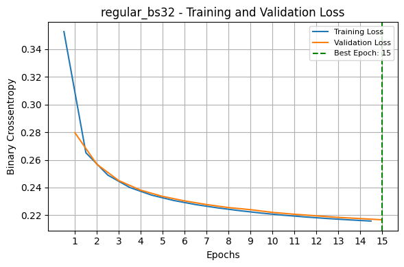
    


    
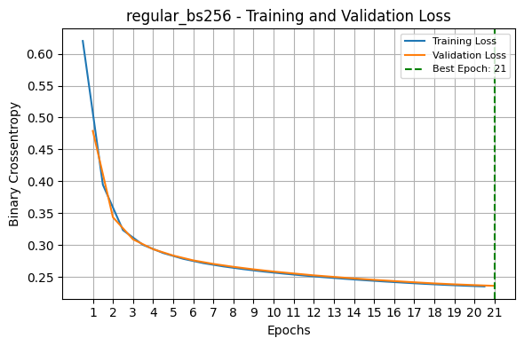
    


    
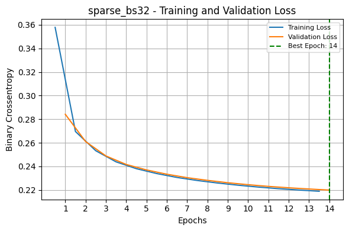
    


    
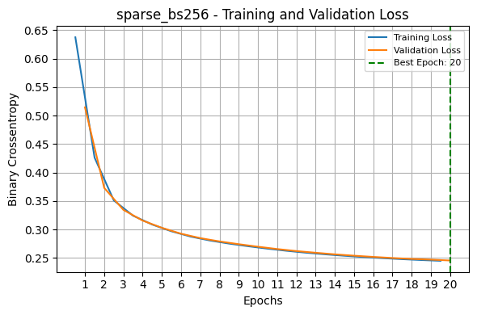
    


## <b>1.5</b>
### Write a function that compares original images with their reconstructions from an autoencoder. The function should: 
### • Accept a model, a set of images, and the number of images to display as input. 
### • Display a grid where the top row shows the original images, and the bottom row shows the reconstructed images.
### • Ensure the pixel values are clipped to the range [0, 1] for proper visualization.
### Then use this function to display the first 15 test images and their reconstructions from the regular autoencoder trained with a batch size of 256, and the sparse autoencoder trained with a batch size 256.


```python
def show_reconstructions(model, images, n_images=15):
    """
    Plots original and reconstructed images in a 2-row grid.

    Top row: original images
    Bottom row: reconstructed images
    """
    reconstructions = model.predict(images[:n_images], verbose=0)
    reconstructions = np.clip(reconstructions, 0, 1)  # Ensure proper range

    plt.figure(figsize=(n_images, 3))
    for i in range(n_images):
        # Original
        plt.subplot(2, n_images, i + 1)
        plt.imshow(images[i], cmap='gray')
        plt.axis('off')

        # Reconstructed
        plt.subplot(2, n_images, i + 1 + n_images)
        plt.imshow(reconstructions[i], cmap='gray')
        plt.axis('off')

    plt.suptitle("Top: Original Images — Bottom: Reconstructions", fontsize=12)
    plt.tight_layout()
    plt.show()

```

Flatten test images for model input


```python
X_test_flat = X_test.reshape(-1, 28, 28)
```

Display reconstructions for regular autoencoder (batch size 256)


```python
print("Regular Autoencoder (batch size 256):")
show_reconstructions(models["regular_bs256"], X_test_flat, n_images=15)
```

    Regular Autoencoder (batch size 256):
    


    
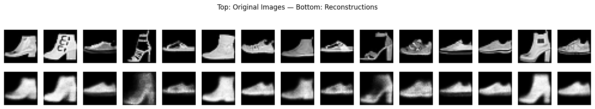
    


Display reconstructions for sparse autoencoder (batch size 256)


```python
print("Sparse Autoencoder (batch size 256):")
show_reconstructions(models["sparse_bs256"], X_test_flat, n_images=15)
```

    Sparse Autoencoder (batch size 256):
    


    
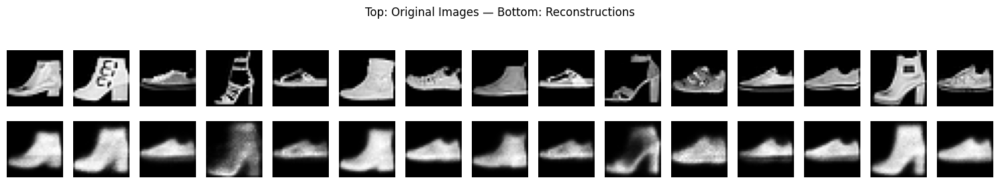
    


# Problem 2

### In this assignment, you will implement and train a Generative Adversarial Network (GAN) from scratch using the Fashion-MNIST dataset. Your GAN will learn to generate synthetic fashion item images that resemble real samples from selected categories. Hint: Use tensorflow ∼ 2.14 and follow the code of the book.


```python
import tensorflow as tf
print(tf.__version__)
```

    2.18.0
    

## <b>2.1</b>
### Load the Fashion-MNIST dataset through tensorflow.keras.datasets, keep the data on the training set, select and retain only the T-shirt/top, Trousers, and Pullover classes, and scale the pixel values to the range [-1, 1].


```python
import numpy as np
from tensorflow.keras.datasets import fashion_mnist

# Load Fashion-MNIST (only use training set for GANs)
(X_train_full, y_train_full), _ = fashion_mnist.load_data()

# Keep only classes: 0 = T-shirt/top, 1 = Trouser, 2 = Pullover
selected_classes = [0, 1, 2]
mask = np.isin(y_train_full, selected_classes)

X_train = X_train_full[mask]
y_train = y_train_full[mask]

# Reshape and scale images to [-1, 1]
X_train = X_train.astype("float32") / 127.5 - 1.0  # [0,255] -> [-1,1]
X_train = np.expand_dims(X_train, axis=-1)        # shape: (n, 28, 28, 1)

# Print final shape and class distribution
print(f'Training set shape: {X_train.shape}')
for class_label in selected_classes:
    count = np.sum(y_train == class_label)
    print(f'Class {class_label}: {count} samples')

```

    Training set shape: (18000, 28, 28, 1)
    Class 0: 6000 samples
    Class 1: 6000 samples
    Class 2: 6000 samples
    

## <b>2.2</b>
### Create a generator that takes input random noise vectors of size 30. It has two hidden layers, each with 100 and 150 units, with an activation function ReLU and a He normal kernel initializer. It outputs a fully connected layer of a 784-dimensional vector with activation tanh, which is reshaped to a 28 by 28 pixels image.


```python
from tensorflow.keras.models import Sequential
from tensorflow.keras.layers import Input, Dense, Reshape
from tensorflow.keras.initializers import HeNormal

# Define latent vector size
codings_size = 30

# Generator model
generator = Sequential([
    Input(shape=(codings_size,)),
    Dense(100, activation='relu', kernel_initializer=HeNormal()),
    Dense(150, activation='relu', kernel_initializer=HeNormal()),
    Dense(784, activation='tanh'),
    Reshape((28, 28))
])

generator.summary()

```


<pre style="white-space:pre;overflow-x:auto;line-height:normal;font-family:Menlo,'DejaVu Sans Mono',consolas,'Courier New',monospace"><span style="font-weight: bold">Model: "sequential_14"</span>
</pre>


<pre style="white-space:pre;overflow-x:auto;line-height:normal;font-family:Menlo,'DejaVu Sans Mono',consolas,'Courier New',monospace">┏━━━━━━━━━━━━━━━━━━━━━━━━━━━━━━━━━━━━━━┳━━━━━━━━━━━━━━━━━━━━━━━━━━━━━┳━━━━━━━━━━━━━━━━━┓
┃<span style="font-weight: bold"> Layer (type)                         </span>┃<span style="font-weight: bold"> Output Shape                </span>┃<span style="font-weight: bold">         Param # </span>┃
┡━━━━━━━━━━━━━━━━━━━━━━━━━━━━━━━━━━━━━━╇━━━━━━━━━━━━━━━━━━━━━━━━━━━━━╇━━━━━━━━━━━━━━━━━┩
│ dense_30 (<span style="color: #0087ff; text-decoration-color: #0087ff">Dense</span>)                     │ (<span style="color: #00d7ff; text-decoration-color: #00d7ff">None</span>, <span style="color: #00af00; text-decoration-color: #00af00">100</span>)                 │           <span style="color: #00af00; text-decoration-color: #00af00">3,100</span> │
├──────────────────────────────────────┼─────────────────────────────┼─────────────────┤
│ dense_31 (<span style="color: #0087ff; text-decoration-color: #0087ff">Dense</span>)                     │ (<span style="color: #00d7ff; text-decoration-color: #00d7ff">None</span>, <span style="color: #00af00; text-decoration-color: #00af00">150</span>)                 │          <span style="color: #00af00; text-decoration-color: #00af00">15,150</span> │
├──────────────────────────────────────┼─────────────────────────────┼─────────────────┤
│ dense_32 (<span style="color: #0087ff; text-decoration-color: #0087ff">Dense</span>)                     │ (<span style="color: #00d7ff; text-decoration-color: #00d7ff">None</span>, <span style="color: #00af00; text-decoration-color: #00af00">784</span>)                 │         <span style="color: #00af00; text-decoration-color: #00af00">118,384</span> │
├──────────────────────────────────────┼─────────────────────────────┼─────────────────┤
│ reshape_5 (<span style="color: #0087ff; text-decoration-color: #0087ff">Reshape</span>)                  │ (<span style="color: #00d7ff; text-decoration-color: #00d7ff">None</span>, <span style="color: #00af00; text-decoration-color: #00af00">28</span>, <span style="color: #00af00; text-decoration-color: #00af00">28</span>)              │               <span style="color: #00af00; text-decoration-color: #00af00">0</span> │
└──────────────────────────────────────┴─────────────────────────────┴─────────────────┘
</pre>


<pre style="white-space:pre;overflow-x:auto;line-height:normal;font-family:Menlo,'DejaVu Sans Mono',consolas,'Courier New',monospace"><span style="font-weight: bold"> Total params: </span><span style="color: #00af00; text-decoration-color: #00af00">136,634</span> (533.73 KB)
</pre>


<pre style="white-space:pre;overflow-x:auto;line-height:normal;font-family:Menlo,'DejaVu Sans Mono',consolas,'Courier New',monospace"><span style="font-weight: bold"> Trainable params: </span><span style="color: #00af00; text-decoration-color: #00af00">136,634</span> (533.73 KB)
</pre>


<pre style="white-space:pre;overflow-x:auto;line-height:normal;font-family:Menlo,'DejaVu Sans Mono',consolas,'Courier New',monospace"><span style="font-weight: bold"> Non-trainable params: </span><span style="color: #00af00; text-decoration-color: #00af00">0</span> (0.00 B)
</pre>


## <b>2.3</b>
### Create a Discriminator that reads a 28 by 28 pixel image and classifies it as “real” or “fake”. The Discriminator consists of two hidden layers, each with 150 and 100 units, with an activation function ReLU and a He normal kernel initializer. A sigmoid function activates the output layer.


```python
from tensorflow.keras.models import Sequential
from tensorflow.keras.layers import Input, Flatten, Dense
from tensorflow.keras.initializers import HeNormal

# Discriminator model
discriminator = Sequential([
    Input(shape=(28, 28)),
    Flatten(),
    Dense(150, activation='relu', kernel_initializer=HeNormal()),
    Dense(100, activation='relu', kernel_initializer=HeNormal()),
    Dense(1, activation='sigmoid')
])

discriminator.summary()

```


<pre style="white-space:pre;overflow-x:auto;line-height:normal;font-family:Menlo,'DejaVu Sans Mono',consolas,'Courier New',monospace"><span style="font-weight: bold">Model: "sequential_15"</span>
</pre>


<pre style="white-space:pre;overflow-x:auto;line-height:normal;font-family:Menlo,'DejaVu Sans Mono',consolas,'Courier New',monospace">┏━━━━━━━━━━━━━━━━━━━━━━━━━━━━━━━━━━━━━━┳━━━━━━━━━━━━━━━━━━━━━━━━━━━━━┳━━━━━━━━━━━━━━━━━┓
┃<span style="font-weight: bold"> Layer (type)                         </span>┃<span style="font-weight: bold"> Output Shape                </span>┃<span style="font-weight: bold">         Param # </span>┃
┡━━━━━━━━━━━━━━━━━━━━━━━━━━━━━━━━━━━━━━╇━━━━━━━━━━━━━━━━━━━━━━━━━━━━━╇━━━━━━━━━━━━━━━━━┩
│ flatten_5 (<span style="color: #0087ff; text-decoration-color: #0087ff">Flatten</span>)                  │ (<span style="color: #00d7ff; text-decoration-color: #00d7ff">None</span>, <span style="color: #00af00; text-decoration-color: #00af00">784</span>)                 │               <span style="color: #00af00; text-decoration-color: #00af00">0</span> │
├──────────────────────────────────────┼─────────────────────────────┼─────────────────┤
│ dense_33 (<span style="color: #0087ff; text-decoration-color: #0087ff">Dense</span>)                     │ (<span style="color: #00d7ff; text-decoration-color: #00d7ff">None</span>, <span style="color: #00af00; text-decoration-color: #00af00">150</span>)                 │         <span style="color: #00af00; text-decoration-color: #00af00">117,750</span> │
├──────────────────────────────────────┼─────────────────────────────┼─────────────────┤
│ dense_34 (<span style="color: #0087ff; text-decoration-color: #0087ff">Dense</span>)                     │ (<span style="color: #00d7ff; text-decoration-color: #00d7ff">None</span>, <span style="color: #00af00; text-decoration-color: #00af00">100</span>)                 │          <span style="color: #00af00; text-decoration-color: #00af00">15,100</span> │
├──────────────────────────────────────┼─────────────────────────────┼─────────────────┤
│ dense_35 (<span style="color: #0087ff; text-decoration-color: #0087ff">Dense</span>)                     │ (<span style="color: #00d7ff; text-decoration-color: #00d7ff">None</span>, <span style="color: #00af00; text-decoration-color: #00af00">1</span>)                   │             <span style="color: #00af00; text-decoration-color: #00af00">101</span> │
└──────────────────────────────────────┴─────────────────────────────┴─────────────────┘
</pre>


<pre style="white-space:pre;overflow-x:auto;line-height:normal;font-family:Menlo,'DejaVu Sans Mono',consolas,'Courier New',monospace"><span style="font-weight: bold"> Total params: </span><span style="color: #00af00; text-decoration-color: #00af00">132,951</span> (519.34 KB)
</pre>


<pre style="white-space:pre;overflow-x:auto;line-height:normal;font-family:Menlo,'DejaVu Sans Mono',consolas,'Courier New',monospace"><span style="font-weight: bold"> Trainable params: </span><span style="color: #00af00; text-decoration-color: #00af00">132,951</span> (519.34 KB)
</pre>


<pre style="white-space:pre;overflow-x:auto;line-height:normal;font-family:Menlo,'DejaVu Sans Mono',consolas,'Courier New',monospace"><span style="font-weight: bold"> Non-trainable params: </span><span style="color: #00af00; text-decoration-color: #00af00">0</span> (0.00 B)
</pre>


## <b>2.4</b>
### Connect the generator and discriminator to set up a GAN pipeline. Use the Binary Cross Entropy as the loss function and the RMSProp optimizer for both the discriminator and the GAN models. Create batches of 32 images by slicing the training set. Train the GAN for 10 epochs, alternating between updating the Discriminator and Generator models on each batch. After each epoch of training ends, visualize 32 generated images.

Set seed for reproducibility


```python
import tensorflow as tf

np.random.seed(42)
tf.random.set_seed(42)
```

Compile discriminator and GAN


```python
gan = Sequential([generator, discriminator])
discriminator.compile(loss="binary_crossentropy", optimizer="rmsprop", metrics=["accuracy"]) #added accuracy metrics for extra insight
discriminator.trainable = False
gan.compile(loss="binary_crossentropy", optimizer="rmsprop")
```

Prepare the dataset


```python
from tensorflow.data import Dataset

batch_size = 32
dataset = Dataset.from_tensor_slices(X_train).shuffle(buffer_size=1000)
dataset = dataset.batch(batch_size, drop_remainder=True).prefetch(1)
```

Define the plotting function


```python
import matplotlib.pyplot as plt

def plot_multiple_images(images, n_cols=8):
    '''Displays a batch of grayscale images in a grid layout.

    Parameters:
    ----------
    images : tf.Tensor or np.ndarray
        A batch of generated images with pixel values in the range [-1, 1].
        Each image should have shape (28, 28).
    n_cols : int
        Number of images to display per row in the grid layout.
    
    Behavior:
    ---------
    - Automatically rescales the pixel values from [-1, 1] to [0, 1] for display.
    - Calculates the number of rows based on the number of images and columns.
    - Uses matplotlib to render a grid of images with axes turned off.

    Notes:
    ------
    This function is typically called after each GAN training epoch to visualize
    generated images and monitor the quality of outputs over time.
    
    '''
    images = (images + 1) / 2  # Rescale from [-1, 1] to [0, 1]
    n_images = len(images)
    n_rows = n_images // n_cols
    plt.figure(figsize=(n_cols, n_rows))
    for index, image in enumerate(images):
        plt.subplot(n_rows, n_cols, index + 1)
        plt.imshow(image.numpy(), cmap="gray")
        plt.axis("off")
    plt.tight_layout()
    plt.show()
```

Train the GAN


```python
import time
import matplotlib.pyplot as plt

def train_gan(gan, dataset, batch_size, codings_size, n_epochs):
    '''
    Trains a Generative Adversarial Network using a custom training loop.

    This function alternates between training the discriminator and the generator
    on batches of real and synthetic images. After each epoch, it visualizes a grid
    of generated images.

    Parameters:
    ----------
    gan : keras.Sequential
        A compiled Sequential model that chains the generator and the discriminator.
   dataset : tf.data.Dataset
        A dataset of real training images.
        The images are expected to be scaled to the range [-1, 1] and have shape (28, 28, 1).
    batch_size : int
        The number of samples per training batch.
    codings_size : int
        Dimensionality of the random noise vector fed to the generator.
    n_epochs : int
        Number of full passes over the dataset.

    Training Logic:
    ---------------
    For each batch in each epoch:
        - Phase 1: Train the discriminator to distinguish real vs. fake images.
        - Phase 2: Train the generator, via the combined GAN model, to produce
          images that can trick the discriminator.

    Notes:
    ------
    - Before each `train_on_batch()` call, `discriminator.trainable` is toggled:
        - It is set to `True` when training the discriminator.
        - It is set to `False` when training the generator via the GAN model.
    - I decided it would be better not to work in an older Tensorflow version, 
      and this manual toggling is necessary in TensorFlow 2.18+ because `trainable=False`
      does not always work automatically inside nested models, unless explicitly updated at runtime.
    - At the end of each epoch, 32 generated images are visualized using a grid.

    '''
    generator, discriminator = gan.layers
    start_time = time.time()

    for epoch in range(n_epochs):
        print(f"\nEpoch {epoch + 1}/{n_epochs}")
        epoch_start = time.time()

        for step, X_batch in enumerate(dataset):
            X_batch = tf.squeeze(X_batch, axis=-1)

            # Phase 1 - Train the Discriminator
            noise = tf.random.normal(shape=[batch_size, codings_size])
            generated_images = generator(noise)
            X_fake_and_real = tf.concat([generated_images, X_batch], axis=0)
            y1 = tf.constant([[0.]] * batch_size + [[1.]] * batch_size)

            discriminator.trainable = True
            d_loss, d_acc = discriminator.train_on_batch(X_fake_and_real, y1)

            # Phase 2 - Train the Generator
            noise = tf.random.normal(shape=[batch_size, codings_size])
            y2 = tf.constant([[1.]] * batch_size)

            discriminator.trainable = False
            g_loss = gan.train_on_batch(noise, y2)

            if step % 100 == 0:
                print(f"  Step {step} - d_loss: {d_loss:.4f}, d_acc: {d_acc:.4f}, g_loss: {g_loss:.4f}")

        epoch_duration = time.time() - epoch_start
        print(f"Epoch {epoch + 1} duration: {epoch_duration:.2f} seconds")

        # Visualization
        print(f"Visualizing generated images after epoch {epoch + 1}")
        noise = tf.random.normal(shape=[32, codings_size])
        generated_images = generator(noise)
        plot_multiple_images(generated_images, n_cols=8)

    total_time = time.time() - start_time
    print(f"\nTotal training time: {total_time:.2f} seconds")
```


```python
train_gan(gan, dataset, batch_size, codings_size, n_epochs=10)
```

    
    Epoch 1/10
      Step 0 - d_loss: 0.6661, d_acc: 0.5865, g_loss: 0.8321
      Step 100 - d_loss: 0.6662, d_acc: 0.5864, g_loss: 0.8318
      Step 200 - d_loss: 0.6662, d_acc: 0.5863, g_loss: 0.8317
      Step 300 - d_loss: 0.6662, d_acc: 0.5862, g_loss: 0.8317
      Step 400 - d_loss: 0.6662, d_acc: 0.5863, g_loss: 0.8317
      Step 500 - d_loss: 0.6661, d_acc: 0.5864, g_loss: 0.8319
    Epoch 1 duration: 3.78 seconds
    Visualizing generated images after epoch 1
    


    
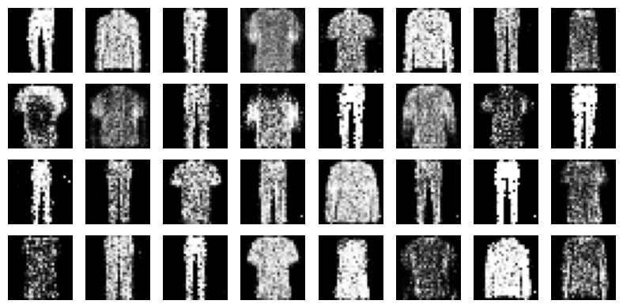
    


    
    Epoch 2/10
      Step 0 - d_loss: 0.6662, d_acc: 0.5863, g_loss: 0.8318
      Step 100 - d_loss: 0.6660, d_acc: 0.5866, g_loss: 0.8321
      Step 200 - d_loss: 0.6660, d_acc: 0.5867, g_loss: 0.8323
      Step 300 - d_loss: 0.6659, d_acc: 0.5867, g_loss: 0.8325
      Step 400 - d_loss: 0.6660, d_acc: 0.5866, g_loss: 0.8325
      Step 500 - d_loss: 0.6659, d_acc: 0.5867, g_loss: 0.8329
    Epoch 2 duration: 3.85 seconds
    Visualizing generated images after epoch 2
    


    
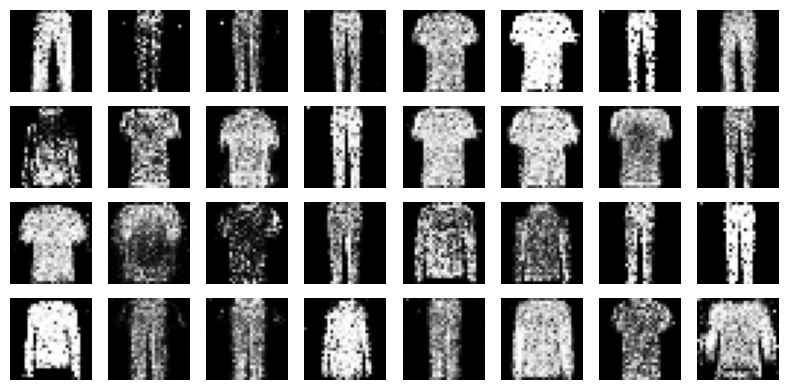
    


    
    Epoch 3/10
      Step 0 - d_loss: 0.6659, d_acc: 0.5868, g_loss: 0.8328
      Step 100 - d_loss: 0.6658, d_acc: 0.5870, g_loss: 0.8331
      Step 200 - d_loss: 0.6657, d_acc: 0.5872, g_loss: 0.8337
      Step 300 - d_loss: 0.6657, d_acc: 0.5871, g_loss: 0.8338
      Step 400 - d_loss: 0.6657, d_acc: 0.5873, g_loss: 0.8340
      Step 500 - d_loss: 0.6656, d_acc: 0.5874, g_loss: 0.8342
    Epoch 3 duration: 3.83 seconds
    Visualizing generated images after epoch 3
    


    
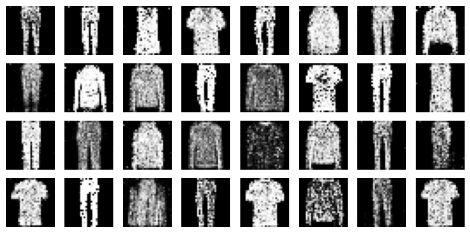
    


    
    Epoch 4/10
      Step 0 - d_loss: 0.6657, d_acc: 0.5874, g_loss: 0.8343
      Step 100 - d_loss: 0.6657, d_acc: 0.5874, g_loss: 0.8345
      Step 200 - d_loss: 0.6657, d_acc: 0.5874, g_loss: 0.8344
      Step 300 - d_loss: 0.6657, d_acc: 0.5875, g_loss: 0.8346
      Step 400 - d_loss: 0.6657, d_acc: 0.5875, g_loss: 0.8349
      Step 500 - d_loss: 0.6655, d_acc: 0.5877, g_loss: 0.8353
    Epoch 4 duration: 3.92 seconds
    Visualizing generated images after epoch 4
    


    
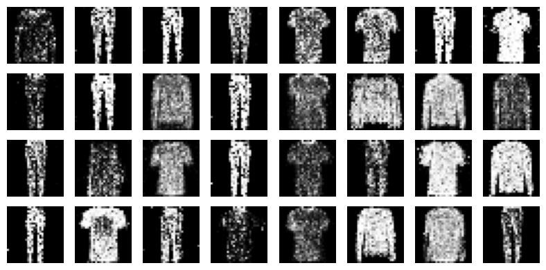
    


    
    Epoch 5/10
      Step 0 - d_loss: 0.6655, d_acc: 0.5877, g_loss: 0.8355
      Step 100 - d_loss: 0.6654, d_acc: 0.5878, g_loss: 0.8356
      Step 200 - d_loss: 0.6653, d_acc: 0.5881, g_loss: 0.8359
      Step 300 - d_loss: 0.6652, d_acc: 0.5883, g_loss: 0.8362
      Step 400 - d_loss: 0.6652, d_acc: 0.5885, g_loss: 0.8366
      Step 500 - d_loss: 0.6652, d_acc: 0.5885, g_loss: 0.8367
    Epoch 5 duration: 3.91 seconds
    Visualizing generated images after epoch 5
    


    
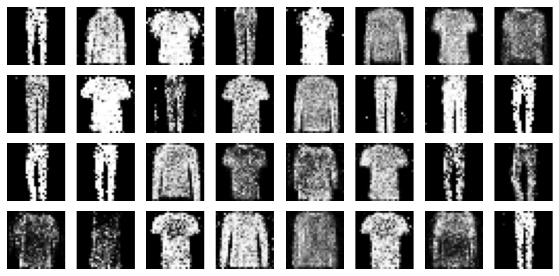
    


    
    Epoch 6/10
      Step 0 - d_loss: 0.6651, d_acc: 0.5886, g_loss: 0.8368
      Step 100 - d_loss: 0.6651, d_acc: 0.5886, g_loss: 0.8370
      Step 200 - d_loss: 0.6651, d_acc: 0.5887, g_loss: 0.8371
      Step 300 - d_loss: 0.6651, d_acc: 0.5887, g_loss: 0.8373
      Step 400 - d_loss: 0.6651, d_acc: 0.5888, g_loss: 0.8375
      Step 500 - d_loss: 0.6650, d_acc: 0.5889, g_loss: 0.8379
    Epoch 6 duration: 3.96 seconds
    Visualizing generated images after epoch 6
    


    
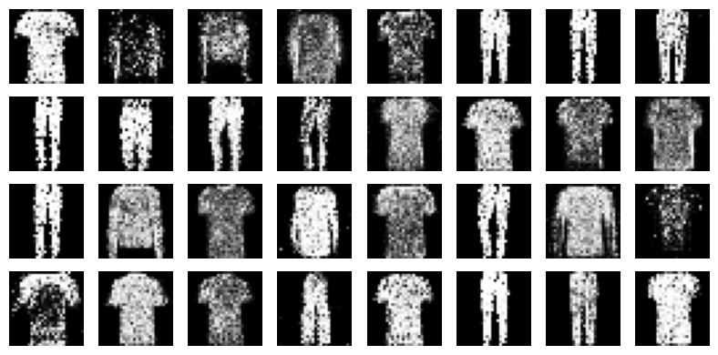
    


    
    Epoch 7/10
      Step 0 - d_loss: 0.6650, d_acc: 0.5889, g_loss: 0.8378
      Step 100 - d_loss: 0.6649, d_acc: 0.5890, g_loss: 0.8380
      Step 200 - d_loss: 0.6649, d_acc: 0.5891, g_loss: 0.8382
      Step 300 - d_loss: 0.6648, d_acc: 0.5892, g_loss: 0.8385
      Step 400 - d_loss: 0.6648, d_acc: 0.5892, g_loss: 0.8387
      Step 500 - d_loss: 0.6648, d_acc: 0.5893, g_loss: 0.8389
    Epoch 7 duration: 3.88 seconds
    Visualizing generated images after epoch 7
    


    
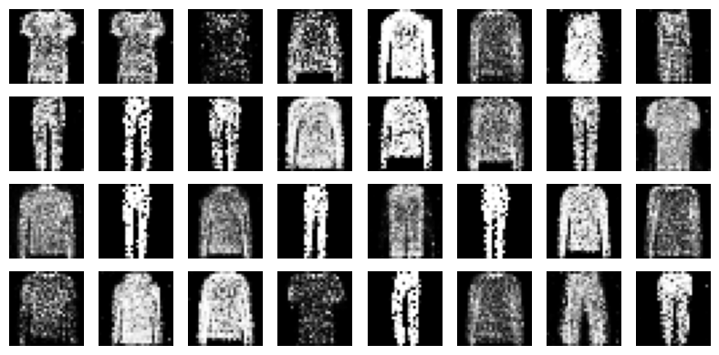
    


    
    Epoch 8/10
      Step 0 - d_loss: 0.6647, d_acc: 0.5893, g_loss: 0.8390
      Step 100 - d_loss: 0.6647, d_acc: 0.5894, g_loss: 0.8392
      Step 200 - d_loss: 0.6647, d_acc: 0.5894, g_loss: 0.8394
      Step 300 - d_loss: 0.6646, d_acc: 0.5896, g_loss: 0.8397
      Step 400 - d_loss: 0.6646, d_acc: 0.5897, g_loss: 0.8400
      Step 500 - d_loss: 0.6645, d_acc: 0.5898, g_loss: 0.8402
    Epoch 8 duration: 3.99 seconds
    Visualizing generated images after epoch 8
    


    
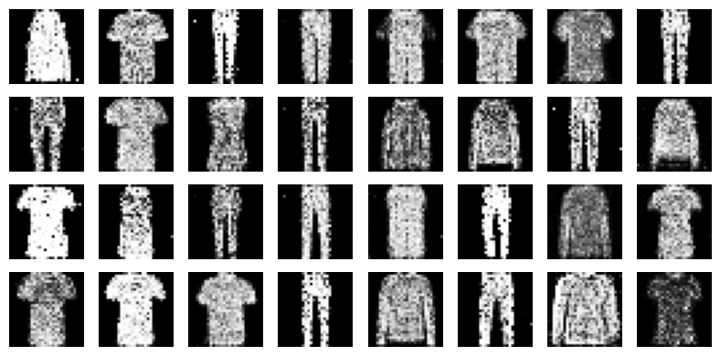
    


    
    Epoch 9/10
      Step 0 - d_loss: 0.6645, d_acc: 0.5899, g_loss: 0.8404
      Step 100 - d_loss: 0.6644, d_acc: 0.5900, g_loss: 0.8406
      Step 200 - d_loss: 0.6644, d_acc: 0.5900, g_loss: 0.8408
      Step 300 - d_loss: 0.6644, d_acc: 0.5901, g_loss: 0.8410
      Step 400 - d_loss: 0.6643, d_acc: 0.5903, g_loss: 0.8412
      Step 500 - d_loss: 0.6642, d_acc: 0.5903, g_loss: 0.8416
    Epoch 9 duration: 4.01 seconds
    Visualizing generated images after epoch 9
    


    
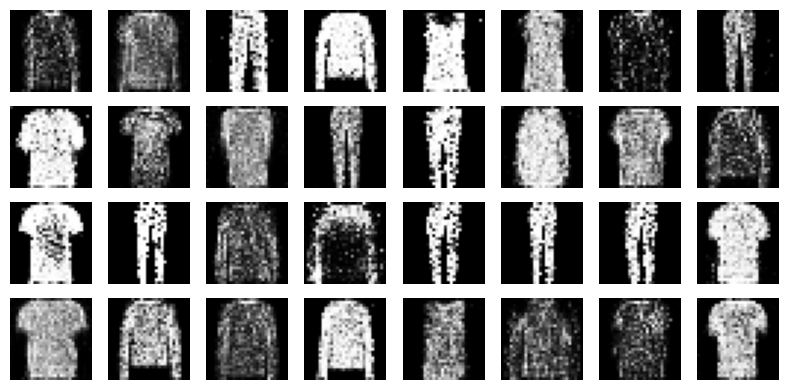
    


    
    Epoch 10/10
      Step 0 - d_loss: 0.6642, d_acc: 0.5904, g_loss: 0.8417
      Step 100 - d_loss: 0.6642, d_acc: 0.5905, g_loss: 0.8417
      Step 200 - d_loss: 0.6642, d_acc: 0.5906, g_loss: 0.8419
      Step 300 - d_loss: 0.6642, d_acc: 0.5906, g_loss: 0.8419
      Step 400 - d_loss: 0.6642, d_acc: 0.5907, g_loss: 0.8419
      Step 500 - d_loss: 0.6642, d_acc: 0.5908, g_loss: 0.8422
    Epoch 10 duration: 3.97 seconds
    Visualizing generated images after epoch 10
    


    
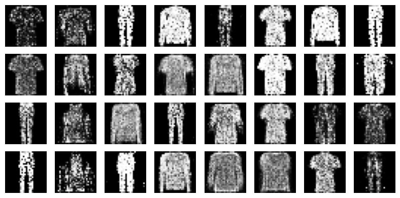
    


    
    Total training time: 43.49 seconds
    

## <b>2.5</b>
### After training the Generator, feed it with 32 random noise vectors and visualize the 32 generated images. Are you satisfied with the results?


```python
# Generate and visualize 32 new images after training
print("Generated images from trained generator:")
noise = tf.random.normal(shape=[32, codings_size])
generated_images = generator(noise)
plot_multiple_images(generated_images, n_cols=8)
```

    Generated images from trained generator:
    


    
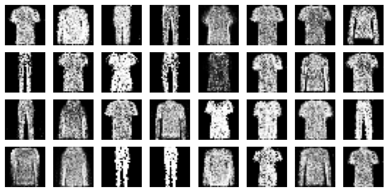
    


The generator has learned some basic structure of the three selected classes, since the generated images resemble clothing items in general shape.
The vast majority of the T-shirts, Trousers, and Pullovers are easily identifiable, while others are still fuzzy or ambiguous.
This indicates that the GAN has not yet fully converged, and could benefit from more training epochs, batch normalization, or improved weight scaling or regularization.

## <b>2.6</b>
### What is the accuracy of the discriminator in predicting that the generated images of the previous question are fake?


```python
# Evaluate discriminator's accuracy on the 32 generated images
labels_fake = tf.constant([[0.]] * 32)  # label = fake
loss, accuracy = discriminator.evaluate(generated_images, labels_fake, verbose=0)

print(f"\nDiscriminator accuracy on generated (fake) images: {accuracy:.4f}")
```

    
    Discriminator accuracy on generated (fake) images: 0.7188
    

The discriminator achieved an accuracy of 0.7188 on the 32 generated (fake) images. This means it correctly identified approximately 23 out of 32 images as fake. This result indicates that the discriminator is still relatively strong, but not perfect — which is a good sign. It suggests that the generator has started producing outputs that are somewhat realistic, to the point that the discriminator misclassifies them roughly 28% of the time. Ideally, in a well-balanced GAN, we aim for the discriminator to have an accuracy around 50%, meaning it can no longer reliably distinguish real from fake. So, while  
his result shows some progress, further training or architectural improvements could help the generator produce even more convincing outputs.


```python

```
